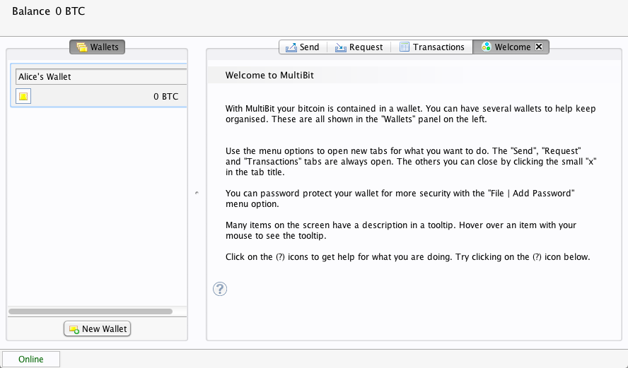
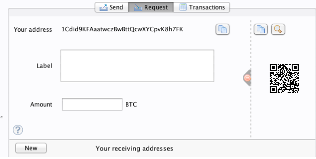
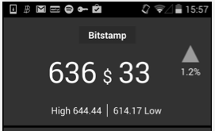
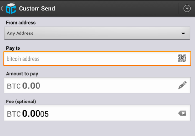

[[ch01_intro_what_is_bitcoin]]
== Introduzione

=== Cos’è Bitcoin?

((("bitcoin", id="ix_ch01-asciidoc0", range="startofrange")))((("bitcoin","defined")))Bitcoin è una collezione di concetti e tecnologie che formano le basi per un ecosistema di denaro digitale. Le unità di valuta chiamate bitcoin vengono utilizzate per immagazzinare e trasferire valore tra i partecipanti del network Bitcoin. Gli utenti Bitcoin comunicano tra loro utilizzando il protocollo Bitcoin principalmente attraverso internet, anche se sono possibili altri network di trasporto. L'intero protocollo Bitcoin, disponibile come software open source, può essere utilizzato su un'ampia gamma di dispositivi digitali, inclusi laptops e cellulari, rendendo questa tecnologia facilmente accessibile.

Gli utenti possono trasferire bitcoin sulla rete per fare qualunque cosa sia possibile fare con le valute tradizionali, incluso comprare e vendere beni, mandare soldi a persone o organizzazioni, oppure fare credito. I bitcoin possono essere comprati, venduti, e scambiati con altre valute su specifici mercati di cambio. Bitcoin rappresenta in un certo senso la forma di denaro perfetta per Internet perché è veloce, sicuro e senza frontiere. 

A differenza delle monete tradizionali, i bitcoin sono completamente virtuali. Non c'è moneta fisica e neanche monete digitali in sé per sé. La moneta è sottintesa nelle transazioni che trasferiscono valuta dal mittente al ricevente. Gli utenti di bitcoin utilizzano le proprie chiavi che permettono loro di avere la prova di essere i proprietari delle transazioni nel network bitcoin, sbloccando la valuta da spendere e trasferendola al nuovo ricevente. Queste chiavi sono generalmente contenute in portafogli (wallet) digitali nei computer di ciascun utente. Il possesso delle chiavi che sbloccano una transazione è il solo prerequisito per spendere i bitcoin, mettendo il controllo dei propri bitcoin interamente nelle mani di ogni utente.

Bitcoin è un sistema distribuito e peer-to-peer. In quanto tale non ha alcun server "centrale", o centro di controllo. I bitcoin sono creati tramite un processo chiamato "mining", che comporta una competizione per cercare le soluzioni di un complesso problema matematico mentre vengono processate le transazioni. Ogni partecipante al network bitcoin (cioè chiunque stia usando un dispositivo che esegue un'istanza completa del protocollo) può operare come "minatore", usando la potenza di calcolo del proprio computer per verificare e registrare le transazioni. In media ogni 10 minuti, qualcuno è in grado di validare le transazioni dei 10 minuti precedenti ed è ricompensato con bitcoin nuovi di zecca. Essenzialmente, il mining di bitcoin decentralizza le funzioni di emissione di valuta e di compensazione attualmente tipiche di una banca centrale, e rimpiazza la necessità di qualunque banca centrale con questa competizione globale. 
 
((("mining","algoritmi che regolano il")))Il protocollo bitcoin include algoritmi incorporati in esso che regolano la funzione di mining su tutto il network. La difficoltà del problema che i miner devono risolvere utilizzando potenza computazionale—per il salvataggio di un blocco di transazioni—è aggiustata automaticamente di modo che, di media, si arrivi a una soluzione del problema ogni 10 minuti qualunque sia il numero dei miner (e CPU) che stanno lavorando alla risoluzione del problema in ogni momento. ((("bitcoin","tasso di emissione")))Il protocollo inoltre dimezza il tasso per il quale nuovi bitcoin sono creati, ogni quattro anni, e limita il numero totale di bitcoin che saranno creati a un numero fisso massimo di 21 milioni di bitcoin. Il risultato è che il numero di bitcoin in circolazione è molto vicino a essere una curva prevedibile che raggiungerà 21 milioni entro l'anno 2140. A causa del tasso di emissione dei bitcoin in diminuzione, a lungo termine, la valuta bitcoin è deflazionaria. Per questo, bitcoin non può essere inflazionata °stampando° nuova moneta al di sopra e oltre il limite dato dal tasso di emissione previsto. 

Dietro le quinte bitcoin è anche il nome del protocollo, del network e dell'innovazione informatica distribuita. La valuta bitcoin è davvero solo la prima applicazione di questa invenzione. Come programmatore, vedo bitcoin come qualcosa di simile all'Internet del denaro, un network per trasportare valore e assicurare la proprietà di asset digitali tramite computazione distribuita. Bitcoin è molto di più di ciò che appare a prima vista. 

In questo capitolo inizieremo a spiegare alcuni dei principali concetti e termini, come ottenere il software necessario, e l'uso di bitcoin per effettuare semplici transazioni. Nei capitoli seguenti inizieremo a scoprire i vari livelli della tecnologia che rendono bitcoin possibile e esamineremo i funzionamenti interni della rete bitcoin e del protocollo.   

.Valute Digitali Pre-Bitcoin
****

((("bitcoin","precursori di")))L'emergenza della moneta digitale fruibile è strettamente collegata agli sviluppi in cittografia. Questo non deve sorprendere quando si considera le sfide fondamentali che si hanno quando si usano i bit per rappresentare valori che possono essere scambiati per beni e servizi. Due domande base per chiunque accetti denaro in forma digitale sono:

1.     Posso fidarmi che i soldi siano autentici e non contraffati?
2.     Posso essere sicuro che nessun'altro possa reclamare che i fondi appartengono a loro e non a me?  (Aka il((("problema del double-spend"))) problema del “double-spend”.)
 
((("contraffazione")))((("crypto-currency","contraffazione")))Gli emettitori di moneta cartacea sono in continua battaglia contro il problema della contraffazione a causa dell'utilizzo di tecnologie cartacee e di stampa sempre più sofisticate. La moneta fisica risolve il problema del double-spend (doppia-spesa) alla radice perchè la stessa banconota cartacea non può essere in due posti allo stesso tempo. Ovviamente, le monete tradizionali sono anche custodite e trasmesse digitalmente. In questi casi, i problemi di contraffazione e di double-spend sono gestite dalla compensazione (clearing, tramite una clearing-house) attraverso autorità centrali che hanno una visione globale della moneta in circolazione. Per la moneta digitale, che non può trarre vantaggio da inchiostri esoterici o striscie olografiche, la ((("crittografia")))crittografia fornisce la base per la fiducia della legittimità della rivendicazione del valore di essa da parte dell'utente. Specificatamente, le firme crittografiche digitali abilitano l'utente a firmare un bene digitale o una transazione provando il possesso di quel bene. Tramite l'appropriata architettura, le firme digitali possono essere usate anche per risolvere il problema del double-spend.

Quando la crittografia è iniziata a diventare sempre più disponibile e compresa alla fine degli anni '80, molti ricercatori hanno iniziato a provare a usare la crittografia per realizzare monete digitali. Questi primi progetti di monete digitali emettevano valuta digitale, generalmente sostenuta da una moneta nazionale o da metalli preziosi come l'oro.

Nonostante queste prime valute digitali funzionassero, erano centralizzate e quindi, di conseguenza, facili prede di attacchi da parte di governi e hacker. Le prime valute digitali usavano una camera di compensazione centrale per gestire le transazioni a intervalli regolari, proprio come un sistema bancario tradizionale. Sfortunatamente, in molti casi queste neonate valute digitali furono prese di mira da governi preoccupati e con il tempo sommerse di contenziosi fino alla loro scomparsa. Alcune fallirono in crolli spettacolari quando la compagnia di emissione andò improvvisamente in liquidazione. Per essere resistenti agli attacchi di enti antagonisti, che si trattasse di istituzioni legali o di criminali, era necessaria una valuta decentralizzata priva di un singolo punto di rottura. Bitcoin è questo sistema, disegnato per essere completamente decentralizzato, e libero da qualunque autorità centrale o centro di controllo che possa essere attaccato o compromesso.

Bitcoin rappresenta il culmine di decenni di ricerca nei campi della crittografia e dei sistemi distribuiti e comprende quattro diverse innovazioni-chiave, portate insieme in un'unica e potente combinazione. Bitcoin consiste in:
 
* Un network peer-to-peer decentralizzato (il protocollo bitcoin)
* Un libro-mastro di transazioni pubblico (la blockchain)
* Un'emissione della moneta decentralizzata, matematica e deterministica (mining distribuito)
* Un sistema decentralizzato di verifica delle transazioni (lo script delle transazioni)

****

=== Storia di Bitcoin

((("bitcoin","sviluppo di")))((("Nakamoto, Satoshi")))Bitcoin è stato inventato nel 2008 con la pubblicazione di un paper scientifico intitolato((("Bitcoin: A Peer-to-Peer Electronic Cash System. (Nakamoto)" - "Bitcoin: Un Sistema di Contante Elettronico Peer-to-Peer")))"Bitcoin: A Peer-to-Peer Electronic Cash System. (Nakamoto)" - "Bitcoin: Un Sistema di Contante Elettronico Peer-to-Peer", scritto sotto lo pseudonimo di Satoshi Nakamoto. Nakamoto ha combinato varie invenzioni scoperte precedentemente quali((("b-money")))((("HashCash"))) b-money e HashCash per arrivare alla creazione di un sistema di contante elettronico completamente decentralizzato che non dipende su nessuna autorità centrale per l'emissione di moneta o per la liquidazione e la validazione delle transazioni. L'innovazione chiave è stata quella di usare un sistema di computazione distribuito (chiamato ((("algoritmo proof-of-work"))) algoritmo di "proof-of-work", letteralmente "prova-di-lavoro", riferito al lavoro effettuato da un computer) per condurre un'"elezione" globale ogni 10 minuti, facendo si che il network decentralizzato arrivi ad un _consenso_ riguardo lo stato delle transazioni. Questo risolve elegantemente il problema del double-spend (doppia-spesa) dove una singola unità di moneta poteva essere spesa due volte. Precedentemente, il problema del double-spend era una debolezza delle valute digitali e era stato affrontato compensando (clearing) tutte le transazioni attraverso una camera di compensazione (clearing-house). 

((("bitcoin network","origine del")))Il network bitcoin ha "preso vita" nel 2009, basato sulla implementazione di riferimento pubblicata da Nakamoto e da quel momento visto e modificato da molti altri programmatori. La computazione distribuita che provvede alla sicurezza e alla resilienza (capacità di resistere agli attacchi) di bitcoin è aumentata esponenzialmente, e al momento eccede la capacità di calcolo di quella di tutti i super-computer più veloci del mondo. Il valore di mercato di Bitcoin al momento è stimato trai 5 e i 10 miliardi di dollari (USD), che dipende sul tasso di cambio bitcoin-dollaro. La transazione più grande processata fino ad ora dal network era di circa 150 milioni di dollari (USD), trasmessi istantaneamente e processata senza alcun costo di commissione (transaction fee).

Satoshi Nakamoto si ritirò dalla scena pubblica nell'Aprile del 2011, lasciando la responsabilità dello sviluppo del codice e del network a una fiorente comunità di volontari. L'identità della persona o del gruppo dietro bitcoin è ancora un mistero. Ad ogni modo, né Satoshi Nakamoto né chiunque altro può esercitare alcun controllo sul sistema bitcoin, che opera sulla base di principi matematici completamente trasparenti. L'invenzione è di per sé rivoluzionaria e ha già generato nuovi traguardi scientifici nei campi dell'informatica distribuita, dell'economia e dell'econometria. 

.Una Soluzione a un Problema Computazionale Distribuito
****
((("Problema dei Generali Bizantini")))L'invenzione di Satoshi Nakamoto è anche una soluzione pratica a un problema precedentemente irrisolto di computazione distribuita, conosciuto come il Problema dei "Generali Bizantini". Brevemente, il problema consiste nel provare a concordare una linea d'azione scambiandosi informazione su di una rete (network) non affidabile e potenzialmente compromessa. La soluzione di Satoshi Nakamoto, che usa il concetto di proof-of-work per raggiungere il consenso senza una autorità fiduciaria centrale, rappresenta un gran passo in avanti nella scienza informatica della computazione distribuita e ha una applicabilità che è molto varia e arriva anche molto oltre le applicazioni monetarie. Può infatti essere utilizzato per arrivare a un consenso su reti decentalizzate per provare l'equità delle elezioni, di lotterie, per registri di beni, per notarizzazione digitale e per molto altro. 
****

[[user-stories]]
=== I vari Utilizzi di Bitcoin, gli Utenti e le loro Storie

Bitcoin è una tecnologia, ma serve a gestire il denaro che è fondamentalmente un linguaggio per scambiare valore tra le persone. Andiamo ad esaminare le tipologie di persona che utilizzano attualmente bitcoin e, attraverso le loro storie, gli usi più comuni della valuta e del protocollo. Utilizzeremo nuovamente queste storie nel corso del libro per illustrare le modalità concrete di utilizzo del denaro digitale ed il modo con cui sono rese possibili dalle diverse tecnologie che costituiscono bitcoin. 

Negozio Nord Americano di prodotti comuni::
Alice vive nella Bay Area, nel nord della California. Ha sentito parlare di bitcoin dai suoi amici appassionati di tecnologia e vuole cominciare ad utilizzarlo. Seguiremo la sua storia mentre impara cos'è bitcoin, acquista un po' di valuta e ne spende una parte per comprare un caffè al Bob's Cafe di Palo Alto. Questa storia ci introdurrà al software di base, agli exchange e alle transazioni più semplici dal punto di vista di un consumatore finale.

Negozio di cose di valore Nord Americano::
Carol è proprietaria di una galleria d'arte in San Francisco. Vende quadri costosi in cambio di bitcoin. Questa storia introdurrà il rischio di un "attacco 51%" per venditori di oggetti di valore.  

Servizi di liberi professionisti esteri::
Bob, il proprietario del caffè a Palo Alto, sta creando un nuovo sito internet. Ha assunto un web-developer indiano, Gopesh, che vive a Bangalore, in India. Gopesh ha accettato di essere pagato in bitcoin. Questa storia illustrerà l'uso di bitcoin per l'outsourcing, i lavori a contratto e i trasferimenti internazionali di denaro. 

Donazioni::
Eugenia è la direttrice di un ente di beneficenza focalizzato sui bambini nelle Filippine. Recentemente ha scoperto bitcoin e vuole utilizzarlo per raggiungere un settore totalmente nuovo di donatori stranieri e domestici per finanziare il suo ente benefico. Sta anche investigando la possibilità di usare bitcoin per distribuire velocemente le risorse alle aree di necessità. Questa storia mostrerà l'uso di bitcoin per la raccolta di fondi globale attraverso frontiere e valute differenti, e l'utilizzo di un registro pubblico ai fini di trasparenza in organizzazioni filantropiche.

Import/export::
Mohammed è un importatore di elettronica a Dubai. Sta cercando di usare bitcoin per comprare ed importare negli Emirati Arabi Uniti componenti elettroniche provenienti dagli USA e dalla Cina, sperando di accelerare il processo di dei pagamenti nella fase di importazione. Questa storia mostrerà come bitcoin può essere utilizzato per importanti pagamenti internazionali da azienda ad azienda relativi a beni fisici.

Bitcoin Mining::
Jing è uno studente di ingegneria informatica a Shanghai. Ha costruito una "mining rig" per fare mining di bitcoin, utilizza le sue abilità da informatico per avere un reddito supplementare. Questa storia esaminerà la base "industriale" di bitcoin: l'attrezzatura specializzata usata per proteggere il network bitcoin da attacchi informatici e per emettere nuova moneta. 

Ognuna di queste storie è basata su personi reali e su settori commerciali reali che stanno correntemente usando bitcoin per creare nuovi mercati, nuovi settori e soluzioni innovative a problemi economici globali. 

=== Per Iniziare

((("bitcoin","forme di")))Per entrare a far parte del network bitcoin e per iniziare a usare la valuta, tutto quello che deve fare un utente è scaricare un'applicazione o utilizzare un'applicazione web. Visto che bitcoin è uno standard, ci sono varie implementazioni del software client di bitcoin. C'è anche un'implementazione di riferimento, conosciuta anche con il nome di Satoshi client, che è gestita come un progetto open source da un team di sviluppatori ed è derivata dall'implementazione originale scritta da Satoshi Nakamoto. 

Le tre forme principali di client bitcoin sono:

Full client:: ((("full node")))Un full client, o "full node," è un client che salva la storia coompleta delle transazioni bitcoin (ogni transazione, da ogni utente, da sempre), che gestisce i wallet dell'utente, e che può iniziare le transazioni direttamente sul network bitcoin. Questo è simile a un server email, visto che gestisce tutti gli aspetti del protocollo senza fare affidamento su altri server o su servizi di terza parte.

Client leggeri:: ((("client leggero")))Un client leggero (light client) utilizza il wallet utente localmente ma fa affidamento a server di proprietà di terze parti per accedere alla rete e alle transazioni bitcoin. Il light client non salva la copia di tutte le transazioni e quindi deve fidarsi dei server di terze parti per la validazione delle transazioni. Questo è molto simile a un client mail indipendente che si connette a un server di posta per accedere a una casella di posta, col fatto che si appoggia su un server di terze parti per interagire con il network. 

Client web:: ((("client web")))I client web sono quelli a cui si accede tramite un web browser e che salvano il wallet dell'utente su di un server controllato da una terza parte. Questo è molto simile a una webmail per il fatto che si fa affidamento interamente su un server di terze parti. 

.Bitcoin su Cellulari
****
((("client mobile")))((("smartphone, client bitcoin per")))I client mobile per smartphone, come quelli basati su sul sistema Android, possono operare sia come full client, light client o web client. Molti client mobile sono sincronizzati con un client web o desktop, fornendo un wallet multipiattaforma su multipli dispositivi ma con una fonte comune di fondi.
****

La scelta del client bitcoin dipende da quanto controllo l'utente vuole avere sui propri fondi. Un client completo offrirà all'utente il livello più alto di controllo e di indipendenza, ma lascerà il peso di backup e sicurezza interamente sulle sue spalle. All'altro estremo dello spettro di scelte, un client web è il più facile da impostare ed utilizzare, ma il lato negativo di una simile soluzione è l'introduzione di un rischio di controparte, perché la sicurezza e il controllo sui fondi sono condivisi tra utente e gestore del servizio. Se un servizio di wallet su web è compromesso, come è successo in molti casi, gli utenti possono perdere tutti i loro fondi. Viceversa, se un utente utilizza un client indipendente senza adeguate strategie di backup, potrebbe perdere i suoi fondi a causa di una disavventura informatica. 

Per lo scopo di questo libro, dimostreremo l'utilizzo di un vario tipo di client bitcoin scaricabili, dall'implementazione di riferimento (reference client, il Satoshi client) a wallet web. Molti di questi esempi richiederanno l'utilizzo del reference client, il quale, oltre a essere un full client, espone anche un'API per il wallet, per il network e per i servizi di transazione. Se prevedi di esplorare le interfacce di programmazione del sistema bitcoin, ti servirà il reference client.

==== Avvio Rapido

((("bitcoin","installazione e configurazione del wallet")))((("wallet","installazione e configurazione")))Alice, che abbiamo introdotto in <<user-stories>>, non è un utente particolarmente tecnico e solo recentemente è venuta a conoscenza di bitcoin da un amico. Alice inizia il suo percorso visitando il sito ufficiale((("bitcoin.org"))) http://www.bitcoin.org[bitcoin.org], dove trova una vasta selezione di client bitcoin. Seguendo il consiglio del sito bitcoin.org, sceglie il client bitcoin light (leggero) ((("Multibit client"))) Multibit. 

Alice segue un link dal sito di bitcoin.org per scaricare e installare Multibit sul suo computer fisso. Multibit è disponibile per computer fissi con Windows, Mac OS, e Linux.

[WARNING]
====
((("wallet","sicurezza dei")))Un wallet bitcoin deve essere protetto da una password o da una passphrase. Ci sono molti hacker che cercano di rompere le password deboli, quindi sii sicuro di scegliere una password che non sia facilmente compromessa. Utilizza una combinazione di caratteri maiuscoli e minuscoli, numeri e simboli. Evita di utilizzare dati personali come date di nascita o nomi famosi come quelli delle squadre di calcio. Evita qualsiasi parola comunemente trovata in dirionari, in ogni linguaggio. Se puoi, utilizza un generatore di password per generare una password casuale di una lunghezza di almeno 12 caratteri. Ricorda: bitcoin è denaro e può essere istantaneamente mosso da qualunque parte del mondo. Se non è ben protetto, può essere rubato facilmente.
====

Una volta che Alice ha scaricato e installato l'applicazione Multibit, la lancia ed è accolta da una schermata di benvenuto, mostrata nel <<multibit-welcome>>.

[[multibit-welcome]]
.La schermata iniziale del client bitcoin Multibit

((("indirizzi, bitcoin","creati da Multibit")))Multibit crea automaticamente un wallet e un nuovo indirizzo bitcoin per Alice. Alice può visualizzare l'indirizzo bitcoin appena creato cliccando la tab Request mostrata in <<multibit-request>>.
[[multibit-request]]
.Il nuovo indirizzo bitcoin di Alice, nella tab Request del client Multibit

La parte più importante di questa schermate è l'indirizzo _bitcoin_ di Alice. Come un indirizzo email, Alice può condividere questo indirizzo e qualunque persona può utilizzaro per inviare denaro direttamente al nuovo wallet di Alice. Sulla schermata appare come una lunga stringa di lettere e numeri: +1Cdid9KFAaatwczBwBttQcwXYCpvK8h7FK+. Accanto all'indirizzo bitcoin del wallet c'è un codice QR (QR code), una forma di codice a barre che contiene le stesse informazione in un formato che può essere facilmente scansionato da una fotocamera di uno smartphone. Il QR code è il quadrato in bianco-e-nero sul lato destro della finestra. Alice può copiare l'indirizzo bitcoin o il QR code nella clipboard (per poterlo poi incollare tramite copy-paste) cliccando il bottone _copy_ adiacente a ognuno di essi. Cliccando sopra il QR code lo ingrandirà, di modo che sia facilmente scansionabile utilizzando la fotocamera di uno smartphone. 

Alice può anche stampare il codice QR come mezzo per dare ad altri il proprio indirizzo in modo semplice, senza obbligarli a digitare una lunga stringa di lettere e numeri. 

[TIP]
====
((("indirizzi, bitcoin","condivisione")))Gli indirizzi Bitcoin iniziano con i caratteri 1 o 3. Come gli indirizzo email, possono essere condivisi con altri utenti bitcoin che possono usarli per inviare bitcoin direttamente al tuo wallet. Al contrario degli indirizzi email, puoi creare nuovi indirizzi bitcoin a volontà, senza limiti, ciascuno dei quali ridirigerà il denaro verso il tuo wallet. Un wallet è semplicemente un'insieme di indirizzi e chiavi che possono sbloccare i fondi contenuti in essi. Puoi migliorare la tua privacy utilizzando indirizzi bitcoin differenti per ogni transazione. Non c'è praticamente alcun limite al numero di indirizzi che un'utente possa creare.
====

Alice è ora pronta a usare il suo nuovo wallet bitcoin. 

[[getting_first_bitcoin]]
==== Ottenere I Tuoi Primi Bitcoin

((("bitcoin","ottenere")))((("mercati di cambio valuta")))Di questi tempi, non è ancora  possibile l'acquisto di bitcoin in banca o in un chiosco di cambiamonete. Visto che siamo nel 2014 (tempo di edizione del libro), è ancora abbastanza difficile ottenere bitcoin in molti paesi. Ci sono un certo numero di servizi cambia valuta dove puoi comprare e rivendere bitcoin in cambio di valuta locale. Questi operano come mercati di valuta attraverso un'applicazione (o sito) web e includono:

http://bitstamp.net[Bitstamp]:: Un mercato di valute europeo che supporta molte valute che includono euro (EUR) e dollari americani (USD) attraverso bonifico bancario.((("Bitstamp currency market")))
http://www.coinbase.com[Coinbase]:: Una piattaforma wallet e piattaforma basata in USA dove venditori e consumatori possono effettuare transazioni in bitcoin. Coinbase rende facile comprare e vendere bitcoin, consentendo agli utenti di connettersi ai conti correnti USA tramite il sistema ACH.((("Coinbase.com")))

Gli exchange (cambia-valuta) di criptomonete come quelli elencati operano all'incrocio tra le valute nazionali e le criptovalute. Per questo, sono soggetti a regolamentazioni sia nazionali che internazionali, e sono spesso specifici per un singolo paese o area economica e si specializzano nelle valute nazionali di quella determinata area. La scelta di un exchange sarà specifica alla valuta nazionale di tuo utilizzo e limitata elle exchange che operano nella giurisdizione legale del tuo paese. Con modalità simili a quelle dell'apertura di un conto in banca, servono alcuni giorni o settimane per l'attivazione dei conti necessari su questi servizi perchè essi richiedo varie forme di identificazione a cui ci si deve attenere quali le norme bancarie  (("norme bancarie di AML (Anti-Money Laundering, Norme Anti-Riciclaggio)")))((("norme bancarie e bitcoin")))((("norme bancarie di KYC (Know Your Customer, identificazione-del-cliente)"))) KYC (know your customer, identificazione-del-cliente) and AML (anti-money laundering, anti-riciclaggio). Una volta ottenuto un conto su di un exchange bitcoin, potrai allora comprare o vendere bitcoin velocemente come faresti tramite un conto con valuta estera o con un conto di brokeraggio.

Puoi trovare una lista più completa su http://bitcoincharts.com/markets[bitcoin charts], un sito che offre quotazioni di prezzo e altri dati di mercato di molte decine di cambia valute. 

Ci sono quattro altri metodi per ottenere bitcoin come nuovo utente:

* Trova((("bitcoin, comprandoli con contante"))) un amico che abbia bitcoin e ne comprane alcuni direttamente da lui. Molti utenti bitcoin iniziano in questo modo. 
* Utilizzare un servizio privato come localbitcoins.com per trovare un venditore nella vostra zona per comprare bitcoin in contanti con una transazione di persona 
* Vendi un prodotto o offri un servizio in cambio di bitcoin. Se sei un programmatore, offri le tue conoscenze in programmazione. 
* Utilizza((("ATMs, bitcoin")))((("bitcoin ATMs"))) un ATM bitcoin nella tua città. Trova un ATM bitcoin vicino a te utilizzando una mappa online di http://www.coindesk.com/bitcoin-atm-map/[CoinDesk].

Alice è venuta in contatto con bitcoin tramite un amico e di conseguenza ha un canale facilitato per ottenere i suoi primi bitcoin intanto che aspetta la verifica e l'attivazione del proprio account su un mercato dei cambi californiano. 

[[sending_receiving]]
==== Inviare e Ricevere Bitcoin

((("bitcoin","invio/ricezione", id="ix_ch01-asciidoc1", range="startofrange")))Alice ha creato il suo wallet bitcoin ed è a questo punto pronta per ricevere fondi. La sua applicazione wallet genera casualmente una chiave privata (processo descritto in maggiore dettaglio nella sezione <<private_keys>>) insieme al suo indirizzo bitcoin corrispondente. A questo punto, il suo indirizzo bitcoin non è conosciuto dal network bitcoin o "registrato" da nessuna parte nel sistema bitcoin. Il suo indirizzo bitcoin è semplicemente un numero che corrisponde a una chiave che lei può utilizzare per controllare l'accesso ai fondi. Non c'è un account o un'associazione tra quell'indirizzo e un conto. Fino al momento in cui questo indirizzo sarà referenziato come ricevente di un determinato valore in una transazione inserita nel registro di transazioni bitcoin (la blockchain), è semplicemente parte del gran numero di indirizzi possibili che sono "validi" in bitcoin. Quando sarà associato con una transazione, diventerà parte degli indirizzi conosciuti sul network bitcoin e Alice potrà controllare il suo saldo sul registro pubblico. 

Alice incontra il suo amico Joe, che le aveva parlato di bitcoin, in un ristorante locale, così da poter scambiare qualche dollaro americano e mettere qualche bitcoin nel suo conto. Lei ha portato una stampa del suo indirizzo e del relativo codice QR, così come visualizzato nel suo wallet. L'indirizzo bitcoin non rappresenta un dato sensibile, dal punto di vista della sicurezza. Può essere lasciato in vista ovunque senza alcun rischio per la sicurezza del suo conto. 

Alice vuole convertire 10 dollari in bitcoin, non correndo il rischio di perdere troppi soldi in questa nuova tecnologia. Alice da una banconota di 10$ a Joe e un foglio stampato con scritto scritto il proprio indirizzo di modo che Joe possa inviarle la somma equivalente di bitcoin.  

((("tasso di cambio, trovare"))) Successivamente, Joe deve scoprire il tasso di cambio (exchange rate) di modo che possa dare la somma corretta di bitcoin ad Alice. Ci sono centinaia di applicazioni e siti che possono provvedere il tasso di cambio corrente. Qua possiamo trovare alcuni dei più famosi:
	
http://bitcoincharts.com[Bitcoin Charts]:: ((("bitcoincharts.com")))Un servizio di listing dei dati di mercato che mostra il valore di mercato di bitcoin nei vari exchange in tutto il mondo, denominato nelle varie valute locali
http://bitcoinaverage.com/[Bitcoin Average]:: ((("bitcoinaverage.com"))) Un sito che mostra una semplice pagina con la media-pesata rispetto al volume per ogni valuta 
http://www.zeroblock.com/[ZeroBlock]:: ((("ZeroBlock")))Un'applicazione gratuita per Android e iOS che può mostrare il prezzo del bitcoin su diversi exchange (vedi <<zeroblock-android>>)
http://www.bitcoinwisdom.com/[Bitcoin Wisdom]:: ((("bitcoinwisdom.com")))Un altro servizio di quotazione
	
[[zeroblock-android]]
.ZeroBlock, un'applicazione per vedere il cambio del bitcoin per Android e iOS

	
Usando una delle applicazioni o siti appena elencati, Joe determina il prezzo dei bitcoin di essere approssimativamente 100 dollari (USD) per bitcoin. A questo tasso di cambio, Joe dovrebbe dare ad Alice 0.10 bitcoin, conosciuti anche come 100 millibits, in cambio per i 10 dollari (USD) che lei gli ha appena dato. 

Non appena Joe ha stabilito un prezzo di scambio equo, apre la sua applicazione wallet per smartphone e seleziona la funzione di "invio" bitcoin. Per esempio, nel caso stia usando il wallet per smartphone Blockchain.info su Android, visualizzerebbe una schermata che richiede due dati da immettere, come mostrato in <<blockchain-mobile-send>>.

* L'indirizzo bitcoin di destinazione per la transazione
* La somma di bitcoin da inviare

Nel campo di input dell'indirizzo bitcoin, si trova una piccola icona che assomiglia a un codice QR. Questa permette a Joe di scansionare il codice a barre con la fotocamera del suo smartphone senza bisogno di digitare manualmente l'indirizzo bitcoin di Alice (+1Cdid9KFAaatwczBwBttQcwXYCpvK8h7FK+), il quale è piuttosto lungo e difficile da digitare. Joe premerà sull'icona del QR code che attiverà la fotocamera del suo smartphone, scansionando il QR code dal wallet stampato di Alice che ella ha portato con se. L'applicazione wallet per smartphone compilerà l'indirizzo bitcoin nel campo designato e Joe potrà controllare che l'indirizzo sia stato scansionato correttamente comparando alcune cifre dall'indirizzo mostrato sullo schermo con l'indirizzo stampato da Alice.   

[[blockchain-mobile-send]]
.La schermata send del mobile wallet Blockchain

A questo punto Joe inserisce il valore in bitcoin per la transazione, 0.10 bitcoin. Accuratamente Joe controlla di essere sicuro di aver inserito la quantità corretta, perchè sta in procinto di trasmettere del denaro e ogni errore potrebbe costargli i fondi che sta trasferendo. Infine, preme il bottone Send (Invia) per trasmettere la transazione. Il bitcoin wallet per smartphone di Joe costruisce una transazione che assegna 0.10 bitcoin all'indirizzo fornito da Alice, pescando i fondi dal wallet di Joe e firmando la transazione con le chiavi private di Joe. Questo comunica al network a bitcoin che Joe ha autorizzato un trasferimento di denaro da uno dei suoi indirizzi al nuovo indirizzo di Alice. Non appena la transazione è stata trasmessa attraverso il protocollo peer-to-peer, si propaga velocemente attraverso il network. In meno di un secondo, la maggior parte dei nodi con una connessione al network di buona qualità riceveranno la transazione e vedranno l'indirizzo di Alice per la prima volta. 

Se Alice ha uno smartphone o un computer portatile con se, sarà anche capace di visualizzare la transazione. Il registro bitcoin-un file in crescita costante che registra ogni transazione bitcoin mai accaduta-è pubblico, questo vuol dire che tutto quello che dovrà fare sarà di consultare il suo indirizzo per controllare se ha ricevuto del denaro. Potrà fare questo piuttosto facilmente sul((("blockchain.info sito web"))) sito web blockchain.info immettendo il suo indirizzo nel campo di ricerca. Il sito web le mostrerà una http://bit.ly/1u0FFKL[pagina] elencando tutte le transazioni ricevute e provenienti da quell'indirizzo. Se Alice sta controllando quella pagina, questa si aggiornerà per mostrare una nuova transazione da 0.10 bitcoin nel suo saldo non appena Joe premerà il tasto Invia. 

++++
<?hard-pagebreak?>
++++

.Conferme
****
((("conferma delle transazioni")))Per prima cosa, l'indirizzo di Alice mostrerà la transazione di Joe come "Unconfirmed" (non ancora confermata). Questo significa che la transazione è stata propagata sul network ma non è stata ancora inclusa nel registro di transazioni bitcoin, conosciuto come blockchain. Per essere inclusa, la transazione dovrà essere "pescata" da un miner e inclusa in un blocco di transazioni. Una volta che un nuovo blocco è stato formato, in circa 10 minuti, la transazione contenuta nel blocco sarà accettata e considerata "confermata" (Confirmed) dal network e potrà essere spesa. La transazione è vista da tutti istantaneamente, ma è "considerata valida" da tutti solo quando è stata inclusa in un nuovo blocco che abbia ricevuto la conferma del mining.
****

Alice è adesso fiera di essere la proprietaria di 0.10 bitcoin che può spendere. Nel prossimo capitolo osserveremo il suo primo acquisto con bitcoin, e esamineremo la transazione sottostante e le tecnologie di propagazione più in dettaglio. (((range="endofrange", startref="ix_ch01-asciidoc1")))(((range="endofrange", startref="ix_ch01-asciidoc0")))

