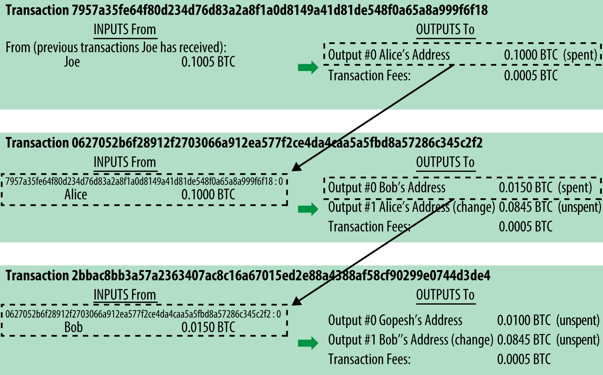

[[ch02_bitcoin_overview]]
== Come Funziona Bitcoin

=== Transazioni, Blocchi, Mining, e la Blockchain

((("bitcoin","implementazione di", id="ix_ch02-asciidoc0", range="startofrange"))) Il sistema di bitcoin, al contrario dei tradizionali sistemi bancari e dei sistemi di pagamento, è basato sulla decentralizzazione della fiducia. Invece di un'autorità centrale fiduciaria, in bitcoin, la fiducia si ottiene come proprietà emergente dall'interazione di diversi partecipanti nel sistema bitcoin. In questo capitolo, esamineremo bitcoin da "lontano" seguendo una singola transazione attraverso il sistema bitcoin e osservando come ottiene la "fiducia" e viene accettata dal meccanismo di bitcoin del consenso distruibito e finalmente registrata sulla blockchain, il libro mastro di tutte le transazioni.

Ogni esempio è basato sulle transazioni effettive fatte sul network bitcoin, simulando le interazioni tra gli utenti (Joe, Alice e Bob) inviando i fondi da un portafoglio all'altro. Per tracciare una transazione attraverso il network bitcoin e la blockchain, useremo un ((("siti di blockchain explorer"))) sito_blockchain explorer_ per visualizzare ogni passaggio. Un sito blockchain explorer è un'applicazione web che opera come un motore di ricerca bitcoin, in esso permette di cercare per indirizzo, transazione e blocco per vedere i relativi rapporti e flussi di essi.

Blockchain explorers conosciuti includono: ((("blockchain.info website")))((("blockexplorer.com")))((("blockr.io website")))((("insight.bitpay.com")))

* http://blockchain.info[Blockchain info]
* http://blockexplorer.com[Bitcoin Block Explorer]
* http://insight.bitpay.com[insight]
* http://blockr.io[blockr Block Reader]

Ogniuno di questi ha una funzione di ricerca che accetta un indirizzo, un hash di una transazione o il numero di un blocco e trovare i dati equivalenti sul network bitcoin e sulla blockchain. Con ogni esempio, forniremo un indirizzo web (URL) che porterà direttamente all'elemento corrispondente, così che potrete studiarli in dettaglio.

==== Panoramica su Bitcoin

Nel diagramma panoramico mostrato su <<bitcoin-overview>>. noteremo che il sistema bitcoin consiste di utenti con portafogli (wallet) contenenti chiavi (key), le transazioni sono propagate attraverso il network, i miner che producono (tramite una gara di computazione) la blockchain (catena di blocchi) del consenso, che è il libro mastro autoritativo di tutte le transazioni. In questo capitolo, seguiremo una singola transazione che viaggia attraverso il network e esamineremo l'interazione tra ogni parte del sistema bitcoin, ad alto livello. I capitoli successivi investigheranno nelle tecnologie che stanno dietro i wallet, il mining e sui sistemi commerciali.  

[[bitcoin-overview]]
.Panoramica su Bitcoin
image::images/msbt_0201.png["Bitcoin Overview"]

[[cup_of_coffee]]
==== Pagare un Caffè

((("transazioni", id="ix_ch02-asciidoc1", range="startofrange")))((("transazioni","semplice esempio di", id="ix_ch02-asciidoc2", range="startofrange")))Alice, introdotta nel capitolo precedente, è un nuovo utente che ha appena ottenuto il suo primo bitcoin. In <<getting_first_bitcoin>>, Alice si è incontrata con il suo amico Joe per scambiare un po di denaro contante per bitcoin. La transazione creata da Joe ha riempito il wallet di Alice con 0.10 BTC. Ora Alice potrà fare la sua prima transazione in un negozio, comprando un caffè al bar di Bob a Palo Alto, Califorinia. Il bar di Bob ha recentemente iniziato ad accettare pagamenti in bitcoin, aggiungendo una opzione bitcoin al suo sistema POS (point-of-sale). I prezzi al Bar di Bob sono elencati nella valuta locale (dollari), ma alla cassa, i clienti hanno la possibilità di pagare sia in dollari che in bitcoin. Il POS, convertirà il prezzo totale da dollari americani a bitcoin al miglior prezzo di mercato e mostrerà i prezzi in entrambe le valute, inoltre mostrerà un QR code contenente una _richiesta di pagamento_ per la transazione (vedi <<payment-request-QR>>):

----
Totale:
$1.50 USD
0.015 BTC
----

[[payment-request-QR]]
.Il QR code della richiesta di pagamento (Indizio: Prova a scansionarlo!)

[[payment-request-URL]]
.Il QR code con la richiesta di pagamento contiene il seguente URL, definito in BIP0021:
----
bitcoin:1GdK9UzpHBzqzX2A9JFP3Di4weBwqgmoQA?
amount=0.015&
label=Bob%27s%20Cafe&
message=Purchase%20at%20Bob%27s%20Cafe

Parti dell'URL 

Un indirizzo bitcoin: "1GdK9UzpHBzqzX2A9JFP3Di4weBwqgmoQA"
L'importo del pagamento: "0.015"
Un'etichetta per l'indirizzo del destinatario: "Bob's Cafe"
Una descrizione del pagamento: "Acquisto al Bar di Bob"
----

[TIP]
====
((("QR code","richieste di pagamento come")))Invece di un QR code che contiene semplicemente un indirizzo bitcoin di destinazione, una richiesta di pagamento (payment request) è un URL sotto forma di QR code che contiene un indirizzo bitcoin di destinazione, il valore del pagamento, e una descrizione generica come "Bar di Bob". Questo consente ad un'applicazione wallet bitcoin di precompilare le informazioni usate per inviare il pagamento e al tempo stesso mostrare all'utente una descrizione leggibile dell'operazione. Puoi scansionare il QR code qui presente con un'applicazione wallet bitcoin per vedere cosa vedrebbe Alice. 
====

Bob dice, "Costa un dollaro e cinquanta, o cinque millibit."

Alice usa il suo smartphone per scansionare il codice a barre mostrato sullo schermo. Il suo smartphone mostra un pagamento di +0.0150 BTC+ al +Bar di Bob+ e dopo lei seleziona +Invia+ (Send) per autorizzare la transazione. Nel giro di pochi secondi (circa lo stesso tempo di un'autorizzazione di una carta di credito), Bob sarà in grado di visualizzare la transazione sulla cassa del bar, e la transazione sarà in questo modo completa. 

Nelle sezioni seguenti esamineremo  dettagliatamente la precedente transazione, vedremo come il wallet di Alice l'ha costruita, come è stata propagata al network, come viene verificata e, per ultimo, come Bob può spendere quella quantità nelle future transazioni.

[NOTE]
====
Il network bitcoin può effettuare transazioni in valori frazionari, es. da millibitcoin (un millesimo di bitcoin) fino a 1/100.000.000mo di bitcoin, che è anche conosciuto come un satoshi((("satoshi","definito da"))). Per tutto il libro useremo il termine "bitcoin" per riferirci a qualsiasi quantità di valuta bitcoin, dalla sua unità più piccola (1 satoshi) al numero totale (21.000.000) di tutti i bitcoin che saranno mai minati.(((range="endofrange", startref="ix_ch02-asciidoc2"))) 
====

=== Transazioni Bitcoin

((("transazioni","definiamo le")))In parole povere, una transazione comunica al  network che il proprietario di un certo numero di bitcoin ha autorizzato il trasferimento di una parte di essi ad un altro proprietario. Il nuovo proprietario può ora spendere questi bitcoin creando un'altra transazione che autorizza il trasferimento a un nuovo proprietario, e così via, formando una catena di passaggi di proprietà. 

Le transazioni sono come righe in un registro di contabilità in partita doppia. ((("input, definiti")))In parole povere, ogni transazione contiene uno o più "input", che sono debiti verso un account bitcoin. ((("output", "definiti")))Dall'altro lato della transazione, ci sono uno o più "output", che sono crediti aggiunti ad un account bitcoin. Gli input e gli output (debiti e crediti) se sommati, non totalizzano necessariamente lo stesso risultato. Al contrario, gli output totalizzano un risultato poco inferiore a quello degli input e la differenza rappresenta una "commissione di transazione" (transaction fee) sottintesa, che è un piccolo pagamento che il miner che include la transazione nel registro ottiene. Una transazione bitcoin è mostrata come una riga in un registro di contabilità in <<transaction-double-entry>>. 

La transazione contiene anche una proof of ownership (prova di propietà) per ogni quantità di bitcoins (input) il cui valore viene trasferito, sotto forma di una firma digitale del possessore, che può essere validata indipendentemente da chiunque. Nel gergo bitcoin, "spending" (spendere) vuol dire firmare una transazione che trasferisce valore da una precedente transazione ad un nuovo proprietario identificato da un indirizzo bitcoin. 

[TIP]
====
Le _transazioni_ muovono valuta dagli _input di transazione_ agli _output di transazione_. Un input è laddove proviene il valore dei bitcoin, generalmente da un output di una transazione precedente. Un output di transazione assegna un nuovo utente al valore associandolo tramite una chiave. La chiave di destinazione è chiamata _encumberance_ (impedimento). Essa impone il requisito di una firma per poter riscattare i fondi in transazioni future. Gli output provenienti da una transazione possono essere usati come input di una nuova transazione, creando in questo modo una catena di proprietà nella quale la valuta è spostata da indirizzo a indirizzo (vedi <<blockchain-mnemonic>>) 
====

[[transaction-double-entry]]
.Transazioni come libro di contabilità in partita doppia 
image::images/msbt_0203.png["Transaction Double-Entry"]

[[blockchain-mnemonic]]
.Una catena di transazioni, dove l'output di una transazione è l'input della transazione successiva

Il pagamento di Alice al Bar di Bob utilizza una transazione precedente come input. Nel capitolo precedente Alice ha ricevuto bitcoin dal suo amico Joe in cambio di contanti. La transazione ha un numero di bitcoin bloccati attraverso la chiave di Alice. La sua nuova transazione al Bar di Bob fa riferimento alla transazione precedente come un input e crea nuovi output per pagare il caffè e per ricevere il resto. La transazioni formano una catena, nella quale gli input dell'ultima transazione corrispondono agli output di transazioni precedenti. La chiave di Alice fornisce la firma che sblocca questi output delle transazioni precedenti, e quindi provando al network bitcoin che lei è la proprietaria dei fondi. Alice combina il pagamento per il caffè all'indirizzo di Bob, in questo modo "blocca" l'output con il requisito che Bob produca una firma per spendere quel valore. Questo rappresenta un trasferimento di valore da Alice a Bob. Questa catena di transazioni, da Joe a Alice a Bob, è illustrata in <<blockchain-mnemonic>>.

==== Forme di Transazioni Comuni

((("transazioni","forme comuni di", id="ix_ch02-asciidoc3", range="startofrange")))La forma più comune di transazione è un semplice pagamento da un indirizzo ad un altro, la quale spesso include del "resto" che ritorna al proprietario originario. Questo tipo di transazione ha un imput e due output ed è illustrata in <<transaction-common>>.

[[transaction-common]]
.Transazioni più comuni
image::images/msbt_0205.png["Transazioni Comuni"]

Un'altra forma comune di transazione è quella che aggrega multipli input in un singolo output (vedi <<transaction-aggregating>>). Questo rappresenta l'equivalente nel mondo'reale dello scambiare una pila di monete e banconote per una banconota singola di valore maggiore. Transazioni come queste sono talvolta generate da applicazioni wallet per "far pulizia" di transazioni di valore piccolo che sono state ricevute come resto dei precedenti pagamenti.

[[transaction-aggregating]]
.Transazioni aggregatrici
image::images/msbt_0206.png["Aggregating Transaction"]

Infine, un'altra forma di transazione molto comune sul registro bitcoin è una transazione che distribuisce un input a piú di un output che rappresentano multipli destinatari (vedi <<distribuzione delle transazioni>>). Questo tipo di transazioni è talvolta usato da esercizi commerciali per distribuire i  guadagni, ad esempio quando si fanno i pagamenti degli stipendi a vari dipendenti.(((range="endofrange", startref="ix_ch02-asciidoc3")))

[[transaction-distributing]]
.Transazioni che distribuiscono fondi
image::images/msbt_0207.png["Transazioni distribuenti"]

=== Costruire una Transaction

((("transazioni","costruire", id="ix_ch02-asciidoc4", range="startofrange")))L'applicazione wallet di alice contiene tutta la logica per selezionare gli appropriati input e output per costruire una transazione secondo le specifiche date da Alice. Alice deve solo specificare una destinazione e un importo e il resto accadrà nell'applicazione wallet senza che lei ne veda i dettagli. ((("offline transazioni")))Nota bene, un'applicazione wallet può costruire transazioni anche essendo completamente offline. Come compilare e firmare un assegno a casa propria e inviarlo successivamente alla banca dentro una busta, la transazione non deve essere costruita e firmata mentre si è connessi alla rete bitcoin. Deve essere inviata al network eventualmente perchè sia eseguita.

==== Ottenere gli Input Giusti

((("transazioni","ottenere, input", id="ix_ch02-asciidoc5", range="startofrange")))L'applicazione wallet di Alice all'inizio dovrà trovare gli input che potrà pagare per il valore che vuole inviare a Bob. La maggior parte delle applicazioni wallet salvano un piccolo database di "output di transazione non spesi" che sono bloccati (encumbered) con le chiavi stesse del wallet. Perciò, il wallet di Alice conterrà una copia degli output di transazione dalla transazione di Joe, che è stata creata in cambio di contanti (vedi <<getting_first_bitcoin>>). Un'applicazione wallet bitcoin che è eseguita come client con indice-completo (full-index, txindex abilitato) contiene una copia di ogni unspent output da ogni transazione nella blockchain. Questo consente a un wallet di costruire gli input di transazione e anche di verificare velocemente che transazioni in entrata abbiano input corretti. Però, visto che un client con full-index richiede un gran quantitativo di spazio disco, la maggior parte di wallet utente eseguono client "leggeri" (light client) che tengono traccia solo degli unspent output dell'utente stesso. 
	
((("wallet","salvataggio della blockchain su")))Se l'applicazione wallet non mantiene una copia degli unspent output, può interrogare il network bitcoin per recuperare quest'informazione, utilizzando una varietà di API disponibili da servizi differenti o può interrogare un nodo con full-index utilizzando l'API JSON RPC. <<example_2-1>> mostra una richiesta API RESTful, costruita come un comando HTTP GET verso un URL specifico. Questo URL restituirà tutti gli unspent output delle transazioni riguardanti un indirizzo, fornendo a qualunque applicazione le informazioni necessarie per costruire gli input della transazione per spenderli. Utilizziamo un semplice client HTTP da riga di comando ((("client HTTP cURL"))) _cURL_ per recuperare la risposta.

[[example_2-1]]
.Ricerca tutti gli unspent output (output non spesi) per l'indirizzo bitcoin di Alice
====
[source,bash]
----
$ curl https://blockchain.info/unspent?active=1Cdid9KFAaatwczBwBttQcwXYCpvK8h7FK
----
====

[[example_2-2]]
.Risposta della richiesta
====
[source,json]
----
{
 
	"unspent_outputs":[

		{
			"tx_hash":"186f9f998a5...2836dd734d2804fe65fa35779",
			"tx_index":104810202,
			"tx_output_n": 0,	
			"script":"76a9147f9b1a7fb68d60c536c2fd8aeaa53a8f3cc025a888ac",
			"value": 10000000,
			"value_hex": "00989680",
			"confirmations":0
		}
  
	]
}
----
====

La risposta nell'<<example_2-2>> mostra un unspent output (un output che non è stato ancora speso) di proprietà dell'indirizzo di Alice  +1Cdid9KFAaatwczBwBttQcwXYCpvK8h7FK+. La risposta include una referenza alla transazione nella quale questo unspent output è contenuto (il pagamento fatto da Joe) e il suo valore in satoshi, 10 milioni, equivalente a 0.10 bitcoin. Con questa informazione, l'applicazione wallet di Alice può costruire la transazione per trasferire quel valore all'indirizzo della nuova proprietaria.

[TIP]
====
Visualizza la http://bit.ly/1tAeeGr[transazione da Joe a Alice].
====

Come puoi notare, il wallet di Alice contiene abbastanza bitcoin in un singolo unspent output per il pagamento del caffè. Se non fosse stato così, l'applicazione wallet di Alice avrebbe dovuto "frugare" nella pila di unspent output più piccoli, come scegliere delle monete da un borsellino fino a che non se ne saranno trovate abbastanza da poter pagare il caffè. In entrambi i casi, ci sarà probabilmente bisogno di ottenere indietro un po di resto, il quale vedremo nella prossima sezione, quando l'applicazione wallet creerà gli output della transazione (pagamenti).(((range="endofrange", startref="ix_ch02-asciidoc5")))

==== Creare gli Output

((("transazioni","output, creazione")))Un nuovo output di transazione è creato nella forma di uno script che crea un blocco sul valore e può essere riscattato solo da l'introduzione di una soluzione allo script. In termini più semplici, l'output di transazione di Alice conterrà uno script che dice qualcosa come, "Questo output è pagabile a chiunque possa presentare una firma dalla chiave corrispondente all'indirizzo pubblico di Bob." Visto che solo Bob ha il wallet con le chiavi corrispondenti a quell'indirizzo, solo il wallet di Bob potrà presentare una simile firma per riscattare questo output. Alice quindi "bloccherà" il valore dell'output con una richiesta di una firma da Bob. 

Questa transazione inoltre includerà un secondo output, visto che i fondi di Alice sono nella forma di un output di 0.10 BTC, troppi soldi per la tazza di caffè da 0.015 BTC. Ad Alice spetteranno 0.085 BTC di resto. Il pagamento per il resto di Alice è creato _dal wallet di Alice_ proprio nella stessa transazione usata per il pagamento a Bob. Essenzialmente, il wallet di Alice divide i fondi in due pagamenti: uno a Bob, e uno indietro a se stessa. Alice può infine usare l'output del resto in una transazione successiva, spendendolo in un secondo momento. 

Infine, perchè il network processi la transazione in un tempo ragionevole, l'applicazione wallet di Alice aggiungerà una piccola commissione (fee) di transazione. Questa non è esplicita nella transazione; è data dalla differenza tra gli input e gli output. Se invece di prendere 0.085 come resto, Alice crea solo 0.0845 come secono output, si avrà un 0.0005 BTC (mezzo millibitcoin) rimanente. L'input di 0.10 BTC non è speso completamente con i due output, perchè la loro somma sarà inferiore a 0.10. La differenza risultante è la _transaction fee_ (commissione della transazione) che sarà recuperata dal miner come commissione per aver incluso la transazione in un blocco e averla scritta sul registro blockchain.

La transazione risultante può essere vista utilizzando un'applicazione web blockchain explorer, come mostrato in <<transaction-alice>>.

[[transaction-alice]]
.La transazione di Alice al Bar di Bob
image::images/msbt_0208.png["Alice Coffee Transaction"]

[[transaction-alice-url]]
[TIP]
====
Visualizza la http://bit.ly/1u0FIGs[transazione da Alice al Bar di Bob].
====

==== Aggiungere la Transazione al Ledger (libro mastro)

((("transazioni","aggiungere al registro")))La transazione creata dall'applicazione wallet di Alice ha una grandezza di 258 byte e contiene tutto il necessario per confermare la proprietà dei fondi e assegnare loro nuovi proprietari. A questo punto, la transazione deve essere trasmessa al network bitcoin dove diventerà parte del registro distribuito (la blockchain). Nella prossima sezione vedremo come una transazione diviene parte di un nuovo blocco e come questo blocco è "minato". Infine, noteremo come questo nuovo blocco, una volta aggiunto alla blockchain, acquista sempre più "fiducia" dal network man mano che vengono aggiunti ulteriori blocchi.

===== Transmettendo la transaction

((("transazioni","trasmissione di")))((("trasmissione di transazioni")))Visto che la transazione contiene tutte le informazioni necessarie per essere processata, non importa come o da dove sia trasmessa al network bitcoin. La rete bitcoin è un network peer-to-peer, dove ogni client bitcoin partecipa connettendosi a altri numerosi client bitcoin. Lo scopo del network bitcoin è di propagare transazioni e blocchi a tutti i partecipanti.  

===== Come si propaga

((("transazioni","propagazione delle")))L'applicazione wallet di Alice può inviare la nuova transazione a qualsiasi altro client bitcoin sia raggiungibile tramite una connessione Internet: via cavo, WiFi, o via cellulare. Il wallet bitcoin di Alice non deve essere connesso direttamente al wallet bitcoin di Bob e non dovrà usare la connessione Internet offerta dal bar, anche se entrambe siano valide opzioni. Ogni nodo (altro client) del network bitcoin che riceva una transazione valida che non è stata vista prima la inoltrerà ad altri nodi ai quali è connesso. Così facendo, la transazione si propagherà rapidamente attraverso il network peer-to-peer, raggiungendo una gran percentuale di nodi in pochi secondi. 

===== Il Punto di Vista di Bob

Se l'applicazione wallet bitcoin di Bob è direttamente connessa all'applicazione wallet di Alice, l'applicazione wallet di Bob potrebbe essere il primo nodo a ricevere la transazione nel giro di pochi secondi. Il wallet di Bob identificherà immediatamente la transazione di Alice come un pagamento in ricezione perchè contiene output redimibile dalle chiavi di Bob. L'applicazione wallet di Bob può anche indipendentemente verificare che la transazione sia formata correttamente, che utilizzi come input, i precedenti output non spesi, e che conttenga sufficenti fee di transazione per essere inclusa nel blocco successivo. A questo punto Bob può assumere, con poco rischio, che la transazione sarà nel giro di poco tempo inclusa in un blocco e confermata. 

[TIP]
====
((("transazioni","accettare senza conferme")))Un idea sbagliata sulle transazioni bitcoin è che debbano essere "confermate" aspettando 10 minuti per un nuovo blocco, o fino a 60 minuti per sei conferme. Anche se le conferme assicurano che la transazione sia stata accettata dall'intera rete, un ritardo del genere è innecessario per un valore di transazione piccolo come quello per pagare un caffè. Un venditore può accettare come valida una transazione di piccolo valore senza conferme, senza incorrere in un rischio maggiore di un pagamento tramite carta di credito senza che si mostri un documento di identità o una firma, cosa che i venditori ad oggi accettano senza problemi.(((range="endofrange", startref="ix_ch02-asciidoc4")))(((range="endofrange", startref="ix_ch02-asciidoc1")))
====

=== Il Mining di Bitcoin

((("mining","blockchain")))La transazione è in questo modo propagata sulla rete bitcoin. Non entra a far parte del libro mastro condiviso (la _blockchain_) fino a che non è verificata e inclusa in un blocco da un processo chiamato _mining_. Vedi il <<ch8>> per una spiegazione più dettagliata. 

Il sistema della fiducia usato da bitcoin è basato sulla computazione. Le transazioni sono raggruppate in _blocchi_, che richiedono un'enorme quanità di potenza computazionale per essere verificate come valide. Il processo di mining in bitcoin serve a due scopi: 

* Il Mining crea nuovi bitcoin per ogni blocco, quasi come una banca centrale emette nuova moneta. La quantità di bitcoin creata per blocco è fissa e diminuisce col tempo.
* Il Mining crea fiducia assicurando che le transazioni siano confermate solo se è stata usata sufficiente potenza di calcolo per il blocco che le contiene. Un maggior numero di blocchi richiede una maggiore potenza di calcolo, questo processo assicura una fiducia maggiore. 

Un buon modo per descrivere l'attività di mining è quello di immaginarsi una partita di Sudoku avente un tabellone di gioco veramente enorme che si resetta ogni volta che una soluzione viene trovata e la quale difficoltà di gioco si aggiusta di modo che si impieghi approssimativamente 10 minuti per trovare una soluzione. Immaginati una partita di sudoku gigante, con una dimensione di numerose righe e colonne. Se io ti mostro un tabellone completato, tu potrai facilmente e velocemente verificarne la correttezza. Al contrario, se il tabellone ha qualche casella piena e molte vuote, ci vorrà un notevole sforzo (lavoro, "work") per risolverlo! La difficoltà del sudoku può essere aggiustata cambiando la dimensione del tabellone (aumentando o riducendo le righe e le colonne), ma potrà comunque essere verificato piuttosto facilmente anche se esso è molto grande in dimensioni. Il "problema da risolvere" usato in bitcoin è basato su di un hash crittografico e esibisce caratteristiche simili al problema di risoluzione di un puzzle come il sudoku: è asimmetricamente difficile da risolvere ma molto facile da verificare, e la sua difficoltà può essere aggiustata.

In <<user-stories>>, abbiamo introdotto Jing, uno studente di informatica di Shangai. Jing sta partecipando al network bitcoin come miner. Ogni circa 10 minuti, Jing entra a far parte insieme agli altri miner in una gara globale per trovare una soluzione per un blocco di transazioni. Trovare una soluzione simile, la cosi-chiamata "proof of work" (prova di lavoro), richiede decine di miliardi in operazioni di hashing al secondo in tutta la rete bitcoin. L'algoritmo di proof-of-work comporta l'effetuare ripetutamente un'operazione di hashing dell'header del blocco e un numero casuale con l'algoritmo crittografico SHA256 fino a che non emerga una soluzione corrispondente a un determinato pattern. Il primo miner a trovare tale soluzione vince il round della competizione e pubblica il blocco nella blockchain. 

((("mining","ptofittabilità del")))Jing ha iniziato a partecipare al mining nel 2010 utilizzando un computer fisso molto veloce per trovare una proof of work per nuovi blocchi adeguata. Man mano che altri miner hanno iniziato a far parte del network bitcoin, la difficoltà del problema è aumentata rapidamente. Presto, Jing e altri miner sono passati a aggiornamenti hardware più specializzati, come a schede grafiche dedicate (GPUs) di fascia alta come quelle usate su computer fissi per gaming o su varie console di gioco. Al momento della scrittura di questo libro, la difficoltà è così alta che è redditizio effettuare mining solo con circuiti integrati specifici per l'applicazione selezionata (application-specific integrated circuits, ASIC), essenzialmente centinaia di algoritmi di mining stampati su chip hardware, eseguiti in parallelo su un singolo chip al silicio. Jing inoltre è entrato a far parte di una "mining pool," la quale pressochè nello stesso modo in cui una lottery pool permette a molti partecipanti di entrare a far parte di essa e dividere gli sforzi e i proventi. Jing al momento gestisce due macchine ASIC connesse via USB per effettuare mining di bitcoin 24 ore al giorno. Jing paga i costi per l'elettricità consumata rivendendo i bitcoin che è capace di generare dal mining, creando un pò di guadagno dai profitti. Il suo computer ha una copia dell'applicazione bitcoind in esecuzione, il client bitcoin di riferimento ("the reference client"), come backend per il suo software di mining specializzato. 

=== Effettuare Mining delle Transazioni presenti nei Blocchi

((("mining","transazioni nei blocchi")))((("transazioni","mining dei blocchi")))Una transazione trasmessa attraverso il network non è verificata fino a quando non inizia a far parte del registro distribuito globale, la blockchain. Ogni 10 minuti in media, i miner generano un nuovo blocco che contiene le transazioni successive al blocco precedente. Nuove transazioni fluiscono costantemente nel network da wallet utente e altre applicazioni. Non appena queste transazioni vengono notate dai nodi del network bitcoin, esse vengono aggiunte a una pool temporanea di transazioni non-verificate, pool mantenuta da ogni singolo nodo. Man mano che i miner cercano di generare un nuovo blocco, aggiungono transazioni non verificate prese da questa pool, in un nuovo blocco e cercano di risolvere un problema molto difficile (conosciuto come proof-of-work) per provare la validità di questo nuovo blocco. Il processo del mining è spiegato in dettaglio in <<mining>>.

Le transazioni vengono aggiunte al nuovo blocco, ordinate dando priorità alle fee più alte e poi per altri criteri. Ogni miner inizia il processo di mining di un nuovo blocco di transazioni nel momento in cui riceve il blocco precedente dal network, sapendo che egli ha perso l'ultimo round della competizione. Il miner crea immediatamente un nuovo blocco, lo riempie con transazioni e con le informazioni (l'hash) del blocco precedente, e inizia a calcolare la proof of work per il nuovo blocco. Ogni miner include una transazione speciale nel suo blocco, una che paga al proprio indirizzo bitcoin una ricompensa per i nuovi bitcoin creati (attualmente 25 BTC per blocco). Se il miner trova una soluzione che rende il blocco valido, egli "vince" questa ricompensa perchè il suo blocco "vincente" è aggiunto alla blockchain globale e la transazione di ricompensa che lui ha incluso in esso diventa spendibile. Jing, il quale partecipa in una mining pool, ha impostato il suo software per creare nuovi blocchi che assegneranno la ricompensa all'indirizzo di una mining pool. A questo punto, una frazione della ricompensa sarà distribuita a Jing e agli altri miner in proporzione alla quantità di lavoro che hanno contribuito a fornire nell'ultimo round. 

La transazione di Alice è stata raccolta dalla rete e inclusa nel gruppo di transazioni non ancora verificate. Visto che aveva una commissione sufficiente, è stata inclusa in un blocco generato dalla mining pool di Jing. Approssimativamente cinque minuti dopo che la transazione è stata trasmessa dal wallet di Alice, l'ASIC miner di Jing ha trovato una soluzione per il blocco e ha pubblicato il blocco #277316, contenente 419 altre transazioni. Il miner ASIC di Jing ha pubblicato il nuovo blocco sul network bitcoin, dove altri miner lo hanno validato e hanno iniziato la competizione per generare il blocco successivo. 

E' possibile visionare il blocco che include https://blockchain.info/block-height/277316[la transazione di Alice].

Qualche minuto dopo, un nuovo blocco, #277317, è confermato tramite il lavoro di mining di un altro miner. Visto che questo nuovo blocco è basato sul blocco precedente (#277316) che conteneva la transazione di Alice, ha aggiunto una grande quantità di computazione su quel blocco, rafforzando in questo modo la fiducia in quelle transazioni. Il blocco contenente le transazioni di Alice è contato come una "conferma" di quella transazione. Ogni blocco su cui è effettuato mining sopra di quello contenente la transazione è una conferma addizionale. Man mano che i blocchi si impilano uno sopra l'altro, diventa esponenzialmente più difficile invertire la transazione, in questo modo rendendo il network sempre più sicuro. 

Nel diagramma in <<block-alice1>> possiamo notare il blocco  #277316, contenente la transazione di Alice. Al di sotto di esso ci sono i blocchi 277,316 (includenti il blocco #0), collegati l'uno all'altro in una catena di blocchi (blockchain) fino al blocco #0, conosciuto come il _genesis block_. Col passare del tempo, mano a mano che la "height" (altezza) dei blocchi aumenta, allo stesso modo aumenta anche la difficoltà computazionale per ogni blocco e per la catena nel complesso. I blocchi su cui è stato effettuato mining dopo quello che contiene la transazione di Alice, agiscono come garanzia ulteriore, man mano che si accumulano su maggior computazione in una catena sempre più lunga. Per convenzione, ogni blocco con più di sei conferme è considerato irrevocabile, perchè si necessiterebbe di un'ammontare immenso di computazione per invalidarlo e ricalcolare sei blocchi. Esamineremo il processo di mining e le modalità in cui la fiducia viene costruita in maggiore dettaglio nel <<ch8>>.

[[block-alice1]]
.La transazione di Alice inclusa nel blocco #277316
image::images/msbt_0209.png["La transazione di Alice inclusa in un blocco"]

=== Spendere la Transaction

((("transazioni","spendibilità")))Adesso che la transazione di Alice è stata inclusa nella blockchain, contenuta in un blocco, è diventata parte del registro distribuito bitcoin e visibile a tutte le applicazioni bitcoin. Ogni client bitcoin può verificare independentemente la transazione come valida e spendibile. I client con indice completo (full-index) possono tracciare la provenienza dei fondi dal momento che i bitcoin sono stati generati un un blocco, incrementalmente da transazione a transazione, fino a che non arrivano all'indirizzo di Bob. I light-client possono effettuare quella che viene chiamata una verifica di pagamento semplificata (simple payment verification, vedi <<spv_nodes>>) confermando che la transazione si trovi nella blockchain e abbia numerosi blocchi confermati dopo di essa, quindi provedendo la garanzia che il network la accetti come valida. 
	
Bob a questo punto può spendere l'output da questa e da altre transazioni, creando la sua transazione che referenzia questi output come loro input e li rende propri (gli assegna la ownership). Per esempio, Bob può pagare un cliente o fornitore trasferendo valore dal pagamento del caffè a questi nuovi proprietari. Più probabilmente, il software di bitcoin di Bob aggregherà molti pagamenti piccoli in un pagamento più grande, probabilmente concentrando tutto il guadagno dei bitcoin del giorno in un'unica transazione. Questo muoverà i vari pagamenti verso un singolo indirizzo, usato come account "bancario" generico (checking account). Per vedere un diagramma di aggregazione di transazione, vedi <<transaction-aggregating>> (aggregazione in una transazione).   
	
Non appena Bob spende i pagamenti ricevuti da Alice e da altri clienti, egli estende la catena delle transazioni, le quali all'indietro sono aggiunte alla ledger (libro mastro) globale in modo che tutti possano vedere e fidarsi. Assumiamo che Bob paghi il suo web designer Gopesh a Bangalore per una nuova pagina web del suo sito. Adesso la catena di transazioni assomiglierà a <<block-alice2>>.(((range="endofrange", startref="ix_ch02-asciidoc0")))

[[block-alice2]]
.La transazione di Alice come parte di una catena di transazioni da Joe a Gopesh
image::images/msbt_0210.png["La transazione di Alice come parte della catena di transazioni"]