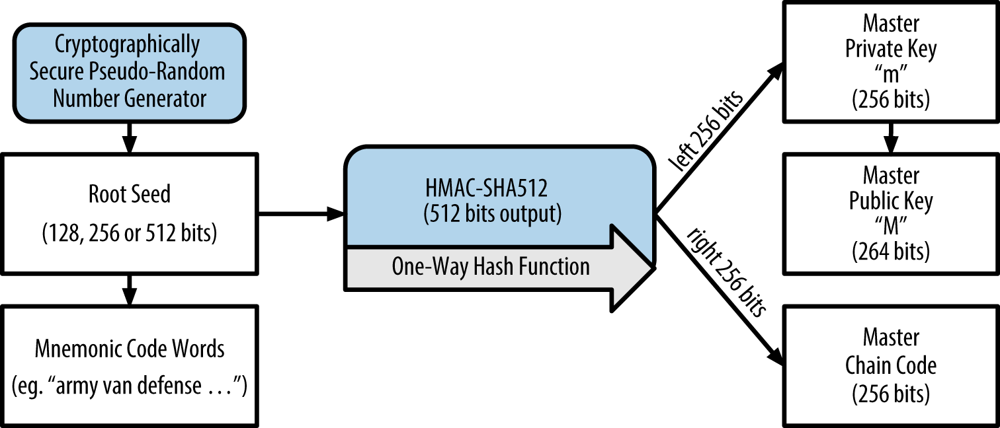
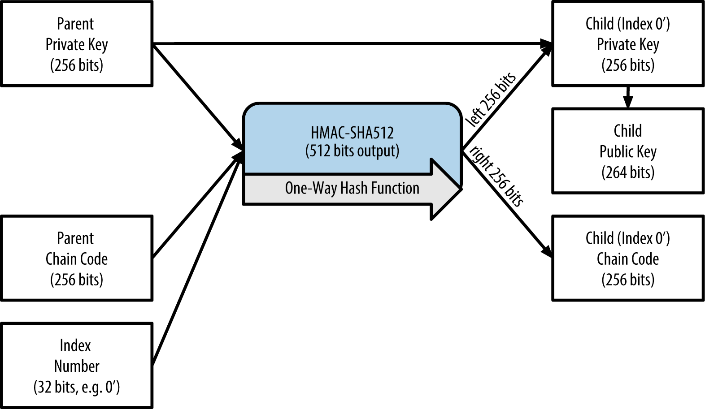
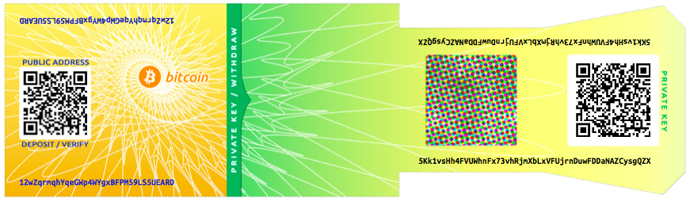

[[ch04_keys_addresses_wallets]]
== Chiavi, Indirizzi, Wallet

=== Introduzione

((("bitcoin","stabilire la proprietà dei")))La proprietà dei bitcoin si stabilisce attraverso _chiavi digitali_, _indirizzi bitcoin_, e _firme digitali_. Le chiavi digitali non sono in realtà memorizzate nella rete, ma sono invece create e memorizzate dagli utenti in un file, o in un semplice database, chiamato _wallet_ (portafoglio). Le chiavi digitali nel wallet di un utente sono completamente indipendenti dal protocollo bitcoin e possono essere generate e gestite dal software del wallet dell'utente senza alcuna relazione con la blockchain o accesso a Internet. Le Chiavi consentono molte delle interessanti proprietà dei bitcoin, inclusa controllo e la fiducia (trust) de-centralizzata, attestazione della proprietà, e il modello di sicurezza a prova crittografica. 

Ogni transazione bitcoin richiede una firma valida per essere inclusa nella blockchain, che può essere generata solo con chiavi digitali valide; pertanto, chiunque ha una copia di quelle chiavi ha il controllo del bitcoin in quel conto. Si tratta di coppie di chiavi composte da una chiave privata (segreta) e una chiave pubblica. Pensate alla chiave pubblica come ad un numero di conto bancario e la chiave privata come il PIN segreto, o la firma su un assegno che consente di controllare il conto. Queste chiavi digitali molto raramente vengono viste dagli utenti bitcoin. Per lo più, sono memorizzate all'interno del file del wallet e gestite dal software del wallet bitcoin. 

Nella parte di pagamento di una transazione bitcoin, la chiave pubblica del destinatario è rappresentata dalla sua impronta digitale, chiamata ((("indirizzi, Bitcoin", "definito"))) _indirizzo bitcoin_, che viene utilizzata allo stesso modo del nome del beneficiario su un assegno (cioè, "Pagare all'ordine di"). Nella maggior parte dei casi, un indirizzo bitcoin è generato da e corrisponde ad una chiave pubblica. Tuttavia, non tutti gli indirizzi bitcoin rappresentano chiavi pubbliche; possono anche rappresentare altri beneficiari come gli script, come vedremo più avanti in questo capitolo. In questo modo, gli indirizzi bitcoin astraggono il destinatario dei fondi, rendendo flessibile le destinazioni delle transazione, simile ad assegni di carta: un unico strumento di pagamento che può essere utilizzato per pagare nei conti delle persone, pagare nei conti delle società, pagare le bollette, o pagare in contanti. L'indirizzo Bitcoin è l'unica rappresentazione delle chiavi che gli utenti regolarmente vedono, perché questa è la parte di cui hanno bisogno di condividere con il mondo.

In questo capitolo introdurremo i wallet (portafogli), che contengono chiavi crittografiche. Vedremo come le chiavi vengono generate, archiviate e gestite. Esamineremo i vari formati di codifica utilizzati per rappresentare le chiavi pubbliche e private, gli indirizzi e gli indirizzi script (script address). Infine, prenderemo in considerazione usi speciali di chiavi: per firmare i messaggi, per dimostrare la proprietà e per creare vanity address e paper wallet (wallet su carta). 

==== La Crittografia a Chiave Pubblica e le Criptovalute

((("chiavi", id="ix_ch04-asciidoc0", range="startofrange")))((("criptovaluta")))((("chiavi","criptovaluta e")))((("chiavi","pubbliche")))((("crittografia a chiave pubblica")))((("crittografia a chiave pubblica","implementazione della")))La crittografia a chiave pubblica è stata inventata negli anni '70 (1970) ed è una delle basi matematiche dei computer e della sicurezza informatica.

Da quando  stata inventata la crittografia a chiave pubblica, sono state scoperte diverse funzioni matematiche idonee, come ad esempio ((("l'elevazione a potenza dei numeri primi"))) l'elevazione a potenza dei numeri primi e la moltiplicazione a curva ellittica. Queste funzioni matematiche sono praticamente irreversibili, nel senso che sono facili da calcolare in una direzione e impossibili da calcolare nella direzione opposta. Sulla base di queste funzioni matematiche, la crittografia consente la creazione di segreti digitali e firme digitali non falsificabili. Bitcoin usa la moltiplicazione a curva ellittica come base per la sua crittografia a chiave pubblica.  
 
In bitcoin, usiamo la crittografia a chiave pubblica per creare una coppia di chiavi che controlla l'accesso ai bitcoin. La coppia di chiavi consiste di una chiave privata e --derivata da essa-- un'unica chiave pubblica. La chiave pubblica è usata per ricevere bitcoin, e la chiave privata è usata per autorizzare transazioni per spenderli.

C'è una relazione matematica tra la chiave pubblica e quella privata che permette alla chiave privata di essere usata per generare firme sui messaggi. Questa firma può essere validata attraverso la chiave pubblica senza rivelare la chiave privata.

Quando si spendono bitcoin, il proprietario attuale dei bitcoin presenta la sua chiave pubblica e una firma (differente ogni volta, ma creata dalla stessa chiave privata) in una transazione per autorizzare il rilascio di quei bitcoin. Attraverso la presentazione della chiave pubblica e della firma, tutti i membri della rete bitcoin possono verificare e accettare la transazione come valida, confermando che la persona che trasferisce i bitcoin li ha posseduti al momento del trasferimento. 

[TIP]
====
((("wallet","coppie di chiavi nei")))Nella maggior parte delle implementazioni di wallet, le chiavi privata e pubblica sono salvate insieme come _coppia di chiavi_ per convenienza. Comunque, la chiave pubblica può essere ricavata dalla chiave privata, quindi è possibile salvare anche solo la chiave privata.
====

[[private_public_keys]]
==== Chiavi Private e Pubbliche

((( "Chiavi", "pubblica / privata"))) ((( "chiavi", "in portafogli"))) ((( "chiavi pubbliche"))) ((( "portafogli", "privato pubblico / chiavi in ​​")))Un portafoglio bitcoin contiene una raccolta di coppie di chiavi, ognuno composto da una chiave privata e una chiave pubblica. La chiave privata (k) è un numero, di solito scelto a caso. Dalla chiave privata, viene utilizzata la curva ellittica, una funzione di crittografia unidirezionale, per generare una chiave pubblica (K). Dalla chiave pubblica (K), viene utilizzata una funzione di hash crittografica unidirezionale per generare un indirizzo bitcoin (A). In questa sezione, si inizierà con la generazione della chiave privata, analizzando la matematica relativa alla curva ellittica che viene utilizzata per generare una chiave pubblica e, infine, generare un indirizzo bitcoin dalla chiave pubblica. Il rapporto tra la chiave privata, la chiave pubblica e l'indirizzo bitcoin è mostrato in < <k_to_K_to_A> >.

[[k_to_K_to_A]]
.Chiave privata, chiave pubblica e indirizzo bitcoin
image::images/msbt_0401.png["privk_to_pubK_to_addressA"]

[[private_keys]]
==== Chiavi Private

((( "Chiavi", "privato", id = "ix_ch04-asciidoc1", range = "startofrange"))) ((( "chiavi private", id = "ix_ch04-asciidoc2", range = "startofrange")))Una chiave privata è semplicemente un numero scelto a caso. La proprietà e il controllo sulla chiave privata è alla base del controllo dell'utente su tutti i fondi associati all'indirizzo bitcoin corrispondente. La chiave privata viene utilizzata per creare firme che sono necessarie per trasferire bitcoin dimostrando la proprietà dei fondi utilizzati in una transazione. La chiave privata deve rimanere segreta in ogni momento, perché rivelarla a terzi equivale a dare loro il controllo sui bitcoin associati a quella chiave. La chiave privata deve essere conservata e protetta da perdite accidentali, perché se persa non può essere recuperata e i fondi associati ad essa saranno anch'essi persi per sempre. 

[TIP]
====
((("chiavi private","creazione manuale")))La chiave privata bitcoin è soltanto un numero. Puoi generare le tue chiavi private in modo casuale utilizzando semplicemente una moneta, una matita e un foglio di carta: lancia una moneta 256 volte e otterrai le cifre binarie di una chiave privata casuale che puoi utilizzare in un wallet bitcoin. La chiave pubblica può essere successivamente generata da quella privata.
====

===== Generando una chiave privata da un numero casuale

((("chiavi private","generatore di numeri casuali", id="ix_ch04-asciidoc3", range="startofrange")))Il primo e il più importante passo per generare chiavi per trovare una fonte sicura di entropia, o casualità. Creare una chiave bitcoin é essenzialmente la stessa cosa di "Scegli un numero tra 1 e 2^256^." Il metodo esatto usato per scegliere quel numero non é importante fintanto che non è prevedibile o ripetibile. Il software bitcoin usa il generatore di numeri casuali del sistema operativo per produrre 256 bit di entropia (casualità). Di solito, il generatore di numeri casuali dell'OS è inizializzato da una fonte umana di casualità, che è il motivo per il quale qualche programma potrebbe chiederti di muovere il mouse a caso per qualche secondo. Per i veri paranoici, niente batte i dadi, una matita e un pezzo di carta.

Più accuratamente, la chiave privata potrebbe essere un qualsiasi numero da +1+ e +n - 1+, dove n è una costante (n = 1.158 * 10^77^, un po meno di 2^256^) definita come l'ordine della curva ellittica usata in bitcoin (vedi <<elliptic_curve>>). Per creare una chiave del genere, sceglieremo casualmente un numero da 256-bit e controlleremo che  sia inferiore di +n - 1+. Nei termini da programmatori, questo viene realizzato tramite il dare in pasto una stringa più lunga di bit casuali, all'algoritmo di hash SHA256 che produrrà convenientemente un numero da 256-bit. Se il risultato è meno di +n - 1+, avremo una chiave privata adeguata. Altrimenti, riproveremo nuovamente con un altro numero casuale. 
	
[TIP]
====
E' consigliato di non ri-scrivere il codice per creare un generatore di numeri casuali o di non utilizzare un generatore di numeri casuali "semplice" offerto dal tuo linguaggio di programmazione. Utilizza un ((("generatore di numeri pseudo-randomici crittograficamente sicuro (CSPRNG - cryptographically secure pseudo-random number generator')"))) generatore di numeri pseudo-randomici crittograficamente sicuro che ottenga un seed da una fonte con sufficiente entropia. Studia la documentazione della libreria di numeri casuali che hai scelto per essere certo che sia crittograficamente sicura. Una corretta implementazione del CSPRNG è critica per la sicurezza per le chiavi.
====

La seguente è una chiave privata randomicamente (k) mostrata nella sua rappresentazione esadecimale (256 cifre mostrate come 64 cifre esadecimali, ognuna da 4 bit):

----
1E99423A4ED27608A15A2616A2B0E9E52CED330AC530EDCC32C8FFC6A526AEDD
----

[TIP]
====
La dimensione dello spazio di una chiave privata bitcoion, 2^256^ è un numero incomprensibilmente grande. E' approssimativamente 10^77^ in cifre decimali. E' stato stimato che l'universo visibile contenga 10^80^ atomi.
====

Per generare una nuova chiave con il client Bitcoin Core (vedi <<ch03_bitcoin_client>>), utilizza il ((("comando getnewaddress (bitcoin-cli)"))) comando +getnewaddress+. Per ragioni di sicurezza, esso mostrerà solamente la chiave pubblica, non la chiave privata. ((("comando dumpprivkey (bitcoin-cli)")))((("chiave private","espose con bitcoind")))Per chiedere a bitcoind di esporre la chiave privata, utilizza il comando +dumpprivkey+. Il comando +dumpprivkey+ mostra la chiave privata in un formato Base58 checksum-encoded chiamato _Wallet Import Format_ (WIF), il quale esamineremo con maggiore dettaglio in <<priv_formats>>. Ecco un esempio per generare e mostrare una chiave privata utilizzando questi due comandi:

----
$ bitcoind getnewaddress
1J7mdg5rbQyUHENYdx39WVWK7fsLpEoXZy
$ bitcoind dumpprivkey 1J7mdg5rbQyUHENYdx39WVWK7fsLpEoXZy
KxFC1jmwwCoACiCAWZ3eXa96mBM6tb3TYzGmf6YwgdGWZgawvrtJ
----

Il comando +dumpprivkey+ apre il wallet e estrae la chiave privata che è stata generata dal comando +getnewaddress+. Non è invece possibile per bitcoind conoscere la chiave privata avendo solo la chiave pubblica, a meno che non siano entrambe salvate nel wallet. 

[TIP]
=====================================================================
Il comando +dumpprivkey+ non genera una chiave privata da una chiave pubblica, visto che è impossibile. Il comando semplicemente rivela la chiave privata che è già conosciuta al wallet e che è stata generata dal comando getnewaddress. 
=====================================================================

È inoltre possibile utilizzare lo strumento Bitcoin Explorer da riga di comando (si veda <libbitcoin>) per generare e visualizzare le chiavi private con i comandi ((("Bitcoin Explorer","seed command")))((("seed command (bx)"))) +seed+,((("Bitcoin Explorer","ec-new command")))((("ec-new command (bx)"))) +ec-new+ and((("Bitcoin Explorer","ec-to-wif command")))((("ec-to-wif command (bx)"))) +ec-to-wif+: (((range="endofrange", startref="ix_ch04-asciidoc3")))(((range="endofrange", startref="ix_ch04-asciidoc2")))(((range="endofrange", startref="ix_ch04-asciidoc1")))

----
$ bx seed | bx ec-new | bx ec-to-wif
5J3mBbAH58CpQ3Y5RNJpUKPE62SQ5tfcvU2JpbnkeyhfsYB1Jcn
----

[[pubkey]]
==== Chiavi Pubbliche

((("chiavi","pubbliche")))((("chiavi private","generare")))La chiave pubblica è calcolata dalla chiave privata utilizzando la proprietà di moltiplicazione delle curve ellittiche, la quale è un'operazione irreversibile: latexmath:[\(K = k * G\)] dove _k_ è la chiave privata, _G_ è un punto della curva ellittica costante chiamato _punto di generazione_ e _K_ è la chiave pubblica risultante. L' operazione inversa, conosciuta come il "trovare il logaritmo discreto"--calcolando  _k_ affinchè __K__  sia difficile da trovare come eseguendo la seguente operazione: provare tutti i possibili valori di  +k+, ovvero con una ricerca brute-force (O(n)? n.d.t). Prima di dimostrare come generare una chiave pubblica da una chiave privata, osserviamo la crittografia delle curve ellittiche un poco più in dettaglio. 

[[elliptic_curve]]
==== Crittografia a Curve Ellittiche

((("crittografia delle curve ellittiche", id="ix_ch04-asciidoc4", range="startofrange")))((("public key cryptography","elliptic curve cryptography", id="ix_ch04-asciidoc5", range="startofrange")))((("ECC", see="crittografia delle curve ellittiche")))Le Curve Ellittiche in crittografia sono un tipo di crittografia asimmetrica o crittografia a coppia di chiavi (crittografia a chiave pubblica, crittografia a chiave pubblica e privata) basata sul problema del logaritmo discreto espressa addizionando e moltiplicando i punti di una curva ellittica. 

<<ecc-curve>> è un esempio di curva ellittica, simile a quella usata da bitcoin.

[[ecc-curve]]
.Una curva ellittica
image::images/msbt_0402.png["ecc-curve"]

Bitcoin utilizza una curva ellittica specifica e una serie di costanti matematiche, definite in uno standard detto  ((("secp256k1 curve standard - curva ellittica standard secp256k1"))) +secp256k1+, stabilita dall' ((("National Institute of Standards and Technology (NIST)"))) National Institute of Standards and Technology (NIST) - Istituto Nazionale degli Standard e della Tecnologia. La curva +secp256k+ è definita dalla seguente funzione, la quale produce una curva ellittica:

[latexmath]
++++
\begin{equation}
{y^2 = (x^3 + 7)}~\text{over}~(\mathbb{F}_p)
\end{equation}
++++

o 

[latexmath]
++++
\begin{equation}
{y^2 \mod p = (x^3 + 7) \mod p}
\end{equation}
++++

Il _mod p_ (modulo del numero primo p) indica che questa curva è su un campo finito di numeri primi di ordine _p_, che possiamo scrivere come latexmath:[\(\mathbb{F}_p\)], dove  p = 2^256^ – 2^32^ – 2^9^ – 2^8^ – 2^7^ – 2^6^ – 2^4^ – 1, un numero primo molto grande. 

Dato che questa curva è definita su un campo finito di ordine primo invece che su un campo di numeri reali, viene osservata come un pattern di punti sparpagliati in due dimensioni, ed è questa proprietà che li rende difficili da visualizzare. In ogni caso, la matematica utilizzata è identica a quella di una curva ellittica su (un campo finito) di numeri reali. Come esempio, <<ecc-over-F17-math>> mostra la stessa curva ellittica su di un campo finito molto più piccolo di ordine primo 17, mostrando un pattern di punti su di una griglia. La curva ellittica bitcoin +secp256k1+ può essere visualizzata come ad un pattern molto più complesso di punti su di una griglia impensabilmente ampia. 

[[ecc-over-F17-math]]
.Crittografia a curve ellittiche: visualizzando una curva ellittica su F(p), con p=17
image::images/msbt_0403.png["ecc-over-F17-math"]

Quindi, per esempio, il seguente è un punto P con coordinate (x,y) che è un punto sulla curva +secp256k1+. Puoi controllarlo tu stesso usando Python:
----
P = (55066263022277343669578718895168534326250603453777594175500187360389116729240, 32670510020758816978083085130507043184471273380659243275938904335757337482424) 
----

====
[source, pycon]
----
Python 3.4.0 (default, Mar 30 2014, 19:23:13)
[GCC 4.2.1 Compatible Apple LLVM 5.1 (clang-503.0.38)] on darwin
Type "help", "copyright", "credits" or "license" for more information.
>>> p = 115792089237316195423570985008687907853269984665640564039457584007908834671663
>>> x = 55066263022277343669578718895168534326250603453777594175500187360389116729240
>>> y = 32670510020758816978083085130507043184471273380659243275938904335757337482424
>>> (x ** 3 + 7 - y**2) % p
0
----
====

Nella matematica delle curve ellittiche, c'è un punto chiamato il ((("punto all'infinito (ECC - curve ellittiche)"))) "punto all'infinito," il quale corrisponde quasi al ruolo del numero 0 in un'addizione. Nei computer, è reppresentato qualche volta come x = y = 0 (che non soddisfa l'equazione delle curve ellittiche, ma è un caso semplice e separato che può essere verificato).

Esiste anche ((("operatore +")))((("crittografia delle curve ellittiche","operatore - addizione"))) un operatore pass:[+], chiamato "addizione," il quale ha alcune proprietà simili a quello tradizionale sui numeri reali che i bambini imparano a scuola. Dati due punti P~1~ e P~2~ sulla curva ellittica, esiste un terzo punto  P~3~ = P~1~ + P~2~, anch'esso sulla curva ellittica.

Geometricamente, questo terzo punto P~3~ viene calcolato disegnando una linea tra P~1~ e P~2~. Questa linea andrà a intersecare la curva ellittica in esattamente un altro punto addizionale. Chiamiamo questo punto P~3~ = (x, y). Lo riflettiamo sull'asse x per ottenere P~3~ = (x, –y).

Ci sono un paio di casi particolari che chiariscono il bisogno di "puntare all'infinito".

Se P~1~ e P~2~ sono lo stesso punto, la linea "tra" P~1~ e P~2~ dovrebbe estendersi per essere la tangente sulla curva al punto P~1~. Questa tangente intersecherà la curva in esattamente un nuovo punto. Puoi utilizzare tecniche dal calcolo per determinare l'inclinazione (angolo) della linea tangente. Queste tecniche funzionano curiosamente, anche se noi stiamo restringendo il nostro interesse ai punti sulla curva con due coordinate intere!

In alcuni casi (cioè se P ~ 1 ~ e P ~ 2 ~ hanno gli stessi valori x ma diversi valori y), la linea tangente sarà esattamente verticale, nel qual caso P3 = "punto all'infinito."

Se P~1~ è il "punto all'infinito," (vedi geometria proiettiva, detto anche punto improprio n.d.t.) allora anche la sua somma P~1~ + P~2~ = P~2~. Allo stesso modo, se P~2~ è il punto all'infinito, allora è valido anche P~1~ + P~2~ = P~1~. Questo mostra come il punto all'infinito abbia il ruolo di 0.

E' il caso che pass:[+] sia associativo, il quale significa anche che è valido (A pass:[+] B) pass:[+] C = A pass:[+] (B pass:[+] C). Quindi possiamo andare a scrivere A pass:[+] B pass:[+] C senza ambiguità e senza bisogno di utilizzare parentesi. 

Ora che abbiamo definito l'addizione, possiamo definire la moltiplicazione nel modo standard che estende l'addizione. Per un punto P sulla curva ellittica, se k è un numero intero, allora kP = P + P + P + ... + P (k volte) è anche valido. Nota che k è talvolta confuso e chiamato "esponente" in questo caso.(((range="endofrange", startref="ix_ch04-asciidoc5")))(((range="endofrange", startref="ix_ch04-asciidoc4"))) 

[[public_key_derivation]]
==== Generare una Chiave Pubblica 

((("keys","public, generating", id="ix_ch04-asciidoc6", range="startofrange")))((("public keys","generating", id="ix_ch04-asciidoc7", range="startofrange")))Partendo da una chiave privata sotto forma di un numero generato in modo casuale _k_, lo moltiplichiamo con un punto predeterminato sulla curva denominato il((("generator point")))((("secp256k1 curve standard","generator point definition in"))) _generator point_ _G_ per produrre un altro punto in qualche altra parte della curva, che corrisponde alla chiave pubblica _K_. Il punto generato è specificato come parte dello stanrdard + secp256k1 + ed è sempre lo stesso per tutte le chiavi in bitcoin: 

[latexmath]
++++
\begin{equation}
{K = k * G}
\end{equation}
++++

dove k è la chiave privata, G è il punto generatore e K è la chiave pubblica risultante, un punto sulla curva. Poiché il punto di generazione è sempre lo stesso per tutti gli utenti di bitcoin, una chiave privata k moltiplicata per G avrà sempre la stessa chiave pubblica K. La relazione tra k e K è fissa, ma può essere calcolata solo in una direzione, da k a K. Ecco perché un indirizzo bitcoin (derivato da K) può essere condiviso con chiunque e non rivela la chiave privata dell'utente (k). 

[TIP]
====
Una chiave privata può essere convertita in una chiave pubblica, ma una chiave pubblica non può essere ri-convertita in una chiave privata perchè la funzione matematica utilizzata è unidirezionale. 
====

Implementando la((("moltiplicazione complessa"))) moltiplicazione complessa (teoria delle curve ellittiche), prendiamo la chiave privata k generata precedentemente e la moltiplichiamo con il punto generatore G per trovare la chiave pubblica K:

----
K = 1E99423A4ED27608A15A2616A2B0E9E52CED330AC530EDCC32C8FFC6A526AEDD * G
----

La Chiave Pubblica K è definita come punto +K = (x,y)+:

----
K = (x, y) 

dove,

x = F028892BAD7ED57D2FB57BF33081D5CFCF6F9ED3D3D7F159C2E2FFF579DC341A
y = 07CF33DA18BD734C600B96A72BBC4749D5141C90EC8AC328AE52DDFE2E505BDB
----

Per visualizzare la moltiplicazione di un punto con un numero intero, utilizzeremo la curva ellittica più semplice rispetto ai numeri reali - ricorda, la matematica è la stessa. Il nostro obiettivo è trovare il multiplo kG del punto G del generatore. Equivale ad aggiungere G a se stesso, k volte di seguito. Nelle curve ellittiche, aggiungere un punto a se stesso equivale a tracciare una linea tangente al punto e a trovare dove questa interseca nuovamente la curva, quindi a riflettere quel punto sull'asse x. 

<<ecc_illustrated>> mostra il processo di derivazione di  G, 2G, 4G, come un'operazione geometrica sulla curva.

[TIP]
====
La maggior parte delle implementazioni di bitcoin utilizzano ((("la libreria crittografica OpenSSL"))) http://bit.ly/1ql7bn8[OpenSSL cryptographic library] per gestire la matematica della curva ellittica. Ad esempio, per derivare la chiave pubblica, usano la funzione +EC_POINT_mul()+.(((range="endofrange", startref="ix_ch04-asciidoc7")))(((range="endofrange", startref="ix_ch04-asciidoc6")))(((range="endofrange", startref="ix_ch04-asciidoc0")))
====

[[ecc_illustrated]]
.Crittografia Ellittica: Visualizzando la moltiplicazione di un punto G per un intero k su una curva ellittica
image::images/msbt_0404.png["ecc_illustrated"]

=== Indirizzi Bitcoin

((("addresses, bitcoin", id="ix_ch04-asciidoc8", range="startofrange")))((("addresses, bitcoin","generally", id="ix_ch04-asciidoc9", range="startofrange")))Un indirizzo bitcoin è una stringa di cifre e caratteri che possono essere condivisi con chiunque desideri inviarti denaro. Gli indirizzi prodotti dalle chiavi pubbliche sono costituiti da una stringa di numeri e lettere, che inizia con la cifra "1". Ecco un esempio di indirizzo bitcoin:

----
1J7mdg5rbQyUHENYdx39WVWK7fsLpEoXZy
----

L'indirizzo bitcoin e' quello che appare comunemente in una transazione come il "destinatario" dei fondi. Se volessimo paragonare una transazione bitcoin ad un assegno, l'indirizzo bitcoin e' il beneficiario, che e' cio che si scrive sulla riga seguita da "Pagato all'ordine di". Su un assegno cartaceo, tale beneficiario può a volte essere il nome di un titolare di un conto bancario, ma può anche includere società, istituzioni o anche denaro contante. Poiché gli assegni cartacei non devono specificare un account (n.d.t. si fa riferimento ad assegni al portatore che in Italia non è più possibile utilizzare), ma piuttosto utilizzare un nome astratto come destinatario di fondi, ciò rende gli assegni cartacei molto flessibili come strumenti di pagamento. Le transazioni bitcoin usano un'astrazione simile, l'indirizzo bitcoin, per renderle molto flessibili. Un indirizzo bitcoin può rappresentare il proprietario di una coppia di chiavi privata/pubblica o può rappresentare qualcos'altro, come uno script di pagamento, come vedremo in <<p2sh>>. Per ora, esaminiamo il caso semplice, un indirizzo bitcoin che rappresenta, ed è derivato da, una chiave pubblica.

L'indirizzo bitcoin e' derivato dalla chiave pubblica attraverso l'uso di hashing crittografico a senso unico. Un "algoritmo di hashing" o semplicemente "algoritmo di hash" e' una funzione a senso unico che produce un'impronta digitale o "hash" di un input di dimensione arbitraria. Le funzioni di hash crittografiche sono usate ampiamente in bitcoin: negli indirizzi bitcoin, negli indirizzi di script, e negli algoritmi di mining proof-of-work. Gli algoritmi usati per creare un indirizzo bitcoin da una chiave pubblica sono il((("Secure Hash Algorithm (SHA)"))) Secure Hash Algorithm (SHA) ed il((("RACE Integrity Primitives Evaluation Message Digest (RIPEMD)"))) RACE Integrity Primitives Evaluation Message Digest (RIPEMD), specifically((("RIPEMD160")))((("SHA256"))) SHA256 e RIPEMD160. 

Iniziando con la chiave pubblica K, calcoliamo l'hash SHA256 e poi calcoliamo l'hash RIPEMD160 del risultato, producendo un numero a 160-bit (20-byte):
[latexmath]
++++
\begin{equation}
{A = RIPEMD160(SHA256(K))}
\end{equation}
++++
dove K è la chiave pubblica e A è l'indirizzo bitcoin risultante. 

[TIP]
====
((("addresses, bitcoin","public keys vs.")))((("public keys","bitcoin addresses vs.")))Un indirizzo bitcoin _non_ e' la stessa cosa di una chiave pubblica. Gli indirizzi bitcoin sono derivati da una chiave pubblica usando una funzione a senso unico.  
====

Gli indirizzi bitcoin sono quasi sempre presentati agli utenti in una codifica chiamata((("addresses, bitcoin","Base58 encoding", id="ix_ch04-asciidoc10", range="startofrange")))((("addresses, bitcoin","Base58Check encoding", id="ix_ch04-asciidoc11", range="startofrange")))((("Base58 encoding", id="ix_ch04-asciidoc12", range="startofrange")))((("Base58Check encoding", id="ix_ch04-asciidoc13", range="startofrange"))) "Base58Check" (see <1>), che usa 58 caratteri (sistema numerico Base58) ed un checksum per facilitare la leggibilità umana, evitando ambiguità, e proteggere contro errori nella trascrizione ed ingresso di indirizzi. Base58Check e' utilizzato anche in molti altri modi in bitcoin, se c'e' il bisogno per l'utente di leggere e trascrivere correttamente un numero, come un indirizzo bitcoin, una chiave privata, una chiave criptata, o un hash di script. Nella prossima sezione esamineremo il meccanismo di codifica e decodifica di Base58Check, e le rappresentazioni risultanti. <2> Illustra la conversione di una chiave pubblica in un indirizzo bitcoin.(((range="endofrange", startref="ix_ch04-asciidoc13")))

[[pubkey_to_address]]
.Da chiave pubblica a indirizzo bitcoin: conversione di una chiave pubblica in un indirizzo bitcoin  
image::images/msbt_0405.png["pubkey_to_address"]

[[base58]]
==== Encoding Base58 e Base58Check

Al fine di rappresentare lunghi numeri in maniera compatta, usando alcuni simboli, molti sistemi di computer usano rappresentazioni alfanumeriche miste con una base (o radice) superiore a 10. Ad esempio, se il sistema decimale tradizionale usa i 10 numerali 0 fino a 9, il sistema esadecimale usa 16, con le lettere A fino ad F come 6 simboli aggiuntivi. Un numero rappresentato nel formato esadecimale e' piu corto rispetto all'equivalente rappresentazione. Anche piu compatto,((("Rappresentazione Base-64"))) la rappresentazione Base-64 usa 26 lettere minuscole, 26 lettere maiuscole, 10 numerali, e due ulteriori caratteri come "\+" e "/" per trasmettere dati binari attraverso medium testuali come email. Base-64 e' maggiormente utilizzato per aggiungere allegati binari alle email. Base58 e' un formato di codifica binario testuale sviluppato per l'impiego in bitcoin and usato in molte altre criptovalute. Offre un equilibrio tra compatta rappresentazione, leggibilita', e riconoscimento e prevenzione degli errori. Base58 e' un sottoinsieme di Base64, impiegando lettere maiuscole e minuscole e numeri, ma omettendo alcuni caratteri che sono frequentemente confusi per altri e che possono sembrare identici quando visualizzati in alcuni tipi di font. In particolare, Base58 e' Base64 senza lo 0 (numero zero), O (o maiuscola), l (L minuscola), I (i maiuscola), ed il simbolo "\+" e "/". O, piu semplicemente, e' un insieme di lettere minuscole e maiuscole e numeri senza il quartetto (0, O,  l, I) appena menzionato. 

[[base58alphabet]]
.alfabeto bitcoin in Base58
====
----
123456789ABCDEFGHJKLMNPQRSTUVWXYZabcdefghijkmnopqrstuvwxyz
----
====

Per aggiungere ulteriore sicurezza rispetto ad errori di battitura o di trascrizione, Base58Check e' un formato di codifica Base58, usato di frequente in bitcoin, che ha un codice per la verifica degli errori integrato. Il checksum sono degli ulteriori quattro byte aggiunti alla fine dei dati che vengono codificati. Il checksum deriva dall'hash dei dati codificati e può quindi essere utilizzato per rilevare e prevenire errori di trascrizione e di battitura. Quando viene presentato con un codice Base58Check, il software di decodifica calcola il checksum dei dati e lo confronta con il checksum incluso nel codice. Se i due non corrispondono, ciò indica che è stato introdotto un errore e che i dati di Base58Check non sono validi. Ad esempio, ciò impedisce che un indirizzo bitcoin errato venga accettato dal software wallet come destinazione valida, un errore che altrimenti comporterebbe una perdita di fondi.

((("data, converting to Base58Check")))Per convertire i dati (un numero) in un formato Base58Check, prima aggiungiamo un prefisso ai dati, chiamato "byte di versione", che serve per identificare facilmente il tipo di dati che è codificato. Ad esempio, nel caso di un indirizzo bitcoin il prefisso è zero (0x00 in esadecimale), mentre il prefisso usato quando si codifica una chiave privata è 128 (0x80 in esadecimale). Un elenco di prefissi di versione comuni è mostrato in <<base58check_versions>>.

Successivamente, calcoliamo il checksum a "doppio-SHA", cioè applichiamo l'algoritmo di hashing SHA256 due volte sul risultato precedente (prefisso e dati).
 
----
checksum = SHA256(SHA256(prefix+data)) 
----

Dal risultante hash a 32 byte (hash del hash), prendiamo solo i primi quattro byte. Questi quattro byte servono come codice di controllo degli errori o ((("checksum"))) checksum. Il checksum è concatenato (aggiunto) alla fine. 

Il risultato è composto da tre elementi: un prefisso, i dati e un checksum. Questo risultato è codificato usando l'alfabeto Base58 descritto in precedenza. <<base58check_encoding>> illustra il processo di codifica Base58Check.

[[base58check_encoding]]
.encoding Base58Check: un formato Base58, versionato, con checksum per codificare dati bitcoin senza generare ambiguità
image::images/msbt_0406.png["Base58CheckEncoding"]

In bitcoin, la maggior parte dei dati presentati all'utente è codificata Base58Check per renderli compatti, facili da leggere e facilitare la rilevazione degli errori. Il prefisso di versione nella codifica Base58Check viene utilizzato per creare formati facilmente distinguibili, che quando codificati in Base58 contengono caratteri specifici all'inizio della stringa  codificata in Base58Check. Questi caratteri rendono facile per gli umani identificare il tipo di dati codificati e come usarli. Questo è ciò che differenzia, per esempio, un indirizzo bitcoin codificato Base58Check che inizia con un 1 da un formato WIF con chiave privata codificata Base58Check che inizia con un 5. Alcuni esempi di prefissi di versione e i relativi caratteri Base58 sono mostrati in <<base58check_versions>>. ((("Base58Check encoding", "prefixes, listed"))))

++++
<?hard-pagebreak?>
++++

[[base58check_versions]]
.Prefisso di versione Base58Check e esempi del risultato 
[options="header"]
|=======
|Tipo| Prefisso di versione (esadecimale)| Prefisso del risultato Base58
| Indirizzo Bitcoin | 0x00 | 1 
| Indirizzo Pay-to-Script-Hash | 0x05 | 3 
| Indirizzo Bitcoin Testnet | 0x6F | m oppure n 
| Private Key WIF |  0x80 | 5, K oppure L 
| Chiave Privata Criptata BIP38 | 0x0142 | 6P 
| Chiave Pubblica Estesa BIP32 | 0x0488B21E | xpub  
|=======

Diamo un'occhiata al processo completo di creazione di un indirizzo bitcoin, da una chiave privata, a una chiave pubblica (un punto sulla curva ellittica), a un indirizzo a doppio hash e infine alla codifica Base58Check. Il codice C ++ in <<addr_example>> mostra passo-passo il processo completo, dalla chiave privata all'indirizzo bitcoin codificato Base58Check. Il codice di esempio utilizza la libreria libbitcoin introdotta in <<alt_libraries>> per alcune funzioni di supporto. ((("Base58Check encoding", "indirizzo bitcoin, codice completo per")))

[[addr_example]]
.Creazione di un indirizzo bitcoin Base58Check-encoded da una chiave privata
====
[source, cpp]
----
include::code/addr.cpp[]
----
====

Il codice usa una chiave privata predefinita in modo che produca lo stesso indirizzo bitcoin ogni volta che viene eseguito, come mostrato in <<addr_example_run>>. (((Range = "endofrange", startref = "ix_ch04-asciidoc12"))) ((( range = "endofrange", startref = "ix_ch04-asciidoc11"))) (((range = "endofrange", startref = "ix_ch04-asciidoc10"))) (((range = "endofrange", startref = "ix_ch04-asciidoc9 ")))

[[addr_example_run]]
.Compilando ed eseguendo il codice addr
====
[source,bash]
----
# Compila il codice addr.cpp
$ g++ -o addr addr.cpp $(pkg-config --cflags --libs libbitcoin)
# Esegui l'eseguibile addr Run the addr executable
$ ./addr
Public key: 0202a406624211f2abbdc68da3df929f938c3399dd79fac1b51b0e4ad1d26a47aa
Address: 1PRTTaJesdNovgne6Ehcdu1fpEdX7913CK
----
====

==== Formati di Chiavi

((("addresses, bitcoin","key formats", id="ix_ch04-asciidoc14", range="startofrange")))((("keys","formats of", id="ix_ch04-asciidoc15", range="startofrange")))Sia le chiavi private che quelle pubbliche possono essere rappresentate in numerosi formati diversi. Queste rappresentazioni codificano tutte lo stesso numero, anche se hanno un aspetto diverso. Questi formati vengono principalmente utilizzati per semplificare la lettura e la trascrizione delle chiavi da parte delle persone senza introdurre errori.

[[priv_formats]]
===== Formati delle Chiavi Private

((("private keys","format")))((("Bitcoin Explorer","modifying private key formats with")))La chiave privata può essere rappresentata in numerosi formati diversi, ognuno dei quali corrisponde allo stesso numero di 256-bit. <<table_4-2>> mostra tre formati comuni utilizzati per rappresentare le chiavi private.

[[table_4-2]]
.Rappresentazioni di chiavi private (formati di codifica)
[options="header"]
|=======
|Tipo|Prefisso|Descrizione
| Hex | Nessuno | 64 cifre esadecimali
| WIF |  5 | encoding Base58Check: Base58 con prefisso di versione di 128 e checksum a 32-bit
| WIF-compressed | K or L | Come sopra, con l'aggiunta di un suffisso 0x01 precedente all'encoding
|=======

<<table_4-3>> mostra la chiave provata generata nei seguenti tre formati.

++++
<?hard-pagebreak?>
++++

[[table_4-3]]
.Esempio: Stessa chiave, formati differenti
[options="header"]
|=======
|Formato | Chiave Privata
| Hex | 1e99423a4ed27608a15a2616a2b0e9e52ced330ac530edcc32c8ffc6a526aedd 
| WIF | 5J3mBbAH58CpQ3Y5RNJpUKPE62SQ5tfcvU2JpbnkeyhfsYB1Jcn
| WIF-compressed | KxFC1jmwwCoACiCAWZ3eXa96mBM6tb3TYzGmf6YwgdGWZgawvrtJ
|=======

Tutte queste rappresentazioni sono modi diversi di mostrare lo stesso numero, la stessa chiave privata. Sembrano diverse, ma qualunque di questi formati possono essere convertiti in qualsiasi altro formato. 

Usiamo il((("Bitcoin Explorer","comando wif-to-ec")))((("comando wif-to-ec (bx)"))) comando +wif-to-ec+ dal  Bitcoin Explorer (vedi <<libbitcoin>>) per mostrare entrambe le chiavi WIF rappresentanti la stessa chiave privata:
----
$ bx wif-to-ec 5J3mBbAH58CpQ3Y5RNJpUKPE62SQ5tfcvU2JpbnkeyhfsYB1Jcn
1e99423a4ed27608a15a2616a2b0e9e52ced330ac530edcc32c8ffc6a526aedd

$ bx wif-to-ec KxFC1jmwwCoACiCAWZ3eXa96mBM6tb3TYzGmf6YwgdGWZgawvrtJ
1e99423a4ed27608a15a2616a2b0e9e52ced330ac530edcc32c8ffc6a526aedd
----

===== Decodifica da Base58Check

((("Base58Check encoding","decoding to hex")))I comandi di Bitcoin Explorer (vedi <<libbitcoin>>) semplificano la scrittura di script di shell e "pipes" da riga di comando che manipolano chiavi bitcoin, indirizzi e transazioni. È possibile utilizzare Bitcoin Explorer per decodificare il modulo in formato Base58Check da riga di comando.

Usiamo il comando ((("Bitcoin Explorer","base58check-decode command")))((("base58check-decode command (bx)"))) +base58check-decode+ per decodificare e decomprimere la chiave:
----
$ bx base58check-decode 5J3mBbAH58CpQ3Y5RNJpUKPE62SQ5tfcvU2JpbnkeyhfsYB1Jcn
wrapper
{
    checksum 4286807748
    payload 1e99423a4ed27608a15a2616a2b0e9e52ced330ac530edcc32c8ffc6a526aedd
    version 128
}
----

Il risultato contiene una chiave come payload, il prefisso Wallet Import Format (WIF) 128, e un checksum. 

Nota che il "payload" della chiave compressa è accodato con il suffisso +01+, stando a segnalare che la chiave pubblica derivata è da generare compressa.
----
$ bx base58check-decode KxFC1jmwwCoACiCAWZ3eXa96mBM6tb3TYzGmf6YwgdGWZgawvrtJ
wrapper
{
    checksum 2339607926
    payload 1e99423a4ed27608a15a2616a2b0e9e52ced330ac530edcc32c8ffc6a526aedd01
    version 128
}
----

===== Codifica da esadecimale a Base58Check

((("Base58Check encoding","from hex")))Per codificare in Base58Check (l'opposto del comando precedente), usiamo il comando ((("Bitcoin Explorer","base58check-encode command")))((("base58check-encode command (bx)"))) +base58check-encode+ da Bitcoin Explorer (vedi <<libbitcoin>>) fornendo la chiave privata esadecimale, seguita dal ((("Base58Check encoding","WIF prefix for")))((("Wallet Import Format (WIF)"))) Prefisso della versione WIF (Wallet Import Format) 128:
----
bx base58check-encode 1e99423a4ed27608a15a2616a2b0e9e52ced330ac530edcc32c8ffc6a526aedd --version 128
5J3mBbAH58CpQ3Y5RNJpUKPE62SQ5tfcvU2JpbnkeyhfsYB1Jcn
----

===== Codifica da hex (chiave compressa) a Base58Check

((("chiavi compresse","encoding/decoding da Base58Check"))) Per effettuare la codifica in Base58Check come chiave privata "compressa" (vedi <<comp_priv>>), accodiamo il suffisso +01+ alla chiave esadecimale e poi la codifichiamo come abbiamo fatto prima:
----
$ bx base58check-encode 1e99423a4ed27608a15a2616a2b0e9e52ced330ac530edcc32c8ffc6a526aedd01 --version 128
KxFC1jmwwCoACiCAWZ3eXa96mBM6tb3TYzGmf6YwgdGWZgawvrtJ
----

Il formato WIF-compressed risultante inizia con una "K". Questo denota che la chiave privata contenuta ha il suffisso di "01" e sarà usata per produrre solo chiavi pubbliche compresse (vedi <<comp_pub>>).

===== Formati di Chiavi Pubbliche

((("public keys","formats of")))Le chiavi pubbliche vengono presentate anche in diversi modi, soprattutto come chiavi pubbliche _compresse_ o _non compresse_. 

Come abbiamo visto in precedenza, la chiave pubblica è un punto sulla curva ellittica costituito da una coppia di coordinate + (x, y) +. Di solito viene presentato con il prefisso((("Wallet Import Format (WIF)","for uncompressed keys"))) +04+ seguito da due numeri a 256-bit, uno per la coordinata _x_ del punto, l'altro per la coordinata _y_. Il prefisso +04+ viene utilizzato per distinguere le chiavi pubbliche non compresse dalle chiavi pubbliche compresse che iniziano con +02+ o +03+.

Ecco la chiave pubblica generata dalla chiave privata che abbiamo creato in precedenza, mostrata con le coordinate + x + e + y +:

----
x = F028892BAD7ED57D2FB57BF33081D5CFCF6F9ED3D3D7F159C2E2FFF579DC341A
y = 07CF33DA18BD734C600B96A72BBC4749D5141C90EC8AC328AE52DDFE2E505BDB
----

Qui si può notare la stessa chiave pubblica mostrata come un numero da 520-bit (130 cifre esadecimali) con il prefisso +04+ seguito dalle coordinate +x+ e +y+, come +04 x y+: 

----
K = 04F028892BAD7ED57D2FB57BF33081D5CFCF6F9ED3D3D7F159C2E2FFF579DC341A<?pdf-cr?>07CF33DA18BD734C600B96A72BBC4749D5141C90EC8AC328AE52DDFE2E505BDB
----

[[comp_pub]]
===== Chiavi pubbliche compresse

pass:[<?dbhtml orphans="4"?>]Le chiavi pubbliche compresse sono state introdotte in bitcoin per ridurre la dimensione delle transazioni e risparmiare spazio su disco su nodi che memorizzano la blockchain. La maggior parte delle transazioni include la chiave pubblica, necessaria per convalidare le credenziali del proprietario e per trasferire il bitcoin. Ogni chiave pubblica richiede 520 bit (prefisso \+ x \+ y), che quando moltiplicato per diverse centinaia di transazioni per blocco o decine di migliaia di transazioni al giorno, aggiunge una quantità significativa di dati alla blockchain.((("compressed public keys", id="ix_ch04-asciidoc16", range="startofrange")))((("public keys","compressed", id="ix_ch04-asciidoc17", range="startofrange")))

Come abbiamo visto nella sezione <<pubkey>>, una chiave pubblica è un punto (x, y) su una curva ellittica. Poiché la curva esprime una funzione matematica, un punto sulla curva rappresenta una soluzione all'equazione e, quindi, se conosciamo la coordinata _x_, possiamo calcolare la coordinata _y_ risolvendo l'equazione y^2^ mod p = (x ^ 3 ^ + 7) mod p. Ciò ci consente di memorizzare solo la coordinata _x_ del punto chiave pubblico, omettendo la coordinata _y_ e riducendo la dimensione della chiave e lo spazio richiesto per memorizzarla di 256 bit. Una riduzione di quasi il 50% delle dimensioni in ogni transazione consente di risparmiare molto spazi dati nel tempo!

Mentre le chiavi pubbliche non compresse hanno un prefisso +04+, ((("Wallet Import Format (WIF)","for compressed keys"))) le chiavi pubbliche compresse iniziano con un prefisso + 02+ o +03+. Vediamo perché ci sono due possibili prefissi: perché il lato sinistro dell'equazione è y^2^, ciò significa che la soluzione per y è una radice quadrata, che può avere un valore positivo o negativo. Visivamente, ciò significa che la coordinata _y_ risultante può essere sopra l'asse x o sotto l'asse x. Come si può vedere dal grafico della curva ellittica in <<ecc-curve>>, la curva è simmetrica, il che significa che viene riflessa come uno specchio dall'asse x. Quindi, mentre possiamo omettere la coordinata _y_, dobbiamo memorizzare il segno di y (positivo o negativo), o in altre parole, dobbiamo ricordare se era sopra o sotto l'asse x poiché ciascuna di queste opzioni rappresenta un diverso punto e una chiave pubblica diversa. Quando si calcola la curva ellittica nell'aritmetica binaria sul campo finito dell'ordine primo p, la coordinata _y_ è pari o dispari, che corrisponde al segno positivo / negativo come spiegato in precedenza. Pertanto, per distinguere tra i due possibili valori di y, memorizziamo una chiave pubblica compressa con il prefisso +02+ se + y + è pari, e +03+ se è dispari, consentendo al software di dedurre correttamente la coordinata _y_ la coordinata _x_ e decomprimere la chiave pubblica per le coordinate complete del punto. La compressione della chiave pubblica è illustrata in <<pubkey_compression>>. 

[[pubkey_compression]]
.Compressione di una chiave pubblicaPublic key compression
image::images/msbt_0407.png["pubkey_compression"]

((("public keys","compression")))Ecco la stessa chiave pubblica generata in precedenza, mostrata come una chiave pubblica compressa memorizzata in 264 bit (66 cifre esadecimali) con il prefisso +03+ che indica che la coordinata _y_ è dispari:

----
K = 03F028892BAD7ED57D2FB57BF33081D5CFCF6F9ED3D3D7F159C2E2FFF579DC341A
----

((("addresses, bitcoin","converting compressed keys to")))((("compressed keys","converting to bitcoin addresses")))Questa chiave pubblica compressa corrisponde alla stessa chiave privata, il che significa che è generata dalla stessa chiave privata. Tuttavia, sembra diversa dalla chiave pubblica non compressa. Ancora più importante, se convertiamo questa chiave pubblica compressa in un indirizzo bitcoin usando la funzione di double-hash (+RIPEMD160(SHA256(K))+) produrremo un indirizzo bitcoin differente. Ciò può essere fonte di confusione, perché significa che una singola chiave privata può produrre una chiave pubblica espressa in due formati diversi (compressi e non compressi) che producono due indirizzi bitcoin diversi. Tuttavia, la chiave privata è identica per entrambi gli indirizzi bitcoin.

((("blockchains","size of, and compressed public keys")))Le chiavi pubbliche compresse stanno diventando gradualmente l'impostazione predefinita tra i client bitcoin, il che sta avendo un impatto significativo sulla riduzione delle dimensioni delle transazioni e quindi della blockchain. Tuttavia, non tutti i client supportano ancora chiavi pubbliche compresse. I client più recenti che supportano chiavi pubbliche compresse devono tenere conto delle transazioni da client precedenti che non supportano chiavi pubbliche compresse. Questo è particolarmente importante quando un'applicazione wallet sta importando chiavi private da un'altra applicazione wallet di bitcoin, perché il nuovo portafoglio ha bisogno di scansionare la blockchain per trovare le transazioni corrispondenti a queste chiavi importate. Per quali indirizzi bitcoin deve essere cercato il portafoglio bitcoin? Gli indirizzi bitcoin saranno prodotti da chiavi pubbliche non compresse o  da chiavi pubbliche compresse? Entrambi sono indirizzi bitcoin validi e possono essere firmati con la chiave privata, ma sono indirizzi diversi!

((("Wallet Import Format (WIF)","newer bitcoin wallets and")))Per risolvere questo problema, quando le chiavi private vengono esportate da un portafoglio, il formato di importazione del wallet utilizzato per rappresentarli viene implementato in modo diverso nel nuovo wallet bitcoin, per indicare che queste chiavi private sono state utilizzate per produrre chiavi pubbliche _compresse_ e quindi indirizzi bitcoin  _compressi_. Ciò consente al wallet di importazione di distinguere tra chiavi private provenienti da portafogli più vecchi o più recenti e cercare sulla blockchain le transazioni con gli indirizzi bitcoin corrispondenti rispettivamente alle chiavi pubbliche non compresse o compresse. Nella prossima sezione diamo un'occhiata a come funziona nel dettaglio.(((range="endofrange", startref="ix_ch04-asciidoc17")))(((range="endofrange", startref="ix_ch04-asciidoc16"))) 

[[comp_priv]]
===== Chiavi private compresse

((("compressed private keys")))((("private keys","compressed")))Ironia della sorte, il termine "chiave privata compressa" è fuorviante, perché quando una chiave privata viene esportata come compressa WIF, in realtà è un byte più lungo di una chiave privata "non compressa". Questo perché ha aggiunto il suffisso 01, che significa che proviene da un nuovo portafoglio e dovrebbe essere usato solo per produrre chiavi pubbliche compresse. Le chiavi private non sono compresse e non possono essere compresse. Il termine "chiave privata compressa" significa realmente "chiave privata da cui devono essere derivate le chiavi pubbliche compresse", mentre "chiave privata non compressa" significa in realtà "chiave privata da cui derivare le chiavi pubbliche non compresse". Si dovrebbe solo fare riferimento al formato di esportazione come "WIF-compressed" o "WIF" e non fare riferimento alla chiave privata come "compressa" per evitare ulteriore confusione.

Ricorda, questi formati _non_ sono usati in modo intercambiabile. In un nuovo portafoglio che implementa chiavi pubbliche compresse, le chiavi private verranno sempre esportate come WIF-compressed  (con un prefisso K o L). Se il wallet adotta un'implementazione meno recente e non utilizza chiavi pubbliche compresse, le chiavi private verranno sempre esportate come WIF (con 5 come prefisso). L'obiettivo è di segnalare al wallet che sta eseguendo l'importazione, queste chiavi private, e se deve cercare sulla blockchain per chiavi e indirizzi pubblici compressi o non compressi.

Se un portafoglio bitcoin è in grado di implementare chiavi pubbliche compresse, utilizzerà quelle in tutte le transazioni. Le chiavi private nel portafoglio verranno utilizzate per ricavare i punti chiave pubblici sulla curva, che verranno quindi compressi. Le chiavi pubbliche compresse verranno utilizzate per produrre indirizzi bitcoin e quelle saranno utilizzate nelle transazioni. Quando si esportano chiavi private da un nuovo portafoglio che implementa chiavi pubbliche compresse, viene modificato il formato di importazione del wallet, con l'aggiunta di un suffisso di un byte +01+ alla chiave privata. La chiave privata codificata Base58Check risultante è chiamata "WIF compressed" e inizia con la lettera K o L, invece di iniziare con "5" come nel caso delle chiavi codificate WIF (non compresse) dai portafogli più vecchi. 

<<table_4-4>> mostra la stessa chiave, codificata nei formati WIF e WIF-compressed.

[[table_4-4]]
.Esempio: Stessa chiave, formati differenti
[options="header"]
|=======
|Formato | Chiave Privata
| Esadecimale | 1E99423A4ED27608A15A2616A2B0E9E52CED330AC530EDCC32C8FFC6A526AEDD
| WIF | 5J3mBbAH58CpQ3Y5RNJpUKPE62SQ5tfcvU2JpbnkeyhfsYB1Jcn
| Esadecimale-compressa | 1E99423A4ED27608A15A2616A2B0E9E52CED330AC530EDCC32C8FFC6A526AEDD_01_
| WIF-compressed | KxFC1jmwwCoACiCAWZ3eXa96mBM6tb3TYzGmf6YwgdGWZgawvrtJ
|=======

[TIP]
====
"Chiavi private compresse" è un termine improprio! Non sono compressi; piuttosto, il formato WIF-compressed significa che dovrebbero essere usati solo per generare chiavi pubbliche compresse e i loro corrispondenti indirizzi bitcoin. Ironia della sorte, una chiave privata codificata "WIF-compressed" è un byte più lungo perché ha il suffisso aggiunto 01 per distinguerlo da un "non compresso".(((range="endofrange", startref="ix_ch04-asciidoc15")))(((range="endofrange", startref="ix_ch04-asciidoc14")))(((range="endofrange", startref="ix_ch04-asciidoc8")))
====

=== Implementando le Chiavi e gli Indirizzi in Python  

((("addresses, bitcoin","implementing in Python", id="ix_ch04-asciidoc18", range="startofrange")))((("keys","implementing in Python", id="ix_ch04-asciidoc19", range="startofrange")))((("pybitcointools", id="ix_ch04-asciidoc20", range="startofrange")))((("Python","implementing addresses in", id="ix_ch04-asciidoc21", range="startofrange")))((("Python","implementing keys in", id="ix_ch04-asciidoc22", range="startofrange")))La libreria in Python più completa è https://github.com/vbuterin/pybitcointools[pybitcointools] by((("Buterin, Vitalik"))) Vitalik Buterin. In <<key-to-address_script>>, abbaimo usato la libreria pybitcointools (importata come "bitcoin") per generare e mostrare chiavi e indirizzi nei vari formati.

[[key-to-address_script]]
.Generazione di chiavi e indirizzi e formattazione tramite la libreria pybitcointools
====
[source,python]
----
include::code/key-to-address-ecc-example.py[]
----
====

<<key-to-address_script_run>> mostra l'output ottenuto eseguendo questo codice.

[[key-to-address_script_run]]
.Eseguendo key-to-address-ecc-example.py
====
++++
<screen>
$ python key-to-address-ecc-example.py 
Private Key (hex) is:  
 3aba4162c7251c891207b747840551a71939b0de081f85c4e44cf7c13e41daa6
Private Key (decimal) is:  
 26563230048437957592232553826663696440606756685920117476832299673293013768870
Private Key (WIF) is:  
 5JG9hT3beGTJuUAmCQEmNaxAuMacCTfXuw1R3FCXig23RQHMr4K
Private Key Compressed (hex) is:  
 3aba4162c7251c891207b747840551a71939b0de081f85c4e44cf7c13e41daa601
Private Key (WIF-Compressed) is:  
 KyBsPXxTuVD82av65KZkrGrWi5qLMah5SdNq6uftawDbgKa2wv6S
Public Key (x,y) coordinates is: 
 (41637322786646325214887832269588396900663353932545912953362782457239403430124L, 
 16388935128781238405526710466724741593761085120864331449066658622400339362166L)
Public Key (hex) is: 
 045c0de3b9c8ab18dd04e3511243ec2952002dbfadc864b9628910169d9b9b00ec<?pdf-cr?>243bcefdd4347074d44bd7356d6a53c495737dd96295e2a9374bf5f02ebfc176
Compressed Public Key (hex) is: 
 025c0de3b9c8ab18dd04e3511243ec2952002dbfadc864b9628910169d9b9b00ec
Bitcoin Address (b58check) is: 
 1thMirt546nngXqyPEz532S8fLwbozud8
Compressed Bitcoin Address (b58check) is: 
 14cxpo3MBCYYWCgF74SWTdcmxipnGUsPw3
</screen>
++++
====

<<ec_math>> ((("elliptic curve cryptography","in Python")))((("Python ECDSA library")))è un altro esempio, utilizzando la libreria Python ECDSA per la matematica della curva ellittica senza utilizzare alcuna libreria specializzata di bitcoin .

[[ec_math]]
.Uno script che dimostra la matematica a curve ellittiche usata per le chiavi bitcoin
====
[source, python]
----
include::code/ec-math.py[]
----
====

<<ec_math_run>> mostra l'output prodotto dall'esecuzione di questo script.(((range="endofrange", startref="ix_ch04-asciidoc22")))(((range="endofrange", startref="ix_ch04-asciidoc21")))(((range="endofrange", startref="ix_ch04-asciidoc20")))(((range="endofrange", startref="ix_ch04-asciidoc19")))(((range="endofrange", startref="ix_ch04-asciidoc18")))

[NOTE]
====
L'esempio sopra utilizza +os.urandom+, che riflette un generatore di numeri casuali crittograficamente sicuro (CSRNG) fornito dal sistema operativo sottostante. Nel caso di un sistema operativo simile a UNIX come Linux, si basa su +/dev/urandom+; e nel caso di Windows, esegue +CryptGenRandom()+. Se non viene trovata una fonte di generazione di casualità, verrà restituito +NotImplementedError+. Il generatore di numeri casuali utilizzato qui è a scopo dimostrativo, non è appropriato per la generazione di chiavi bitcoin con qualità di produzione poiché non è implementato con sufficiente sicurezza.
====

[[ec_math_run]]
.Installando la libreria Python ECDSA ed eseguendo lo script ec_math.py
====
----
$ # Installa PIP, il package manager di Python 
$ sudo apt-get install python-pip
$ # Installa la libreria Python ECDSA
$ sudo pip install ecdsa
$ # Esegui lo script
$ python ec-math.py 
Secret:  38090835015954358862481132628887443905906204995912378278060168703580660294000
EC point: (70048853531867179489857750497606966272382583471322935454624595540007269312627, 105262206478686743191060800263479589329920209527285803935736021686045542353380)
BTC public key: 029ade3effb0a67d5c8609850d797366af428f4a0d5194cb221d807770a1522873
----
====

=== I Wallet

((("wallets", id="ix_ch04-asciidoc23", range="startofrange")))I Wallet sono contenitori di chiavi private, solitamente implementati come file strutturati o semplici database. 
Un altro metodo per creare chiavi è ((("deterministic key generation"))) il generatore di chiavi deterministiche. Qui si ricava ogni nuova chiave privata, utilizzando una funzione di hash unidirezionale da una chiave privata precedente, collegandole in una sequenza. Finché puoi ricreare quella sequenza, ti serve solo la prima chiave (nota come _seed_ o _master_ key) per generarle tutti. In questa sezione esamineremo i diversi metodi di generazione delle chiavi e la struttura del wallet che è costruita attorno a esse. 

[TIP]
====
I wallet di Bitcoin contengono chiavi, non monete. Ogni utente ha un portafoglio contenente le chiavi. I wallet sono in realtà portachiavi contenenti coppie di chiavi private/pubbliche (vedi <<private_public_keys>>). Gli utenti firmano le transazioni con le chiavi, dimostrando di possedere le gli output delle transazioni (le loro monete). Le monete sono memorizzate sulla blockchain sotto forma di transazioni di output (spesso indicate come vout o txout).((("txout notation")))((("vout notation")))
====

[[random_wallet]]
==== Wallet (Casuali) Nondeterministici

((("nondeterministic wallets")))((("random wallets")))((("Type-0 nondeterministic wallet")))((("wallets","nondeterministic")))((("wallets","random")))Nei primi client bitcoin, i wallet erano semplicemente raccolte di chiavi private generate casualmente. Questo tipo di portafoglio è chiamato _Type-0 wallet non deterministico_. Ad esempio, il ((("Just a Bunch Of Keys (JBOK) wallets"))) client Bitcoin Core pre-genera 100 chiavi private casuali quando viene avviato per la prima volta e genera più chiavi a secondo della necessità, utilizzando ogni chiave una sola volta. Questo tipo di portafogli è soprannominato "Just a Bunch Of Keys" o JBOK e tali wallet vengono sostituiti con wallet deterministici perché sono scomodi da gestire, occorre eseguire il backup e l'importazione. ((("backups","of random wallets")))((("random wallets","backing up")))Lo svantaggio delle chiavi casuali è che, se si generano molte di esse, è necessario conservare le copie di tutte loro, il che significa che sul wallet deve essere eseguito frequentemente un backup. Ogni chiave deve essere salvata, oppure i fondi che controlla vengono persi irrevocabilmente se il wallet diventa inaccessibile. Ciò contrasta direttamente con il principio di evitare il riutilizzo degli indirizzi, utilizzando ciascun indirizzo bitcoin per una sola transazione. Il riutilizzo degli indirizzi riduce la privacy associando più transazioni e indirizzi tra loro. Un portafoglio non deterministico di tipo 0 è una scelta scadente del portafoglio, soprattutto se si desidera evitare il riutilizzo degli indirizzi poiché ciò significa gestire molte chiavi, il che crea la necessità di backup frequenti. Sebbene il client Bitcoin Core includa un portafoglio Type-0, l'uso di questo portafoglio è sconsigliato dagli sviluppatori di Bitcoin Core. <<Type0_wallet>> mostra un portafoglio non deterministico, contenente una raccolta libera di chiavi casuali.

==== Wallet (Seeded) Deterministici

((("deterministic wallets")))((("seeded wallets")))((("wallets","deterministic")))((("wallets","seeded"))) I wallet deterministici detti anche "seeded" sono portafogli che contengono chiavi private che sono tutte derivate da un seme comune, attraverso l'uso di una funzione di hash unidirezionale. Il seme è un numero generato in modo casuale che è combinato con altri dati, come un numero di indice o "codice catena" (vedi <<hd_wallets>>) per derivare le chiavi private. In un portafoglio deterministico, il seed è sufficiente per ripristinare tutte le chiavi derivate e pertanto è sufficiente un singolo backup al momento della creazione. Il seed è anche sufficiente per l'esportazione o l'importazione di un portafoglio, consentendo una facile migrazione di tutte le chiavi dell'utente tra diverse implementazioni di wallet.

[[Type0_wallet]]
.Wallet Type-0 nondeterministico (casuale): una serie di chiavi generate randomicamente
image::images/msbt_0408.png["non-deterministic wallet"]

[[mnemonic_code_words]]
==== Mnemonic Code Words

((("deterministic wallets","mnemonic code words")))((("mnemonic code words")))((("seeded wallets","mnemonic code words")))I codici mnemonici sono sequenze di parole inglesi che rappresentano (codificano) un numero casuale usato come seme per generare un portafoglio deterministico. La sequenza di parole è sufficiente per ricreare il seme e da lì ricreare il portafoglio e tutte le chiavi da esso derivate. Un'applicazione wallet che implementa i wallet deterministici con il codice mnemonico mostrerà all'utente, quando si crea per la prima volta un wallet, una sequenza di 12-24 parole. Questa sequenza di parole è il backup del wallet e può essere utilizzata per recuperare e ricreare tutte le chiavi nella stessa o in qualsiasi applicazione wallet compatibile. Le parole di codice mnemonico facilitano agli utenti il backup dei portafogli perché sono facili da leggere e trascrivere correttamente, rispetto a una sequenza casuale di numeri. 

I codici mnemonici sono definiti in ((("BIP0039"))) Proposta di miglioramento del bitcoin 39 (vedi <<bip0039>>), attualmente in stato Draft. Nota che BIP0039 è una bozza di proposta e non uno standard. Nello specifico, c'è uno standard diverso, con un diverso set di parole, usato da((("Electrum wallet")))((("mnemonic code words","Electrum wallet and"))) wallet Electrum e che ha anticipato il BIP0039 . BIP0039 è usato dal ((("mnemonic code words","Trezor wallet and")))((("Trezor wallet"))) wallet Trezor e alcuni altri portafogli, ma è incompatibile con l'implementazione di Electrum. 
    
BIP0039 definisce la creazione di un codice mnemonico come seed col seguente processo:

1. Crea una sequenza casuale (entropia) da 128 a 256 bit.
2. Crea un checksum della sequenza casuale prendendo qualcuno dei primi bit del suo hash SHA256.
3. Aggiungi il checksum alla fine della sequenza casuale.
4. Dividi la sequenza in due sezioni di 11 bit, utilizzando questi per indicizzare un dizionario di 2048 parole predefinite.
5. Produce da 12 a 24 parole rappresentanti il codice mnemonico.

<<table_4-5>> mostra la relazione tra la grandezza dei dati dell'entropia e la lunghezza dei codici mnemonici in parole.

[[table_4-5]]
.Codici mnemonici: entropia e numero di parole
[options="header"]
|=======
|Entropia (bit) | Checksum (bit) | Entropy+checksum | Numero di parole
| 128 | 4 | 132 | 12
| 160 | 5 | 165 | 15
| 192 | 6 | 198 | 18
| 224 | 7 | 231 | 21
| 256 | 8 | 264 | 24
|=======

Il codice mnemonico rappresenta da 128 a 256 bit, che sono usati per derivare un seed più lungo (512-bit) attraverso l'uso della funzione di key-stretching PBKDF2. Il seed risultante è usato per creare un wallet deterministico e tutte le sue chiavi derivate. 

Le tabelle pass: [<xref linkend="table_4-6" xrefstyle="select: labelnumber"/>] e pass: [<xref linkend="table_4-7" xrefstyle="select: labelnumber"/>] mostrano alcuni esempi di codici mnemonici e i semi che producono.

[[table_4-6]]
.Codice di entropia mnemonica a 128-bit e seed risultante
|=======
| *Entropia di input (128 bit)*| 0c1e24e5917779d297e14d45f14e1a1a
| *Mnemonic (12 parole)* | army van defense carry jealous true garbage claim echo media make crunch
| *Seed  (512 bit)* | 3338a6d2ee71c7f28eb5b882159634cd46a898463e9d2d0980f8e80dfbba5b0fa0291e5fb88
8a599b44b93187be6ee3ab5fd3ead7dd646341b2cdb8d08d13bf7
|=======

[[table_4-7]]
.Codice di entropia mnemonica a 256-bit e seed risultante
|=======
| *Entropia di input (256 bit)* | 2041546864449caff939d32d574753fe684d3c947c3346713dd8423e74abcf8c
| *Mnemonic (24 words)* | cake apple borrow silk endorse fitness top denial coil riot stay wolf 
luggage oxygen faint major edit measure invite love trap field dilemma oblige
| *Seed (512 bit)* | 3972e432e99040f75ebe13a660110c3e29d131a2c808c7ee5f1631d0a977fcf473bee22
fce540af281bf7cdeade0dd2c1c795bd02f1e4049e205a0158906c343 
|=======

[[hd_wallets]]
==== Wallet Gerarchici Deterministici (BIP0032/BIP0044)

((("deterministic wallets","hierarchical", id="ix_ch04-asciidoc24", range="startofrange")))((("hierarchical deterministic wallets (HD wallets)", id="ix_ch04-asciidoc25", range="startofrange")))((("BIP0032", id="ix_ch04-asciidoc25a", range="startofrange")))((("BIP0044", id="ix_ch04-asciidoc25b", range="startofrange"))) I wallet Deterministici sono stati sviluppati per consentire di derivare chiavi multiple da un singolo "seme" (seed). La forma più avanzata di wallet deterministico è il _hierarchical deterministic wallet_ o _HD wallet_ definito dallo standard BIP0032. I wallet gerarchici deterministici contengono chiavi derivate in una struttura ad albero, tale che da una chiave madre si può far derivare una sequenza di chiavi figlie, e da ognuna di queste si può far derivare una sequenza di chiavi nipoti, e così via, ad una profondità infinita. Questa struttura ad albero è illustrata in <<Type2_wallet>>.((("hierarchical deterministic wallets (HD wallets)","tree structure for")))

[[Type2_wallet]]
.Type-2 wallet gerarchico deterministico: una albero di chiavi generate da un singolo seme
image::images/msbt_0409.png["HD wallet"]

[TIP]
====
Se si sta implementando un wallet bitcoin, dovrebbe essere costruito come HD wallet seguendo gli standard BIP0032 e BIP0044. 
====

Gli HD wallet offrono due importanti vantaggi rispetto alle chiavi casuali (non deterministiche). In primo luogo, la struttura ad albero può essere usata per rappresentare una struttura organizzativa aggiuntiva, ad esempio un ramo specifico di sottochiavi potrebbe essere utilizzato per ricevere i pagamenti in arrivo e un altro ramo per ricevere il resto da pagamenti in uscita. Alcuni rami di chiavi potrebbero essere utilizzate in diversi rami aziendali, assegnando diversi rami a dipartimenti, società affiliate, funzioni specifiche, o categorie contabili. 

Il secondo vantaggio dei wallet HD è che gli utenti possono creare una sequenza di chiavi pubbliche senza avere accesso alle corrispondenti chiavi private. Questo permette ai wallet HD di essere utilizzati su un server non sicuro o con sola capacità di ricezione, con l'emissione di una diversa chiave pubblica per ogni transazione. Le chiavi pubbliche non devono essere precaricate o derivati in anticipo, inoltre il server non deve avere le chiavi private necessarie per spendere i fondi. 

===== Creazione del wallet HD da un seme

((("hierarchical deterministic wallets (HD wallets)","creazione dai semi")))((("seeded wallets","HD wallets"))) I wallet HD sono creati da un singolo((("seme radice"))) _root seed_, che è un numero casuale a 128-, 256-, o 512-bit. Tutto il resto nei wallet HD è deterministicamente derivato da questo seme radice, che rende possibile ricreare l'intero wallet HD da quel seme in ogni wallet HD compatibile. Questo rende semplice effettuare copie di sicurezza, ripristinare, esportare, e importare wallet HD contenenti migliaia o anche milioni di chiavi semplicemente trasferendo solo il seme radice. Il seme radice viene spesso rappresentato da una _sequenza mnemonica di parole_, come descritto nella precedente sezione  <<mnemonic_code_words>>, per rendere più semplice alle persone trascriverle e conservarle.

Il processo di creare le chiavi master e il codice master chainper un wallet HD è mostrato in <<HDWalletFromSeed>>.

[[HDWalletFromSeed]]
.Creare le chiavi master e il chain code da un seme radice

Il seme radice è l'input nell'algoritmo HMAC-SHA512 e l'hash risultante viene usato per creare una _chiave privata master_ (m) e un _codice master chain_. La chiave privata master (m) poi genera una chiave pubblica master corrispondente (M), usando il normale processo di moltiplicazione +m * G+ della curva ellitica che abbiamo visto precedentemente in questo capitolo. Il codice chain viene usato per introdurre entropia nela funzione che crea le chiavi figlie dalle chiavi madre, come vedremo nella prossima sezione.

===== Derivazione delle chiavi private figlie

((("child key derivation (CKD) function")))((("child private keys")))((("hierarchical deterministic wallets (HD wallets)","CKD function and")))((("private keys","CKD function and")))((("seeded wallets","CKD function and")))I portafogli deterministici gerarchici usano una funzione  _child key derivation_ (CKD)  per derivare le chiavi figlie dalle chiavi genitori. 

Le funzioni di derivazione delle chiavi figlie sono basate su una funzione hash mono-direzionale che combina: 

* Una chiave madre privata o pubblica (chiave ECDSA non compressa)
* Un seme chiamato chain code (256 bit)
* Un numero indice (32 bit)

Il chain code viene utilizzato per introdurre dati apparentemente casuali nel processo, in modo che non sia sufficiente l'indice per derivare altre chiavi figlie. In questo modo, avere una chiave figlia non rende possibile trovare le chiavi sorelle, a meno che non si possegga anche il chain code. Il seme iniziale del chain code (alla radice dell'albero) è composto da dati casuali, mentre i successivi chain code sono derivate da ogni chain code padre.  

Questi tre elementi vengono combinati e codificati come hash per generare chiavi figlie, come di seguito.

La chiave pubblica principale, il chain code, e il numero indice vengono combinati e codificati con l'algoritmo hash HMAC-SHA512 per produrre un hash di 512 bit. L'hash risultante viene diviso in due metà. I 256 bit della metà di destra dell' hash risultante diventa il chain code per il figlia. I 256 bit della metà di sinistra dell'hash e il numero indice vengono aggiunti alla chiave privata madre per produrre la chiave privata figlia. In << CKDpriv >>, lo vediamo illustrato con il set di indice 0 per produrre lo 0'esimo (primo per indice) figlio del genitore.

[[CKDpriv]]
Estendere una chiave privata madre per creare una chiave privata figlia

Cambiare l'indice ci consente di estendere la chiave madre e creare gli altri figli in sequenza, ad esempio Figlio 0, Figlio 1, Figlio 2, ecc. Ogni chiave madre può avere 2 miliardi di chiavi figlie. 

Ripetendo il processo di un livello verso il basso nell'albero, ogni figlia può a sua volta diventare madre e creare le proprie figlie, in un numero infinito di generazioni. 

===== Usare le chiavi figlie derivate

((("funzione di derivazione delle chiavi figlie (CKD, child key derivation)","using")))((("child private keys","using")))((("security","child private keys and"))) Le chiavi private figlie sono indistinguibili dalle chiavi non deterministiche (casuali). Poiché la funzione di derivazione è una funzione unidirezionale, la chiave figlia non può essere utilizzata per trovare la chiave madre. La chiave figlia inoltre non può essere usata per trovare eventuali sorelle. Se avete l'n°esima figlia, non è possibile trovare le sue sorelle, come la figlia n-1 o la figlia n + 1, o qualsiasi altra figlia che fa parte della sequenza. Solo la chiave madre e il codice della catena possono produrre tutte le figlie. Senza il codice della catena della figlia, la chiave figlia non può essere utilizzata neanche per ricavare eventuali nipoti. È necessaria sia la chiave privata figlia che il codice della catena figlia per iniziare un nuovo ramo e derivare nipoti. 

Quindi la chiave figlia privata di per se stessa per cosa può essere utilizzata? Può essere utilizzata per fare una chiave pubblica e un indirizzo bitcoin. Quindi, può essere utilizzata per firmare transazioni per spendere tutto ciò che è stato pagato su tale indirizzo.  

[TIP]
====
Una chiave figlia privata, la corrispondente chiave pubblica, e l'indirizzo bitcoin sono tutti indistinguibili da chiavi e indirizzi creati in modo casuale. Il fatto che siano parte di una sequenza non è visibile, all'esterno della funzione HD wallet che li ha generati. Una volta create, operano esattamente come chiavi "normali". 
====

===== Chiavi estese

((("chiavi estese")))((("wallet gerarchici deterministici (HD wallets)","chiavi estese")))((("chiavi","estese")))Come abbiamo visto in precedenza, la funzione di derivazione delle chiavi può essere utilizzata per creare figlie a qualsiasi livello della struttura, sulla base dei tre ingressi: una chiave, un codice a catena, e l'indice della figlia desiderata. I due ingredienti essenziali sono il codice della chiave e della catena, e quando combinati vengono chiamati una  _chiave estesa_. Il termine "chiave estesa" potrebbe anche essere pensato come "chiave estensibile" perché tale chiave può essere usata per derivare delle chiavi figlie. 

Le chiavi estese sono memorizzate e rappresentate semplicemente come la concatenazione della chiave a 256 bit e il codice a catena a 256 bit in una sequenza di 512 bit. Esistono due tipi di chiavi estese. Una chiave privata estesa è la combinazione di una chiave privata e codice catena e può essere utilizzato perderivare chiavi figlie private (e da loro, chiavi figlie pubbliche). Una chiave pubblica estesa è una chiave pubblica e catena codice, che può essere utilizzato per creare chiavi pubbliche figlie, come descritto in <<public_key_derivation>>.

Pensate a una chiave estesa come alla radice di un ramo nella struttura del portafoglio HD. Con la radice del ramo, è possibile derivare il resto del ramo. La chiave privata estesa può creare un ramo completo, mentre la chiave pubblica estesa può creare solo un ramo di chiavi pubbliche.

[TIP]
====
Una chiave estesa è composta da una chiave privata o pubblica e chain code (codice catena). Una chiave estesa può creare figli, generando un proprio ramo nella struttura ad albero. Condividere una chiave estesa dà accesso a tutto il ramo. 
==== 

((("Base58Check encoding","extended keys and")))Chiavi estese sono codificate utilizzando Base58Check, per poter essere esportate e importate facilmente tra i diversi portafogli compatibili BIP0032. La codifica Base58Check per le chiavi estese utilizza un numero di versione speciale che produce il prefisso "xprv" e "xpub" quando codificato in caratteri a Base58, per renderli facilmente riconoscibili. Poiché la chiave estesa è 512 o 513 bit, è anche molto più lunga di altre stringhe Base58Check codificate che abbiamo visto in precedenza.

Ecco un esempio di una chiave privata estesa, codificata in Base58Check:

----
xprv9tyUQV64JT5qs3RSTJkXCWKMyUgoQp7F3hA1xzG6ZGu6u6Q9VMNjGr67Lctvy5P8oyaYAL9CAWrUE9i6GoNMKUga5biW6Hx4tws2six3b9c
----

Ecco la corrispondente chiave pubblica estesa, anche questa codificata in Base58Check:

----
xpub67xpozcx8pe95XVuZLHXZeG6XWXHpGq6Qv5cmNfi7cS5mtjJ2tgypeQbBs2UAR6KECeeMVKZBPLrtJunSDMstweyLXhRgPxdp14sk9tJPW9
----

[[public__child_key_derivation]]
===== Derivazione di chiave pubblica figlia

((("funzione di child key derivation (CKD) ","pubbliche")))((("hierarchical deterministic wallets (wallet HD, wallet gerarchici deterministici)","derivazione di chiavi pubbliche")))((("derivazione di chiavi pubbliche figlie")))Come menzionato  precedentemente, una caratteristica molto utile dei wallet gerarchici deterministici è l'abilità di derivare chiavi pubbliche figlie da chiavi pubbliche madri, _senza_ avere le chiavi private. Questo ci fornisce due modi di derivare una chiave pubblica: sia dalla chiave privata figlia, o direttamente dalla chiave pubblica madre. 

Una chiave pubblica estesa può quindi essere utilizzata per derivare tutte le chiavi pubbliche (e solo le chiavi pubbliche) in quel ramo della struttura HD del wallet.

((("private keys","deployments without")))Questo collegamento può essere utilizzato per creare distribuzioni di sicurezza a chiave pubblica molto sicure in cui un server o un'applicazione ha una copia di una chiave pubblica estesa e nessuna chiave privata. Questo tipo di implementazione può produrre un numero infinito di chiavi pubbliche e indirizzi bitcoin, ma non può spendere parte del denaro inviato a tali indirizzi. Nel frattempo, su un altro server più sicuro, la chiave privata estesa può derivare tutte le chiavi private corrispondenti per firmare le transazioni e spendere i soldi. 

((("ecommerce servers, keys for")))((("shopping carts, public keys for")))Un'applicazione comune di questa soluzione è l'installazione di una chiave pubblica estesa su un server Web che serve un'applicazione di e-commerce. Il server Web può utilizzare la funzione di derivazione della chiave pubblica per creare un nuovo indirizzo bitcoin per ogni transazione (ad esempio, per un carrello degli acquisti del cliente). Il server web non avrà alcuna chiave privata che potrebbe essere vulnerabile ai furti. Senza wallet HD, l'unico modo per farlo è generare migliaia di indirizzi bitcoin su un server sicuro separato e quindi precaricarli sul server e-commerce. Tale approccio è macchinoso e richiede una manutenzione costante per garantire che il server e-commerce non "esaurisca" le chiavi.

((("cold-storage wallets","public child key derivation and")))((("hardware wallets","public child key derivation and")))Un'altra applicazione comune di questa soluzione è per la cold-storage (n.d.r. conservazione a freddo) o portafogli hardware. In tale scenario, la chiave privata estesa può essere memorizzata su un portafoglio cartaceo o dispositivo hardware (come un ((("Trezor wallet","public key derivation and"))) wallet hardware Trezor), mentre la chiave pubblica estesa può essere essere tenuta online L'utente può creare a propria discrezione indirizzi per la ricezione, mentre le chiavi private vengono archiviate in modo sicuro offline. Per spendere i fondi, l'utente può utilizzare la chiave privata estesa su un client bitcoin con firma offline o firmare transazioni sul dispositivo del portafoglio hardware (ad es. Trezor). <<CKDpub>> illustra il meccanismo per estendere una chiave pubblica padre per ricavare chiavi pubbliche figlie. 

[[CKDpub]]
.Estendere una chiave pubblica madre per creare una chiave pubblica figlia
image::images/msbt_0412.png["ChildPublicDerivation"]

===== Derivazione di chiave figlia Hardened

((("child key derivation (CKD) function","hardened")))((("hardened child key derivation")))((("hierarchical deterministic wallets (HD wallets)","hardened child key derivation")))((("security","extended public keys and")))((("security","hardened child key derivation")))La possibilità di derivare un ramo di chiavi pubbliche da una chiave pubblica estesa è molto utile, ma ha un rischio potenziale. L'accesso a una chiave pubblica estesa non consente l'accesso alle chiavi private secondarie. Tuttavia, poiché la chiave pubblica estesa contiene il codice catena, se una chiave privata figlio è nota o in qualche modo trapelata, può essere utilizzata con il codice catena per derivare tutte le altre chiavi private secondarie. Una singola chiave privata del figlio trapelata, insieme a un codice di catena padre, rivela tutte le chiavi private di tutti i figli. Peggio ancora, la chiave privata figlio insieme a un codice catena padre può essere utilizzata per dedurre la chiave privata genitore. 

Per contrastare questo rischio, i wallet HD utilizzano una funzione di derivazione alternativa chiamata _hardened derivation_, che "interrompe" la relazione tra la chiave pubblica padre e il codice della catena figlio. La funzione di derivazione consolidata utilizza la chiave privata padre per derivare il codice catena figlio, anziché la chiave pubblica padre. Questo crea un "firewall" nella sequenza genitore / figlio, con un codice di catena che non può essere usato per compromettere una chiave privata genitore o fratello. La funzione di hardened derivation sembra quasi identica alla normale derivazione della chiave privata figlio, tranne per il fatto che la chiave privata genitore viene utilizzata come input per la funzione hash, invece della chiave pubblica padre, come mostrato nel diagramma in <<CKDprime>>.

[[CKDprime]]
.Derivazione hardened di una chiave figlio; omette la chiave pubblica padre

Quando la funzione di derivazione delle chiavi private hardened è utilizzata, la chiave privata figlia e il chain code sono completamente diversi da quello che risulterebbe da una normale funzione di derivazione. Il "ramo" risultante di chiavi può essere usato per produrre chiavi pubbliche estese che non siano vulnerabili, perché il chain code contenuto in esse non può essere compromesso per rivelare alcuna chiave privata. La derivazione delle chiavi hardened è quindi utilizzata per creare uno "spazio" nell'albero precedente dove le chiavi pubbliche estese sono usate. 

In termini semplici, se si desidera utilizzare la convenienza di una chiave pubblica estesa per derivare rami di chiavi pubbliche, senza esporti al rischio di un codice di catena trapelato, si dovrebbe derivare da un genitore hardened, piuttosto che da un genitore normale. Come best practice, i figli di livello 1 delle chiavi master derivano sempre dalla hardened derivation, per impedire la compromissione delle chiavi master. 

===== Numeri di indice per derivazioni normali e hardened

((("hardened child key derivation","indexes for")))((("public child key derivation","indexes for"))) Il numero indice utilizzato nella funzione di derivazione è un numero intero a 32 bit. Per distinguere facilmente tra le chiavi derivate dalla normale funzione di derivazione rispetto alle chiavi derivate dalla hardened derivation, questo numero indice è diviso in due intervalli. ((("child private keys","index numbers for"))) I numeri indice compresi tra 0 e 2 ^ 31 ^ -1 (da 0x0 a 0x7FFFFFFF) sono utilizzati _solo_ per la derivazione normale. I numeri di indice compresi tra 2^31^ e 2^32^-1 (da 0x80000000 a 0xFFFFFFFF) sono utilizzati _solo_ per la hardened derivation. Pertanto, se il numero indice è inferiore a 2^31^, ciò significa che il figlio è normale, mentre se il numero indice è uguale o superiore a 2^31^, il figlio è hardened. 

Per rendere il numero di indice più facile da leggere e mostrare, viene visualizzato il numero di indice per i figli hardened a partire da zero, ma con il simbolo di primo. La prima chiave figlio è quindi visualizzata come 0, mentre il primo figlio hardened (con indice 0x80000000) viene visualizzato come passaggio: [<markup>0'</markup> ]. In sequenza poi, il secondo figlio hardened avrebbe l'indice valorizzato a 0x80000001  e verrebbe visualizzato come 1', e così via. Quando si vede un indice portafogli HD i,  significa 2^31^i.

===== Identificatore di una chiave di un wallet HD (path, percorso)

((("hierarchical deterministic wallets (HD wallets)","identifier for")))((("hierarchical deterministic wallets (HD wallets)","paths for"))) Le chiavi in un wallet HD vengono identificate utilizzando una convenzione di denominazione "path", con ogni livello dell'albero separato da un carattere barra (/) (vedere <<table_4-8>>). Le chiavi private derivate dalla chiave privata principale iniziano con "m". Le chiavi pubbliche derivate dalla chiave pubblica principale iniziano con "M". Pertanto, la prima chiave privata secondaria della chiave privata principale è m/0. La prima chiave pubblica figlio è M/0. Il secondo nipote del primo figlio è m/0/1, e così via. 
 
La "discendenza" di una chiave si può leggere da destra verso sinistra, fino a che non si raggiunge la master key dalla quale è stata derivata. Per esempio, l'identificatore m/x/y/z descrive la chiave che è la z-esima figlia della chiave m/x/y, la quale è la y-esima figlia della chiave m/x, che è la x-esima figlia di m.

[[table_4-8]]
.Esempi di path in un wallet HD
[options="header"]
|=======
|path HD | Chiave descritta
| m/0 | La chiave privata del primo figlio (0) dalla chiave privata master (m)
| m/0/0 | La prima chiave privata nipote, figlia del primo figlio (m/0) 
| m/0/0 | La prima nipote, figlia del primo figlio _hardened_ (m/0)
| m/1/0 | La prima chiave privata "nipote" derivata dal secondo "figlio" (m/1)
| M/23/17/0/0 | La prima chiave pubblica pro-pro-pronipote del primo pronipote del 18° nipote del 24° figlio
|=======

===== Navigando la struttura ad albero degli HD wallet

((("BIP0043")))((("hierarchical deterministic wallets (HD wallets)","navigating")))((("hierarchical deterministic wallets (HD wallets)","tree structure for")))La struttura ad albero del wallet HD offre un'enorme flessibilità. Ogni chiave estesa genitore può avere 4 miliardi di figli: 2 miliardi di figli normali e 2 miliardi di hardened children (n.d.r. induriti, temprati). Ognuno di questi figli può avere altri 4 miliardi di figli, e così via. L'albero può essere profondo quanto vuoi, con un numero infinito di generazioni. Con tutta quella flessibilità, tuttavia, diventa abbastanza difficile navigare su questo albero infinito. È particolarmente difficile trasferire i wallet HD tra le implementazioni, poiché le possibilità di organizzazione interna in filiali e sottobranchi sono infinite. 

Due proposte di miglioramento dei bitcoin (BIP) offrono una soluzione a questa complessità, creando alcuni standard proposti per la struttura degli alberi del wallet HD. BIP0043 propone l'uso del primo indice figlio hardened come identificatore speciale che indica lo "scopo" della struttura ad albero. Sulla base di BIP0043, un wallet HD deve utilizzare solo un ramo di livello 1 dell'albero, con un indice che identifica la struttura e lo spazio dei nomi del resto dell'albero definendone lo scopo. Ad esempio, un portafoglio HD che utilizza solo il ramo m/i'/ è destinato a significare uno scopo specifico e tale scopo è identificato dal numero di indice "i".

((("multiaccount structure")))Estendendo tale specifica, BIP0044 propone una struttura multi account come numero "scopo" +44+ sotto BIP0043. Tutti i wallet HD che seguono la struttura BIP0044 sono identificati dal fatto che hanno usato solo un ramo dell'albero: m/44/. 

BIP0044 specifica la struttura consistente di cinque livelli ad albero predefiniti:

+m / purpose' / coin_type' / account' / change / address_index+

((("coin type level (multiaccount structure)")))((("purpose level (multiaccount structure)")))Lo "scopo" di primo livello è sempre impostato su +44+. Il "coin_type" di secondo livello specifica il tipo di criptovaluta, consentendo wallet HD multivaluta in cui ogni valuta ha il proprio sottoalbero sotto il secondo livello. Ci sono tre valute definite per ora: Bitcoin è m/44/0, Bitcoin Testnet è: [<markup>m/44/1</markup>]; e Litecoin è: [<markup>m/44/2</markup>]. 

((("account level (multiaccount structure)")))Il terzo livello dell'albero è l'account che consente agli utenti di suddividere i loro portafogli in sottoconti con logiche separate, per scopi contabili o organizzativi. Ad esempio, un wallet HD potrebbe contenere due "account" bitcoin pass: [<markup>m/44/0/0</markup>] e pass: [<markup>m/44/0/1</markup>]. Ogni account è il root della propria sottostruttura. 

((("change level (multiaccount structure)")))Al quarto livello, "change", un portafoglio HD ha due sottoalberi, uno per la creazione di indirizzi di ricezione e uno per la creazione di indirizzi di cambiamento. Si noti che mentre i livelli precedenti utilizzavano la hardened derivation, questo livello utilizza la derivazione normale. Questo per consentire a questo livello dell'albero di esportare chiavi pubbliche estese da utilizzare in un ambiente non protetto. Gli indirizzi utilizzabili sono derivati dal portafoglio HD come figli del quarto livello, rendendo il quinto livello dell'albero "address_index". Ad esempio, il terzo indirizzo di ricezione per i pagamenti bitcoin nell'account principale sarebbe M/44/0/0/0/2. <<table_4-9>> mostra alcuni altri esempi.

[[table_4-9]]
.BIP0044 Esempi della struttura dei HD wallet
[options="header"]
|=======
|path HD | Chiave descritta
| M/44'/0'/0'/0/2 | La terza chiave pubblica ricevente per l'account bitcoin primario
| M/44'/0'/3'/1/14 | La quindicesima chiave pubblica dell'indirizzo-del-resto per il quarto account bitcoin
| m/44'/2'/0'/0/1 | La seconda chiave privata nell'account principale di Litecoin, per la firma delle transazioni
|=======

===== Esperimenti con gli HD wallet utilizzando Bitcoin Explorer

((("hierarchical deterministic wallets (HD wallets)","Bitcoin Explorer and")))((("Bitcoin Explorer","HD wallets and")))Utilizzando lo strumento da riga di comando di Bitcoin Explorer introdotto in <<ch03_bitcoin_client>>, è possibile sperimentare la generazione e l'estensione di chiavi deterministiche BIP0032, nonché la visualizzazione in diversi formati((("Bitcoin Explorer","seed command")))((("seed command (bx)")))((("Bitcoin Explorer","hd-seed command")))((("hd-seed command (bx)")))((("Bitcoin Explorer","hd-public command")))((("hd-public command (bx)")))((("Bitcoin Explorer","hd-private command")))((("hd-private command (bx)")))((("Bitcoin Explorer","hd-to-address command")))((("hd-to-address command (bx)")))((("Bitcoin Explorer","hd-to-wif command")))((("hd-to-wif command (bx)"))): (((range="endofrange", startref="ix_ch04-asciidoc25b")))(((range="endofrange", startref="ix_ch04-asciidoc25a")))(((range="endofrange", startref="ix_ch04-asciidoc25")))(((range="endofrange", startref="ix_ch04-asciidoc24")))(((range="endofrange", startref="ix_ch04-asciidoc23")))

====
[source, bash]
----
$ bx seed | bx hd-new > m # crea una master private key da un seed e la salva in un file "m"
$ cat m # mostra la chiave privata master estesa
xprv9s21ZrQH143K38iQ9Y5p6qoB8C75TE71NfpyQPdfGvzghDt39DHPFpovvtWZaRgY5uPwV7RpEgHs7cvdgfiSjLjjbuGKGcjRyU7RGGSS8Xa
$ cat m | bx hd-public # genera la chiave pubblica estesa M/0
xpub67xpozcx8pe95XVuZLHXZeG6XWXHpGq6Qv5cmNfi7cS5mtjJ2tgypeQbBs2UAR6KECeeMVKZBPLrtJunSDMstweyLXhRgPxdp14sk9tJPW9
$ cat m | bx hd-private # genera la chiave privata m/0 estesa
xprv9tyUQV64JT5qs3RSTJkXCWKMyUgoQp7F3hA1xzG6ZGu6u6Q9VMNjGr67Lctvy5P8oyaYAL9CAWrUE9i6GoNMKUga5biW6Hx4tws2six3b9c
$ cat m | bx hd-private | bx hd-to-wif # mostra la chiave privata di m/0 come WIF
L1pbvV86crAGoDzqmgY85xURkz3c435Z9nirMt52UbnGjYMzKBUN
$ cat m | bx hd-public | bx hd-to-address # mostra l'indirizzo bitcoin di M/0
1CHCnCjgMNb6digimckNQ6TBVcTWBAmPHK
$ cat m | bx hd-private | bx hd-private --index 12 --hard | bx hd-private --index 4 # genera m/0/12'/4
xprv9yL8ndfdPVeDWJenF18oiHguRUj8jHmVrqqD97YQHeTcR3LCeh53q5PXPkLsy2kRaqgwoS6YZBLatRZRyUeAkRPe1kLR1P6Mn7jUrXFquUt
----
====

=== Chiavi avanzate e Indirizzi

Nelle sezioni seguenti osserveremo le forme avanzate di chiavi e indirizzi quali, chiavi private criptate, indirizzi script e multifirma, vanity address e paper wallet.

==== Chiave Privata Criptata (BIP0038)

((("BIP0038")))((("encrypted private keys")))((("private keys","encrypted")))((("security","encrypted private keys")))((("security","of private keys")))Le chiavi private devono rimanere segrete. Il bisogno di riservatezza delle chiavi private è una verità ovvia che è abbastanza difficile da ottenere nella pratica, perché è in conflitto con l'altrettanto importante obiettivo di disponibilità. ((("security","of wallet backups"))) Mantenere privata la chiave privata è molto più difficile quando è necessario archiviare i backup della chiave privata per evitare di perderla. Una chiave privata memorizzata in un portafoglio crittografato da una password potrebbe essere protetta, ma è necessario eseguire il backup di tale portafoglio. A volte, gli utenti devono spostare le chiavi da un portafoglio all'altro per aggiornare o sostituire il software del portafoglio, ad esempio. Anche i backup delle chiavi private possono essere archiviati su carta (vedi <<paper_wallets>>) o su supporti di memorizzazione esterni, ad esempio un'unità flash USB. Ma cosa succede se il backup stesso viene rubato o perso? Questi obiettivi di sicurezza in conflitto hanno portato all'introduzione di uno standard portatile e conveniente per crittografare le chiavi private in un modo che può essere compreso da diversi portafogli e client bitcoin, standardizzati da Bitcoin Improvement Proposal 38 o BIP0038 (vedi <<bip0038>>). 
    
BIP0038 propone uno standard comune per crittografare le chiavi private con una passphrase e codificarle con Base58Check in modo che possano essere archiviate in modo sicuro su supporti di backup, trasportate in modo sicuro tra i portafogli o conservate in qualsiasi altra condizione in cui la chiave potrebbe essere esposta. Lo standard per la crittografia utilizza il ((("Advanced Encryption Standard (AES)"))) Advanced Encryption Standard (AES), è uno standard stabilito dal National Institute of Standards and Technology (NIST) e ampiamente utilizzato nelle implementazioni di crittografia dei dati per scopi commerciali e applicazioni militari. 

((("Wallet Import Format (WIF)","from BIP0038 encryption")))Uno schema di crittografia BIP0038 accetta come input una chiave privata bitcoin, solitamente codificata nel Wallet Import Format (WIF), come una stringa Base58Check con un prefisso di "5". Inoltre, lo schema di crittografia BIP0038 accetta una passphrase, una lunga password, in genere composta da più parole o da una stringa complessa di caratteri alfanumerici. Il risultato dello schema di crittografia BIP0038 è una chiave privata crittografata con codifica Base58Check che inizia con il prefisso +6P+. Se vedi una chiave che inizia con +6P+, significa che è crittografata e richiede una passphrase per convertirla (decodificarla) in una chiave privata formattata WIF (prefisso +5+) che può essere utilizzata in qualsiasi portafoglio. Molte applicazioni di wallet ora riconoscono le chiavi private crittografate BIP0038 e richiederanno all'utente una passphrase per decrittografare e importare la chiave. Le applicazioni di terze parti, come l'utilissimo http://bitaddress.org[Indirizzo bit] (scheda Dettagli portafogli) basato su browser, possono essere utilizzate per decrittografare le chiavi BIP0038. 

((("paper wallets","BIP0038 encryption and")))Il caso d'uso più comune per le chiavi crittografate BIP0038 è il paper wallets che può essere utilizzato per eseguire il backup di chiavi private su un pezzo di carta. Finché l'utente seleziona una passphrase forte, un portafoglio cartaceo con chiavi private crittografate BIP0038 è incredibilmente sicuro e un ottimo modo per creare un archivio bitcoin offline (noto anche come "cold storage").

Prova le chiavi criptate nella <<table_4-10>> usando((("bitaddress.org"))) bitaddress.org per vedere come ottenere la chiave decriptata inserendo la passphrase.

[[table_4-10]]
.Esempio di chiave privata codificata BIP0038 
|=======
| *Private Key (WIF)* | 5J3mBbAH58CpQ3Y5RNJpUKPE62SQ5tfcvU2JpbnkeyhfsYB1Jcn
| *Passphrase* | MyTestPassphrase
| *Chiave Criptata (BIP0038)* | 6PRTHL6mWa48xSopbU1cKrVjpKbBZxcLRRCdctLJ3z5yxE87MobKoXdTsJ
|=======

[[p2sh_addresses]]
==== Pay-to-Script Hash (P2SH) e Indirizzi Multi-Sig 

((("addresses, bitcoin","multi-signature addresses")))((("addresses, bitcoin","Pay-to-Script Hash (P2SH)")))((("multi-signature addresses")))((("Pay-to-Script Hash (P2SH)")))Come sappiamo, gli indirizzi bitcoin tradizionali iniziano con il numero "1" e derivano dalla chiave pubblica, che deriva dalla chiave privata. Sebbene chiunque possa inviare bitcoin a un indirizzo "1", quel bitcoin può essere speso solo presentando la corrispondente firma della chiave privata e l'hash della chiave pubblica. 

Gli indirizzi di Bitcoin che iniziano con il numero "3" sono indirizzi di hash  pay-to-script (P2SH), a volte chiamati erroneamente indirizzi multi-firma o multi-sig. Designano il beneficiario di una transazione bitcoin come hash di uno script, invece del proprietario di una chiave pubblica. La funzionalità è stata introdotta a gennaio 2012 con Bitcoin Improvement Proposal 16, o BIP0016 (vedi <<bip0016>>), ed è ampiamente adottata perché offre l'opportunità di aggiungere funzionalità all'indirizzo stesso. A differenza delle transazioni che "inviano" fondi a tradizionali indirizzi "1" bitcoin, anche noti come ((("BIP0016"))) ((("Pay-to-Public-Key-Hash (P2PKH)"))) pay-to-public-key-hash (P2PKH), i fondi inviati a indirizzi che iniziano per "3", richiedono qualcosa di più della presentazione di un hash della chiave pubblica e una firma della chiave privata come prova della proprietà. I requisiti sono designati al momento della creazione dell'indirizzo, all'interno dello script, e tutti gli input a questo indirizzo saranno gravati dagli stessi requisiti.
    
Un indirizzo di hash pay-to-script viene creato da uno script di transazione, che definisce chi può spendere un output di transazione (per maggiori dettagli, vedi <<p2sh>>). La codifica di un indirizzo hash pay-to-script implica l'uso della stessa funzione double-hash utilizzata durante la creazione di un indirizzo bitcoin, applicata solo sullo script anziché sulla chiave pubblica:
    
----
script hash = RIPEMD160(SHA256(script))
----
    
((("script hashes")))Lo "script hash" risultante è codificato con Base58Check con un prefisso di versione 5, che risulta in un indirizzo codificato che inizia con +3+. Un esempio di indirizzo P2SH è + 3F6i6kwkevjR7AsAd4te2YB2zZyASEm1HM +, che può essere derivato utilizzando i comandi di Bitcoin Explorer ((("Bitcoin Explorer","script-encode command")))((("script-encode command (bx)"))) +script-encode+, ((("Bitcoin Explorer","sha256 command"))) ((("sha256 command (bx)"))) +sha256+,((("Bitcoin Explorer","ripemd160 command")))((("ripemd160 command (bx)"))) +ripemd160+,  e ((("Bitcoin Explorer","base58check-encode command")))((("base58check-encode command (bx)"))) +base58check-encode+ (vedi <<libbitcoin>>) come segue:

----
$ echo dup hash160 [ 89abcdefabbaabbaabbaabbaabbaabbaabbaabba ] equalverify checksig > script
$ bx script-encode < script | bx sha256 | bx ripemd160 | bx base58check-encode --version 5
3F6i6kwkevjR7AsAd4te2YB2zZyASEm1HM
----

[TIP]
====
P2SH non è necessariamente lo stesso di una transazione standard multi-firma. Un indirizzo P2SH _molto spesso_ rappresenta uno script multi-firma, ma potrebbe anche rappresentare uno script che codifica altri tipi di transazioni. 
====

===== Indirizzi Multi-firma e P2SH

Attualmente, l'implementazione più comune della funzione P2SH è lo script di indirizzo multi-firma. Come suggerisce il nome, lo script sottostante richiede più di una firma per dimostrare la proprietà e quindi spendere fondi. La funzionalità multi-signature bitcoin è progettata per richiedere le firme M (anche note come "soglia") da un totale di N chiavi, noto come M-of-N multi-sig, dove M è uguale o minore di N. Ad esempio, Bob, il proprietario del coffee shop di <<ch01_intro_what_is_bitcoin>> potrebbe utilizzare un indirizzo multi-firma che richiede 1-di-2 firme da una chiave a lui appartenente e una chiave appartenente al coniuge, garantendo che entrambi possano firmare per passare una transazione uscita bloccata a questo indirizzo. Questo sarebbe simile a un "conto comune" come implementato nel sistema bancario tradizionale in cui entrambi i coniugi possono spendere con una singola firma. O Gopesh, il web designer pagato da Bob per creare un sito web, potrebbe avere un indirizzo multi-firma 2-of-3 per la sua attività che garantisce che nessun denaro possa essere speso a meno che almeno due dei partner commerciali firmino una transazione. 

Esploreremo come creare transazioni che spendono fondi da indirizzi P2SH (e multi-signature) in <<transactions>>.

==== Vanity Address

((("addresses, bitcoin","vanity", id="ix_ch04-asciidoc26", range="startofrange")))((("vanity addresses", id="ix_ch04-asciidoc27", range="startofrange")))Gli indirizzi di vanity sono indirizzi bitcoin validi che contengono messaggi leggibili dall'uomo. Ad esempio, +1LoveBPzzD72PUXLzCkYAtGFYmK5vYNR33+ è un indirizzo valido che contiene le lettere che formano la parola "Love" come le prime quattro lettere Base-58. Gli indirizzi "di vanità" richiedono la generazione e il test di miliardi di chiavi private candidate, finché non si ottiene un indirizzo bitcoin con lo schema desiderato. Sebbene vi siano alcune ottimizzazioni nell'algoritmo di generazione vanità, il processo consiste essenzialmente nel selezionare una chiave privata a caso, derivando la chiave pubblica, derivando l'indirizzo bitcoin e verificando se corrisponde al modello di vanità desiderato, ripetendo miliardi di volte fino a che non verrà trovata una corrispondenza. 

Una volta trovato un vanity address che corrisponde al modello desiderato, la chiave privata da cui è stata derivata può essere utilizzata dal proprietario per spendere bitcoin esattamente nello stesso modo di qualsiasi altro indirizzo. I vanity address non sono meno o più sicuri di qualsiasi altro indirizzo. Essi dipendono dalla stessa Elliptic Curve Cryptography (ECC) e Secure Hash Algorithm (SHA) come qualsiasi altro indirizzo. Non è più semplice trovare la chiave privata di un vanity address quanto non lo sia di qualsiasi altro indirizzo.

Nel <<ch01_intro_what_is_bitcoin>>, abbiamo introdotto Eugenia, direttrice di un'associazione no-profit che opera nelle Filippine. Mettiamo che Eugenia sta organizzando una raccolta fondi in bitcoin e voglia usare un bitcoin vanity address per pubblicizzare la raccolta fondi. Eugenia creerà un vanity address che inizia con "1Kids" per promuovere la raccolta fondii della no-profit che si occupa di bambini bisognosi. Vediamo come questo vanity address sarà generato e come la no-profit di Eugenia si dovrà comportare riguardo alla sicurezza. 

===== Generare vanity address

((("vanity addresses","generating", id="ix_ch04-asciidoc28", range="startofrange")))È importante rendersi conto che un indirizzo bitcoin è semplicemente un numero rappresentato da simboli nell'alfabeto Base58. La ricerca di un modello come "1Kids" può essere vista come ricerca di un indirizzo nell'intervallo compreso tra +1Kids1111111111111111111111111111111+ a +1Kidszzzzzzzzzzzzzzzzzzzzzzzzzzzzzzz+. Ci sono circa 58^29^ (circa 1,4 * 10 ^51^) indirizzi in quell'intervallo, tutti a partire da "1Kids". <<table_4-11>> mostra l'intervallo di indirizzi che hanno il prefisso 1Kids.

[[table_4-11]]
.La gamma di vanity address che iniziano con "1Kids"
|=======
| *Da* | +1Kids11111111111111111111111111111+
| | +1Kids11111111111111111111111111112+
| | +1Kids11111111111111111111111111113+
| | +...+
| *A* | +1Kidszzzzzzzzzzzzzzzzzzzzzzzzzzzzz+
|=======

Diamo un'occhiata al pattern "1Kids" come numero e vediamo con quale frequenza possiamo trovare questo pattern in un indirizzo bitcoin (vedi <<table_4-12>>). Un PC desktop medio, senza hardware specializzato, può cercare circa 100.000 chiavi al secondo.

[[table_4-12]]
.La frequenza di un vanity pattern (1KidsCharity) e il tempo-di-ricerca su un PC fisso
[options="header"]
|=======
| Lunghezza | Pattern | Frequenza | Tempo medio di ricerca
| 1 | 1K | 1 su 58 chiavi | < 1 millisecondi
| 2 | 1Ki| 1 su 3,364 | 50 millisecondi 
| 3 | 1Kid | 1 su 195,000 | < 2 secondi
| 4 | 1Kids | 1 su 11 million | 1 minuto
| 5 | 1KidsC | 1 su 656 milioni | 1 ora
| 6 | 1KidsCh | 1 su 38 miliardi | 2 giorni
| 7 | 1KidsCha | 1 su 2.2 mila miliardi | 3–4 mesi
| 8 | 1KidsChar | 1 su 128 mila miliardi | 13–18 anni
| 9 | 1KidsChari | 1 su 7 milioni di miliardi | 800 anni
| 10 | 1KidsCharit | 1 su 400 milioni di miliardi | 46,000 anni
| 11 | 1KidsCharity | 1 su 23 mila milioni di miliardi | 2.5 milioni di anni
|=======

Come puoi vedere, Eugenia non creerà presto il vanity address "1KidsCharity", anche se ha accesso a diverse migliaia di computer. Ogni carattere aggiuntivo aumenta la difficoltà di un fattore di 58. I pattern con più di sette caratteri sono generalmente trovati da hardware specializzato, come desktop personalizzati con unità di elaborazione grafica multiple ((("graphical processing units (GPUs)"))) (GPU). Si tratta spesso di "rig" di mining bitcoin che non sono più redditizi per il bitcoin mining, ma possono essere utilizzati per trovare gli indirizzi di vanità. Le ricerche di vanità su sistemi GPU sono più veloci di molti ordini di grandezza rispetto a una CPU generica. 

((("vanity-miners")))Un altro modo per trovare un vanity address è esternalizzare il lavoro a un pool di vanity miner, come ad esempio il pool su http://vanitypool.appspot.com[Vanity Pool]. Un pool è un servizio che consente a chi possiede hardware GPU di guadagnare bitcoin alla ricerca di vanity address per gli altri. Per un piccolo pagamento (0,01 bitcoin o circa $ 5 al momento della stesura di questo libro), Eugenia può esternalizzare la ricerca di un vanity address con sette caratteri e ottenere risultati in poche ore invece di dover eseguire una ricerca della CPU per mesi. 

Generare un vanity address è un esercizio di forza bruta: prova una chiave casuale, controlla l'indirizzo risultante per vedere se corrisponde al modello desiderato, e continua a ripetere fino a quando non verrà trovato. <<vanity_miner_code>> mostra un esempio di "vanity miner", un programma progettato per trovare gli indirizzi di vanità, scritti in C ++. L'esempio usa la libreria libbitcoin((("libbitcoin library","finding vanity addresses with"))), che abbiamo introdotto in <<alt_libraries>>.

[[vanity_miner_code]]
.Miner di vanity address
====
[source,cpp]
----
include::code/vanity-miner.cpp[]
----
====

[NOTE]
====
L'esempio sopra usa +std:random_device+. A seconda dell'implementazione, esso puo riflettere un generatore di numeri casuali cittograficamente sicuro (CSRNG) fornito dal sottostante sistema operativo. Nel caso di un sistema operativo UNIX-like come LInux, attinge da +/dev/urandom+. Mentre il generatore di numeri casuali usato qui si limita a scopi dimostrativi, non e' adeguato a generare chiavi bitcoin di production-quality in quanto non implementate con sicurezza sufficiente.
====

Il codice d'esempio deve essere compilato usando un compilatore C++ e linkato alla libreria libbitcoin (che deve essere installata sul sistema). Per eseguire il codice d'esempio, lancia l'eseguibile ++vanity-miner++ senza parametri (vedi <<vanity_miner_run>>)  ed il programma tentera' di trovare un vanity address che inizia con "1kid".

[[vanity_miner_run]]
.Compilare e eseguire l'esempio di vanity-miner
====
[source,bash]
----
$ # Compila il codice con g++
$ g++ -o vanity-miner vanity-miner.cpp $(pkg-config --cflags --libs libbitcoin)
$ # Esegui l'esempio
$ ./vanity-miner
Found vanity address! 1KiDzkG4MxmovZryZRj8tK81oQRhbZ46YT
Secret: 57cc268a05f83a23ac9d930bc8565bac4e277055f4794cbd1a39e5e71c038f3f
$ # Eseguilo nuovamente per ottenere un risultato differente
$ ./vanity-miner
Found vanity address! 1Kidxr3wsmMzzouwXibKfwTYs5Pau8TUFn
Secret: 7f65bbbbe6d8caae74a0c6a0d2d7b5c6663d71b60337299a1a2cf34c04b2a623
# Utilizza "time" per conoscere il tempo necessario per trovare un risultato
$ time ./vanity-miner
Found vanity address! 1KidPWhKgGRQWD5PP5TAnGfDyfWp5yceXM
Secret: 2a802e7a53d8aa237cd059377b616d2bfcfa4b0140bc85fa008f2d3d4b225349

real	0m8.868s
user	0m8.828s
sys	0m0.035s
----
====

Il codice d'esempio impiegherà pochi secondi per trovare una corrispondenza per il pattern "kid", come possiamo vedere quando usiamo il comando Unix +time+ per misurare il tempo d'esecuzione. Puoi cambiare il +pattern di ricerca+ nei codice sorgente e vedere quanto più tempo impiegano dei pattern di quattro o cinque caratteri!(((range="endofrange", startref="ix_ch04-asciidoc28")))

===== Sicurezza dei vanity address

((("security","of vanity addresses")))((("security","vanity addresses and")))((("vanity addresses","security and")))I vanity address possono essere usati per migliorare _e_ per sconfiggere le misure di sicurezza; sono veramente un'arma a doppio taglio. Utilizzato per migliorare la sicurezza, un indirizzo distintivo rende più difficile per gli avversari sostituire il proprio indirizzo e ingannare i tuoi clienti nel pagarli al posto tuo. Sfortunatamente, i vanity address permettono anche a chiunque di creare un indirizzo che assomigli a qualsiasi indirizzo casuale, o anche a un altro indirizzo di vanità, ingannando così i tuoi clienti. 

Eugenia potrebbe pubblicare un indirizzo generato casualmente (e.g., +1J7mdg5rbQyUHENYdx39WVWK7fsLpEoXZy+) a cui altri utenti possono inviare le loro donazioni. Oppure, potrebbe generare un vanity address che inizi con 1Kids, per renderlo più riconoscibile. 

In entrambi i casi, uno dei rischi dell'utilizzo di un singolo indirizzo fisso (piuttosto che un indirizzo dinamico separato per donatore) è che un ladro potrebbe essere in grado di infiltrarsi nel tuo sito Web e sostituirlo con il proprio indirizzo, deviando così le donazioni a se stesso. Se hai pubblicizzato il tuo indirizzo di donazione in un certo numero di luoghi diversi, i tuoi utenti possono ispezionare visivamente l'indirizzo prima di effettuare un pagamento per assicurarsi che sia lo stesso che hanno visto sul tuo sito web, sulla tua email e sul tuo volantino. Nel caso di un indirizzo casuale come +1J7mdg5rbQyUHENYdx39WVWK7fsLpEoXZy+, l'utente medio controllerà forse i primi caratteri "1J7mdg" e si accontenterà che l'indirizzo corrisponda. Usando un generatore di indirizzi di vanità, qualcuno con l'intento di rubare sostituendo un indirizzo dall'aspetto simile può generare rapidamente indirizzi che corrispondono ai primi caratteri, come mostrato in <<table_4-13>>.

[[table_4-13]]
.Generando un vanity address che sia simile a un'indirizzo casuale
|=======
| *Indirizzo Casuale Originario* | 1J7mdg5rbQyUHENYdx39WVWK7fsLpEoXZy
| *Vanity (match di 4 caratteri)* | 1J7md1QqU4LpctBetHS2ZoyLV5d6dShhEy
| *Vanity (match di 5 caratteri)* | 1J7mdgYqyNd4ya3UEcq31Q7sqRMXw2XZ6n
| *Vanity (match di 6 caratteri)* | 1J7mdg5WxGENmwyJP9xuGhG5KRzu99BBCX
|=======

Quindi un vanity address aumenta la sicurezza? Se Eugenia genera l'indirizzo vanity +1Kids33q44erFfpeXrmDSz7zEqG2FesZEN+, è probabile che gli utenti guardino la parola del pattern di vanità _e alcuni caratteri oltre_, ad esempio notando la parte "1Kids33" dell'indirizzo. Ciò costringerebbe un attaccante a generare un indirizzo di vanità corrispondente ad almeno sei caratteri (due in più), spendendo uno sforzo che è 3,364 volte (58 x 58) più alto dello sforzo che Eugenia ha speso per la sua vanità di quattro caratteri. Essenzialmente, lo sforzo che Eugenia spende (o paga una "vanity pool") "spinge" l'attaccante a dover produrre un vanity pattern più lungo. Se Eugenia paga una "vanity pool" per generare un indirizzo di vanità di 8 caratteri, l'attaccante verrebbe spinto fino a 10 caratteri, che è impossibile da usare su un personal computer e costoso anche con un impianto di vanity mining o una vanity pool. Ciò che è conveniente per Eugenia diventa inaccessibile per l'aggressore, specialmente se il bottino ottenuto dalla frode non è abbastanza alto da coprire il costo della generazione dell'indirizzo di vanità. (((range="endofrange", startref="ix_ch04-asciidoc27")))(((range="endofrange", startref="ix_ch04-asciidoc26"))) 

[[paper_wallets]]
==== I Paper Wallet

((("backups","paper wallets", id="ix_ch04-asciidoc29", range="startofrange")))((("cold-storage wallets","paper wallets as", id="ix_ch04-asciidoc30", range="startofrange")))((("paper wallets", id="ix_ch04-asciidoc31", range="startofrange")))((("wallets","paper", id="ix_ch04-asciidoc32", range="startofrange")))I portafogli di carta sono chiavi private bitcoin stampate su carta. Spesso il portafoglio di carta include anche il corrispondente indirizzo bitcoin per comodità, ma questo non è necessario perché può essere derivato dalla chiave privata. I portafogli di carta sono un modo molto efficace per creare backup o archiviare bitcoin offline, nota anche come "cold storage". Come meccanismo di backup, un portafoglio di carta può fornire sicurezza contro la perdita della chiave a causa di un incidente informatico come un guasto del disco rigido, il furto o la cancellazione accidentale. Come meccanismo di "conservazione a freddo", se le chiavi del portafoglio cartaceo vengono generate offline e mai archiviate su un sistema informatico, sono molto più sicure contro hacker, keylogger e altre minacce informatiche online. 

I paper wallet sono disponibili in molte forme, dimensioni e design, ma essenzialmente sono solo una chiave e un indirizzo stampati su carta. <<table_4-14>> mostra la forma più semplice di un paper wallet.

[[table_4-14]]
.La forma più semplice di paper wallet—un foglio stampato con l'indirizzo bitcoin e la chiave privata.
[options="header"]
|=======================
|Indirizzo Pubblico|Chiave Privata (WIF)
|1424C2F4bC9JidNjjTUZCbUxv6Sa1Mt62x|5J3mBbAH58CpQ3Y5RNJpUKPE62SQ5tfcvU2JpbnkeyhfsYB1Jcn
|=======================

((("bitaddress.org","paper wallets, generating")))I portafogli di carta possono essere generati facilmente utilizzando uno strumento come il generatore JavaScript lato client su _bitaddress.org_. Questa pagina contiene tutto il codice necessario per generare chiavi e portafogli di carta, anche se completamente disconnessi da Internet. Per usarlo, salva la pagina HTML sull'unità locale o su un'unità flash USB esterna. Disconnettiti da Internet e apri il file in un browser. Ancora meglio, avvia il tuo computer usando un sistema operativo incontaminato, come un sistema operativo Linux avviabile da CD-ROM. Qualsiasi tasto generato con questo strumento mentre offline può essere stampato su una stampante locale tramite un cavo USB (non in modalità wireless), creando così portafogli di carta le cui chiavi esistono solo sulla carta e non sono mai state memorizzate su alcun sistema online. Metti questi paper wallet in una cassaforte a prova di fuoco e "invia" bitcoin al loro indirizzo bitcoin, per implementare una soluzione di "cold storage" semplice ma altamente efficace. <<paper_wallet_simple>> mostra un portafoglio di carta generato dal sito bitaddress.org.

[[paper_wallet_simple]]
.Un esempio di un paper wallet semplice da bitaddress.org

Lo svantaggio del semplice sistema a paper wallet  e' che le chiavi stampate sono vulnerabili al furto. Un ladro che e' in grado di avere accesso al foglio può sia rubarlo che fotografare le chiavi e prendere il controllo dei bitcoin bloccati con queste chiavi. Un sistema di memorizzazione paper wallet ancora più sofisticato usa chiavi private criptate BIP0038. Le chiavi stampate sul paper wallet sono protette da una passphrase che il proprietario ha memorizzato. Senza la passphrase, le chiavi criptate sono inutilizzabili. Tuttavia, sono ancora superiori a un portafoglio protetto da passphrase perché le chiavi non sono mai state online e devono essere recuperate fisicamente da una cassaforte o da un'altra memoria fisicamente protetta. <<paper_wallet_encrypted>> mostra un portafoglio di carta con una chiave privata crittografata (BIP0038) creata sul sito bitaddress.org. 

[[paper_wallet_encrypted]]
.Un esempio di un paper wallet protetto da password dal sito  bitaddress.org . La passphrase è "test."
image::images/msbt_0415.png[]

[WARNING]
====
((("paper wallets","spending")))((("private keys","exposing with paper wallets")))Sebbene tu possa depositare fondi in un portafoglio di carta più volte, dovresti prelevare tutti i fondi una volta sola, spendendo tutto. Questo perché nel processo di sblocco e spendere fondi alcuni portafogli potrebbero generare un change address (n.d.r. indirizzo di cambiamento) se si spende meno dell'intero importo. Inoltre, se il computer che usi per firmare la transazione è compromesso, rischi di esporre la chiave privata. Spendendo l'intero saldo di un portafogli solo una volta, si riduce il rischio di compromissione della chiave. Se hai bisogno solo di una piccola quantità, invia i fondi rimanenti a un nuovo portafoglio di carta nella stessa transazione.
====

Esistono paper wallet con dimensioni e forme differenti e con diverse funzionalità. Alcuni sono fatti per essere dati come regalo e hanno temi particolari come per esempoo temi di Natale e Capodanno. Altri sono stati progettati per essere conservati in una cassetta di sicurezza o cassaforte con la chiave privata nascosta in qualche maniera, sia con un etichetta opaca grattabile, o piegata e sigillata con un foglio di alluminio adesivo a prova di apertura inattesa. Figures pass:[1] through pass:[2]: mostra vari esempi di portafogli di carta con funzioni di sicurezza e di backup.

[[paper_wallet_bpw]]
.Un esempio di un paper wallet da bitcoinpaperwallet.com con la private key stampata su una parte pieghevole.

[[paper_wallet_bpw_folded]]
.Il paper wallet di bitcoinpaperwallet.com con la chiave privata nascosta.
image::images/msbt_0417.png[]

Altri modelli presentano copie aggiuntive della chiave e dell'indirizzo, sotto forma di matrici staccabili simili a matrici di biglietti, che consentono di archiviare più copie per proteggersi da incendi, inondazioni o altri disastri naturali.(((range="endofrange", startref="ix_ch04-asciidoc32")))(((range="endofrange", startref="ix_ch04-asciidoc31")))(((range="endofrange", startref="ix_ch04-asciidoc30")))(((range="endofrange", startref="ix_ch04-asciidoc29"))) 

[[paper_wallet_spw]]
.Un esempio di un paper wallet con copie aggiuntive di un backup "campione".
image::images/msbt_0418.png[]

