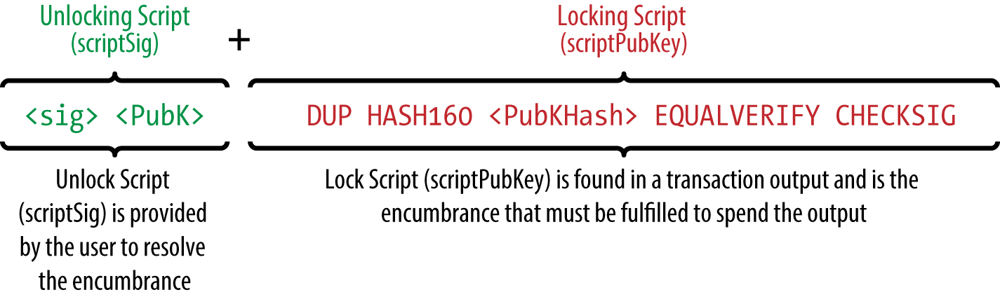
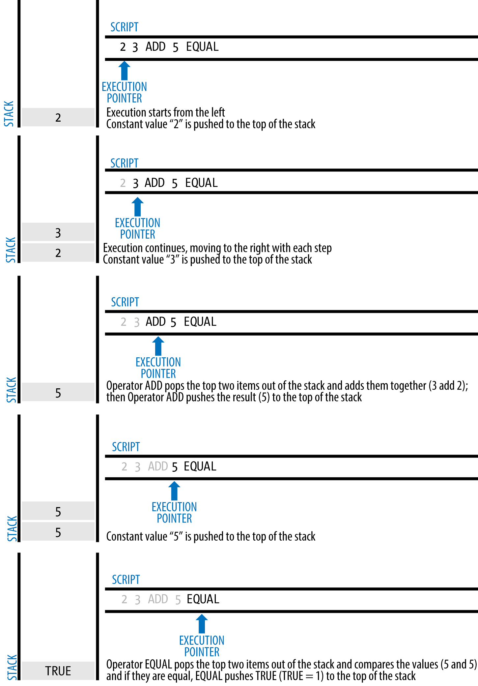
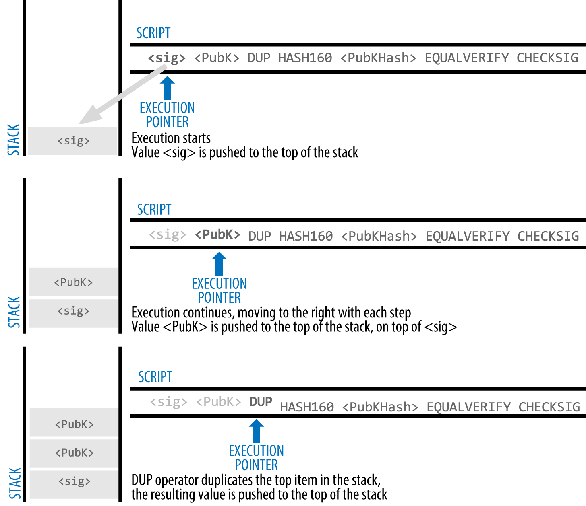
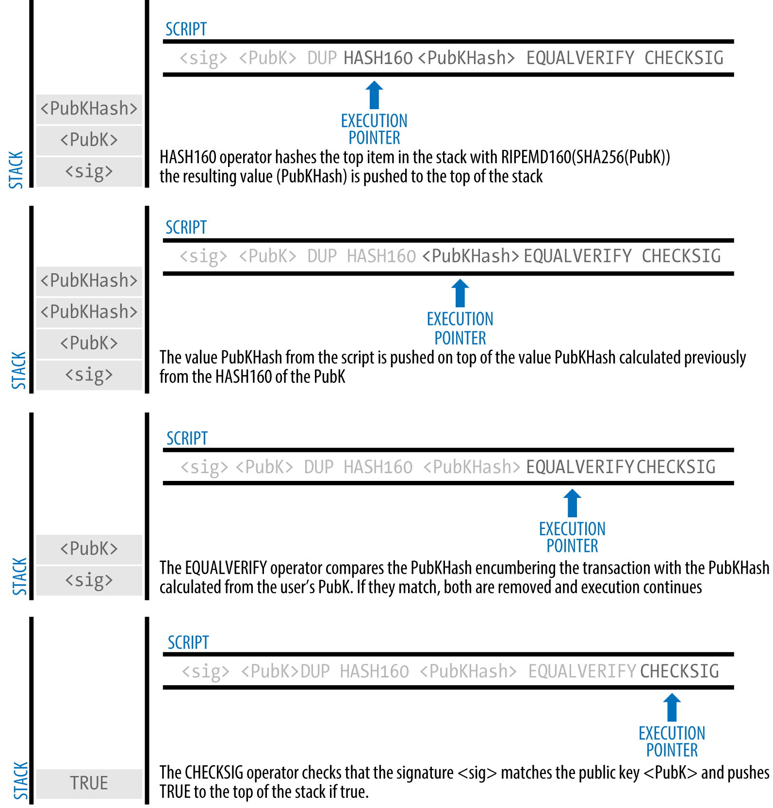

[[ch5]]
[[transactions]]
== Transazioni

[[ch5_intro]]
=== Introduzione

((("transazioni", id="ix_ch05-asciidoc0", range="startofrange")))Le transazioni sono la parte più importante del sistema bitcoin. Tutto il resto in bitcoin è progettato per assicurare che le transazioni possano essere create, propagate nel network, validate e infine aggiunte al registro globale delle transazioni (la blockchain). Le transazioni sono strutture dati che codificano il valore del trasferimento tra partecipanti nel sistema bitcoin. Ogni transazione è un dato pubblico nella blockchain di bitcoin, il registro contabile globale a partita doppia (double-entry bookkeeping). 

In questo capitolo esamineremo le varie forme di transazione, cosa contengono, come crearle, come sono verificate e come diventano parte del registro permanente di tutte le transazioni. 

[[tx_lifecycle]]
=== Ciclo Vitale delle Transazioni

((("transazioni","ciclo di vita delle", id="ix_ch05-asciidoc1", range="startofrange")))Il ciclo di vita di una transazione inizia con la sua creazione, anche conosciuta come((("origine delle transazioni"))) _originazione_. La transazione è poi firmata con una o più firme che indicano l'autorizzazione a spendere i fondi a cui fa riferimento la transazione. La transazione è poi trasmessa sul network bitcoin, dove ogni nodo del network (partecipante) valida e propaga la transazione fino che non arriva (quasi a) ogni nodo del network. Infine, la transazione è verificata da un nodo miner e inclusa in un blocco di transazioni che è registrato nella blockchain. 

Una volta registrata sulla blockchain e confermata da un numero di blocchi successivi sufficienti (conferme), la transazione è parte permanente del registro bitcoin ed è accettata come valida da tutti i partecipanti. I fondi assegnati al nuovo proprietario dalla transazione possono essere spesi in una nuova transazione, estendendo la catena di passaggi di proprietà e iniziando nuovamente il ciclo-vita di una transazione.  

[[tx_origination]]
==== Creare Transazioni

((("transazioni","creare")))In un certo senso si potrebbe pensare ad una transazione come se fosse un assegno. Come un assegno, una transazione è uno strumento che esprime l'intento di trasferire valuta e non è visibile al sistema finanziario fino a che non è immesso nel sistema affinchè sia eseguito. Come per gli assegni, chi effettua la transazione non deve essere per forza colui che firma la transazione. (n.d.t. questo esempio si riferisce ad assegni trasferibili, non più utilizzabili in Italia)   

Le transazioni possono essere create online o offline da chiunque, anche se la persona che crea la transazione non è un firmatario autorizzato sull'account. Ad esempio, un impiegato che paga i conti potrebbe elaborare gli assegni pagabili per la firma da parte del CEO. Allo stesso modo, un impiegato che paga i conti può creare transazioni bitcoin e poi fare in modo che il CEO applichi le firme digitali per renderle valide. Mentre un assegno fa riferimento a un conto specifico come origine dei fondi, una transazione bitcoin fa riferimento a una specifica transazione precedente come origine anziché a un conto. 

Una volta che una transazione è stata creata, viene firmata dal proprietario (o dai proprietari) dei fondi di origine. Se è correttamente formata e firmata, la transazione è ora valida e contiene tutte le informazioni necessarie per eseguire il trasferimento dei fondi. Infine, la transazione valida deve raggiungere la rete bitcoin in modo che possa essere propagata fino a raggiungere un minatore per l'inclusione nel registro pubblico (la blockchain).

[[tx_bcast]]
==== Trasmettere Transazioni sulla Rete Bitcoin

((("network bitcoin","propagazione delle transazioni sul")))((("transazioni","propagazione sulla rete")))Per prima cosa, una transazione deve essere consegnata al network bitcoin così che possa essere propagata e inclusa nella blockchain. In sostanza, una transazione bitcoin pesa da 300 a 400 byte di dati e deve raggiungere uno qualsiasi tra le decine di migliaia di nodi bitcoin. I mittenti non devono fidarsi dei nodi che usano per pubblicare la transazione, fintanto che ne usino più di uno per assicurarsi che la transazione si propaghi. I nodi non devono riporre fiducia nel mittente o stabilire l'"identità" di esso. Visto che la transazione è firmata e non contiene nessuna informazione confidenziale, come chiavi private o credenziali, essa può essere pubblicata apertamente usando qualsiasi rete sottostante per il trasporto di dati che sia conveniente. A differenza delle transazioni delle carte di credito, per esempio, che contengono informazioni sensibili e possono essere trasmesse solo su reti protette, una transazione bitcoin può essere inviata su qualsiasi rete. Fin quando la transazione può raggiungere un nodo bitcoin che la possa propagare nella rete bitcoin, questo è sufficiente, non importa come sia trasportata al primo nodo. 

((("network insicuri, trasmissione di bitcoin attraverso")))Le transazioni bitcoin possono per questo essere trasmesse al network bitcoin su reti insicure come le reti WiFi, Bluetooth, NFC, Chirp, codici a barre, o copiando e incollando attraverso un form web. In casi estremi, una transazione bitcoin può essere trasmessa attraverso packet radio, trasmissione satellitare, onde corte utilizzando una trasmissione burst a onde corte, ad ampio spettro, o con frequency hopping per evitare di essere rivelata e distrubata (jamming). Una transazione bitcoin può anche essere codificata come faccine (smileys, emoticon) e postata in un forum pubblico o inviata come messaggio testuale o come messaggio di una chat su Skype. Bitcoin ha trasformato i soldi in una struttura dati, facendo in modo che sia praticamente impossibile impedire a qualcuno di creare ed eseguire una transazione bitcoin. 

[[tx_propagation]]
==== Propagare Transazioni sulla Rete Bitcoin

((("rete bitcoin","propagazione delle transazioni on")))((("transazioni","propagazione")))Una volta che una transazione bitcoin è inviata a qualsiasi nodo connesso alla rete bitcoin, quella transazione sarà validata da quel nodo. Se valida, quel nodo la propagherà agli altri nodi a cui è connesso, e un messaggio di conferma verrà ritornato sincronamente all'originatore. Se la transazione è invalida, il nodo la respingerà e sincronamente ritornerà un messaggio rigettandola all'originatore. 

La rete bitcoin è una rete peer-to-peer, questo significa che ogni nodo bitcoin è connesso con un po di altri nodi bitcoin che scopre durante l'avvio del programma attraverso il protocollo peer-to-peer. L'intero network forma una maglia (mesh) connessa in modo lasso senza una tipologia fissa o struttura predefinita, rendendo tutti i nodi peer alla pari. I messaggi, includendo transazioni e blocchi, sono propagati da ogni nodo a tutti i peer a cui sono connessi, un processo chiamato "flooding" (inondazione). Una nuova transizione validata iniettata dentro un qualsiasi nodo della rete sarà inviata a tutti i nodi connessi ad esso (vicini), ognuno di essi invierà la transazione a tutti i suoi vicini, e così via. In questo modo, nel giro di pochi secondi una transazione valida si propagherà in un onda che si espanderà esponenzialmente attraverso il network fino a che tutti i nodi non l'avranno ricevuta. 

La rete bitcoin è progettata per propagare transizioni e blocchi a tutti i nodi in modo efficiente e resiliente, che significa resistente agli attacchi. Per prevenire lo spam, attacchi DoS e altri fastidiosi attacchi contro il sistema bitcoin, ogni nodo valuta in modo indipendente ogni transazione prima di divulgarla ulteriormente. Una transazione corrotta non andrà oltre un nodo. Le regole per cui le transazioni sono validate sono spiegate con dettaglio nel capitolo <<tx_verification>>.(((range="endofrange", startref="ix_ch05-asciidoc1"))) 

[[tx_structure]]
=== Struttura della Transazione

((("transazioni","struttura delle")))Una transazione è una((("struttura dati"))) _struttura dati_ che codifica e trasferisce un valore da una fonte di fondi, chiamata ((("input, definita"))) _input_, a una destinazione, chiamata ((("output, definita"))) _output_. Gli input di transazione e gli output non sono relazionati a nessun account o identità. Al contrario, dovresti immaginarteli come pezzi/somme di bitcoin (bloccati e) protetti tramite una chiave segreta che solo il proprietario, o la persona che conosce la chiave, può sbloccare. Una transazione contiene un certo numero di campi, come mostrato in <<tx_data_structure>>.

[[tx_data_structure]]
.La struttura di una transazione
[options="header"]
|=======
|Dimensione| Campo | Descrizione
| 4 bytes | Versione | Specifica quale regole segue la seguente transazione
| 1–9 bytes (VarInt) | Input Counter | Quanti input sono inclusi
| Variable | Inputs | Uno o più input di transazione
| 1–9 bytes (VarInt) | Output Counter | Quanti output sono inclusi
| Variable | Outputs | Uno o più output di transazione
| 4 bytes | Locktime | Un Unix timestamp o numero del blocco
|=======

.Locktime di Transazione
****
((("locktime")))((("transazioni","locktime")))Il locktime, conosciuto anche come nLockTime dal nome della variabile usata nel client di riferimento (reference client), definisce il primo tempo (timestamp) in cui una transazione è considerata valida e può essere trasmessa alla rete o aggiunta alla blockchain. E' impostata a zero in molte transazioni per indicare la propagazione e l'esecuzione immediata. Se il locktime non è impostato a zero e sotto 500 milioni, è interpretato come una block height, questo sta a significare che la transazione non è valida e non sarà trasmessa attraverso o inclusa nella blockchain prima della block height specificata. Se è oltre i 500 milioni, è interpretato come un timestamp Unix Epoch (secondi dal 1-Gen-1970) e la transazione non saraà valida prima del tempo specificato. Le transazioni con locktime che specificano un blocco futuro o un timestamp devono essere create dal sistema originante e trasmesse al network bitcoin solo dopo che esse sono divenute valide. L'uso del locktime è equivalente al postdatare un'assegno.
****

[[tx_inputs_outputs]]
=== Output e Input di una Transazione

((("transazioni","output di transazione non spesi (UTXO)")))((("unspent transaction output (UTXO)")))I mattoni fondamentali di una transazione bitcoin sono gli _output di transazione non spesi_ (unspent transaction outputs), o UTXO. Gli UTXO sono frammenti indivisibili di valuta bitcoin bloccati da un proprietario specifico, registrati sulla blockchain, e riconosciuti come unità di valuta da tutto il network. Il network bitcoin traccia tutti gli UTXO disponibili (non spesi) che attualmente si contano essere nell'ordine dei milioni. Ogniqualvolta un utente riceve bitcoin, quella somma è registrata dentro la blockchain come UTXO. Pertanto, i bitcoin di un'utente potrebbero essere sparpagliati in UTXO nelle centinaia di transazioni e centinaia di blocchi. In effetti, non c'è un qualcosa come un saldo salvato di un indirizzo bitcoin o account; ci sono solo UTXO disseminati, protetti sugli specifici proprietari. Il concetto di un saldo bitcoin di un utente è un costrutto derivato creato dall'applicazione wallet. Il wallet calcola il saldo dell'utente scansionando la blockchain e aggregando tutti gli UTXO appartenenti a quell'utente.

[TIP]
====
((("accounts")))((("balances")))Non ci sono bilanci in bitcoin; ci sono solo _output di transazione non spesi_ (UTXO) sparpagliati nella blockchain. 
====

Una UTXO può avere un valore arbitrario denominato in multipli di((("satoshi"))) satoshi. Proprio come i dollari che possono essere divisi alla seconda cifra decimale come i centesimi, i bitcoin possono essere divisi fino all'ottava cifra decimale come i satoshi. Anche se gli UTXO possono contenere un qualsiasi valore, quando creati questo valore è indivisibile proprio come una moneta che non può essere divisa a metà. Se un UTXO è più grande del valore desiderato della transazione, deve tuttavia essere consumato nella sua interezza e il resto deve essere generato nella transazione. ((("resto, creazione")))In altre parole, se hai una UTXO da 20 bitcoin e vuoi pagare 1 bitcoin, la tua transazione deve consumare tutto l'UTXO da 20 bitcoin e produrre due output: uno che paga 1 bitcoin al tuo destinatario desiderato e un'altro che paga 19 bitcoin come resto indietro al tuo wallet. Come risultato, la maggior parte delle transazioni bitcoin genereranno resto. 

Immagina un cliente che compra una bevanda da 1.50$, prendendo il suo wallet e provando a trovare una combinazione di monete e banconote per coprire il costo da 1.50$. Il cliente sceglierà l'esatto resto se disponibile (una banconota da un dollaro e due da 25 cent), o una combinazione di tagli più piccoli (sei monete da 25cent), o se necessario, una unità piu grande quale una banconota da cinque dollari. Se si da troppa moneta, come per esempio 5$, al proprietario del negozio, ci si aspetterà di ricevere 3.50$ di resto, i quali ritorneranno al suo wallet e in questo modo lei li avrà disponibili per transazioni future.

Nello stesso modo, una transazione bitcoin deve essere creata da una UTXO di un'utente in qualsiasi taglio questo utente abbia a disposizione. Gli utenti non possono tagliare una UTXO a metà così come non non possono tagliare una banconota da un dollaro a metà e utilizzarla come moneta. L'applicazione wallet dell'utente selezionerà solitamente dagli UTXO disponibili da parte dell'utente varie unità per comporre una somma più grande o uguale del valore di transazione desiderato. 

Come nella vita reale, l'applicazione bitcoin può usare diverse strategie per soddisfare la somma da trasferire (in questo caso l'acquisto): combinando diverse unità più piccole, trovando il resto giusto, o usando una singola unità più grande del valore della transazione e creare il resto. Tutto questo complesso assemblaggio di UTXO spendibili è fatto dal wallet dell'utente automaticamente ed è invisibile agli utenti. E' solo rilevante se stai costruendo programmaticamente transazioni raw da UTXO. 

Gli UTXO consumati da una transazione sono chiamati input della transazione (transaction input), e gli UTXO creati da una transazione sono chiamati output della transazione (transaction output). In questo modo, una parte di valore bitcoin si muove in avanti da un proprietario all'altro in una catena di transazioni che consumano e creano UTXO. Le transazioni consumano UTXO sbloccandoli con la firma del proprietario attuale e creano UTXO bloccandoli sull'indirizzo bitcoin di un nuovo proprietario.    

L'eccezione alla catena di output e input è un tipo speciale di transazione chiamata la transazione _coinbase_, che è la prima transazione in ogni blocco. Questa transazione è immessa li (nella blockchain) dal miner "vincitore" e crea bitcoin "nuovi-di-zecca" pagabili a quel miner come ricompensa per aver effettuato il lavoro di mining. Questo è il modo (e l'unico modo, ndt.) in cui la massa monetaria (money supply) di bitcoin viene creata durante il processo di mining, come vedremo nel <<ch8>>.

[TIP]
====
Cosa viene per primo? Gli input o gli output, l'uovo o la gallina?  Tecnicamente, gli output vengono prima a causa delle transazioni coinbase, le quali generano nuovi bitcoin, esse non hanno input e creano output dal niente. 
====

[[tx_outs]]
==== Output della Transazione

((("ledger bitcoin, output nella", id="ix_ch05-asciidoc2", range="startofrange")))((("transazioni","output", id="ix_ch05-asciidoc3", range="startofrange")))((("output di transazione non spesi (UTXO)", id="ix_ch05-asciidoc4", range="startofrange")))Ogni transazione bitcoin crea output, che sono registrati sul registro di bitcoin (ledger). Quasi tutti questi output, con una eccezzione (vedi <<op_return>>) creano pezzi spendibili di bitcoin chiamati _unspent transaction outputs_ o UTXO (output di transazione non spesi), i quali sono poi riconosciuti da tutto il network e disponibili per il proprietario per spenderli in una futura transazioni. Inviare a qualcuno bitcoin equivale a creare un'output di una transazione unspent (non spesa), cioè un UTXO, registrato al loro indirizzo e disponibile per la loro spesa.

Gli UTXO sono tracciati da ogni client bitcoin full-node come serie di dati chiamati la((("pool di UTXO")))((("set di UTXO"))) _UTXO set_ o _UTXO pool_, salvati in un database. Le nuove transazioni consumano (spendono) uno o più di questi output dal set di UTXO. 

Gli output di una Transazione consistono di due parti: 

* Un importo di bitcoin, denominati in _satoshi_, l'unità più piccola di bitcoin
* A ((("ingombro"))) ((("blocco degli script"))) _locking script_, noto anche come "ingombro" che "blocca" questo importo specificando le condizioni che devono essere soddisfatte per poter spenderlo

Il linguaggio di scripting delle transazioni, usato nel locking script menzionato precedentemente, è discusso in dettaglio in <<tx_script>>. <<tx_out_structure>> invece mostra la struttura dell'output di una transazione.

[[tx_out_structure]]
.La struttura di un output di una transazione
[options="header"]
|=======
|Dimensione| Campo | Descrizione
| 8 bytes | Importo | Valore bitcoin rappresentato in satoshi (10^-8^ bitcoin)
| 1-9 byte (VarInt) | Dimensione del Locking-Script | Lunghezza del Locking-Script in byte, a seguire
| Variable | Script di Locking | Uno script che definisce le condizioni necessarie per spendere l'output
|=======

In <<get_utxo>>, usiamo l'API di blockchain.info per trovare gli unspent output (UTXO) di un'indirizzo specifico.

[[get_utxo]]
.Uno script che chiama l'API di blockchain.info per trovare gli UTXO relativi ad un indirizzo
====
[source, python]
----
include::code/get-utxo.py[]
----
====

Eseguendo lo script, possiamo notare una lista di transaction ID, il carattere due punti, il numero dell'indice di un unspent transaction output (UTXO) specifico, e il valore di quell'UTXO in satoshi. Il locking script non è mostrato nell'output in <<get_utxo_run>>.

[[get_utxo_run]]
.Eseguendo lo script get-utxo.py
====
[source,bash]
----
$ python get-utxo.py 
ebadfaa92f1fd29e2fe296eda702c48bd11ffd52313e986e99ddad9084062167:1 - 8000000 Satoshis
6596fd070679de96e405d52b51b8e1d644029108ec4cbfe451454486796a1ecf:0 - 16050000 Satoshis
74d788804e2aae10891d72753d1520da1206e6f4f20481cc1555b7f2cb44aca0:0 - 5000000 Satoshis
b2affea89ff82557c60d635a2a3137b8f88f12ecec85082f7d0a1f82ee203ac4:0 - 10000000 Satoshis
...
----
====

===== Le condizioni per lo Spending (oneri)

((("encumbrance")))((("locking scripts")))Gli output della transazione associano una quantità specifica (in satoshis) a uno specifico _encumbrance_ o script di blocco che definisce la condizione che deve essere soddisfatta per spendere tale importo. Nella maggior parte dei casi, lo script di blocco bloccherà l'output su uno specifico indirizzo bitcoin, trasferendo così la proprietà di tale importo al nuovo proprietario. Quando Alice pagò Bob's Cafe per una tazza di caffè, la sua transazione creò un output bitcoin di 0.015 _encumbered_  o bloccato all'indirizzo bitcoin del caffè. Quell'output da 0,015 bitcoin è stato registrato sulla blockchain ed è diventato parte del set Unspent Transaction Output, il che significa che è mostrato nel portafoglio di Bob come parte del saldo disponibile. Quando Bob sceglie di spendere quell'importo, la sua transazione rilascerà l'encumbrance, sbloccando l'output fornendo uno script di sblocco contenente una firma dalla chiave privata di Bob.(((range="endofrange", startref="ix_ch05-asciidoc4")))(((range="endofrange", startref="ix_ch05-asciidoc3")))(((range="endofrange", startref="ix_ch05-asciidoc2"))) 

[[tx_inputs]]
==== Input della Transaction

((("transactions","inputs", id="ix_ch05-asciidoc5", range="startofrange")))In termini semplici, gli input di transazione sono puntatori a UTXO. Indicano un UTXO specifico facendo riferimento all'hash della transazione e al numero di sequenza in cui l'UTXO è registrato nella blockchain. Per utilizzare UTXO, un input di transazione include anche script di sblocco che soddisfano le condizioni di spesa impostate dall'UTXO. Lo script di sblocco è solitamente una firma che dimostra la proprietà dell'indirizzo bitcoin che si trova nello script di blocco. 

Quando gli utenti effettuano un pagamento, il loro portafoglio costruisce una transazione selezionando dagli UTXO disponibili. Ad esempio, per effettuare un pagamento bitcoin 0,015, l'app wallet può selezionare un UTXO da 0,01 e un UTXO da 0,005, utilizzando entrambi per raggiungere l'importo desiderato per il pagamento . 

In <<select_utxo>>, mostriamo l'uso di un algoritmo "greedy" (n.d.t. avido) per selezionare gli UTXO disponibili per raggiungere un importo specifico per il pagamento. Nell'esempio, gli UTXO disponibili vengono forniti come un array costante, ma in realtà gli UTXO disponibili andrebbero recuperati con una chiamata RPC a Bitcoin Core o a un'API di terze parti come mostrato in <<get_utxo>>. 

[[select_utxo]]
.Uno script per calcolare quanti bitcoin totali saranno emessi
====
[source, python]
----
include::code/select-utxo.py[]
----
====

Se eseguiamo lo script _select-utxo.py_ senza un parametro, tenteremo di costruire un set di UTXO (and change) per un pagamento di 55.000.000 satoshi (0.55 bitcoin). Se fornisci un importo di pagamento target come parametro, lo script seleziona gli UTXO per ottenere l'importo del pagamento indicato. In <<select_utxo_run>>, eseguiamo lo script cercando di effettuare un pagamento di 0,5 bitcoin o 50.000.000 satoshi.

[[select_utxo_run]]
.Lanciando lo script select-utxo.py
====
----
$ python select-utxo.py 50000000
Per una transazione con valore di 50000000 Satoshi (0.500000 bitcoin) usa: 
([<7dbc497969c7475e45d952c4a872e213fb15d45e5cd3473c386a71a1b0c136a1:0 with 25000000 Satoshis>, <7f42eda67921ee92eae5f79bd37c68c9cb859b899ce70dba68c48338857b7818:0 with 16100000 Satoshis>, <6596fd070679de96e405d52b51b8e1d644029108ec4cbfe451454486796a1ecf:0 with 16050000 Satoshis>], 'Change: 7150000 Satoshis')
----
====

Una volta selezionati gli UTXO, il wallet produce quindi script di sblocco contenente le firme per ciascuno degli UTXO, rendendoli così spendibili soddisfacendo le loro condizioni di script di blocco. Il portafoglio aggiunge questi riferimenti agli UTXO e gli script di sblocco come input alla transazione. <<tx_in_structure>> mostra la struttura di un input di transazione. 

[[tx_in_structure]]
.La struttura di un input di una transazione
[options="header"]
|=======
|Dimensione| Campo | Descrizione
| 32 bytes | Hash della Transazione | Puntatore alla transazione contenente l'UTXO che andrà speso
| 4 bytes | Indice dell'Output | Il numero indice dell'UTXO speso; il primo è 0
| 1-9 bytes (VarInt) | Dimensione dell'Unlocking-Script | Lunghezza dell'Unlocking-Script in bytes, a seguire
| Variable | Unlocking-Script | Uno script che completa le condizioni del locking script dell'UTXO.
| 4 bytes | Sequence Number | Attualmente disabilitato, funzione di Tx-replacement, impostato a 0xFFFFFFFF
|=======

[NOTE]
====
Il numero della sequenza è usato per sovrascrivere una transazione prima della scadenza del locktime della transazione, che è una funzione attualmente disabilitata in bitcoin. La maggior parte delle transazioni impostano questo valore al massimo valore intero (0xFFFFFFFF) così che sia ignorato dal network bitcoin. Se la transazione ha un locktime diverso da zero, almeno uno dei suoi input deve avere un numero di sequenza inferiore a 0xFFFFFFFF per abilitare il locktime.(((range="endofrange", startref="ix_ch05-asciidoc5")))
====

[[tx_fees]]
==== Commissioni sulla Transazione (transaction fee)

((("fees, transaction", id="ix_ch05-asciidoc6", range="startofrange")))La maggior parte delle transazioni include commissioni di transazione, che compensano i miner bitcoin, per garantire la sicurezza della rete. Il mining e le commisioni e i premi raccolti dai miner saranno discussi in modo più dettagliato in <<ch8>>. Questa sezione esamina come le commissioni di transazione sono incluse in una transazione tipica. La maggior parte dei wallet calcola e include automaticamente le commissioni di transazione. Tuttavia, se si stanno costruendo transazioni a livello di programmazione o si utilizza un'interfaccia a riga di comando, è necessario eseguire manualmente il conteggio e includerle. 
    
Le spese di transazione servono da incentivo per includere (minare) una transazione nel blocco successivo e anche per disincentivare le transazioni "spam" o qualsiasi tipo di abuso del sistema, imponendo un piccolo costo su ogni transazione. Le spese di transazione sono accreditate al minatore che mina il blocco e registra la transazione sulla blockchain. 

((("fees, transaction","calculating")))Le commissioni di transazione sono calcolate in base alla dimensione della transazione in kilobyte, non al valore della transazione in bitcoin. Nel complesso, le commissioni di transazione sono stabilite in base alle forze di mercato all'interno della rete bitcoin. I miner danno la priorità alle transazioni in base a molti criteri diversi, comprese le commissioni, e possono persino elaborare transazioni gratuitamente in determinate circostanze. Le commissioni di transazione influiscono sulla priorità di elaborazione, il che significa che una transazione con commissioni sufficienti sarà probabilmente inclusa nel blocco più vicino, mentre una transazione con commissioni insufficienti o nulle potrebbe essere ritardata, elaborata su una base di sforzo massimo dopo alcuni blocchi, o non elaborata affatto. Le commissioni di transazione non sono obbligatorie e le transazioni senza commissioni potrebbero essere elaborate alla fine; tuttavia, includere le commissioni di transazione, incoraggia l'elaborazione prioritaria. 

Nel tempo, il modo in cui le commissioni di transazione vengono calcolate e l'effetto che hanno sulla priorità delle transazioni si è evoluto. Inizialmente, le commissioni di transazione erano fisse e costanti in tutta la rete. Gradualmente, la struttura delle commissioni è stata allentata in modo che potesse essere influenzata dalle forze di mercato, in base alla capacità della rete e al volume delle transazioni. L'attuale commissione minima di transazione è fissata a 0,0001 bitcoin o un decimo di milli-bitcoin per kilobyte, recentemente diminuita da un milli-bitcoin. La maggior parte delle transazioni è inferiore a un kilobyte; tuttavia, quelle con più input o output possono essere più grandi. Nelle future revisioni del protocollo bitcoin, si prevede che le applicazioni wallet utilizzeranno l'analisi statistica per calcolare la commissione più appropriata da collegare a una transazione in base alle commissioni medie delle transazioni recenti. 

L'algoritmo usato attualmente dai miner per dare priorità alle transazioni per l'inclusione in un blocco basato sulle rispettive fee è esaminato in dettaglio in <<ch8>>.(((range="endofrange", startref="ix_ch05-asciidoc6")))
    
==== Impostare le Commissioni sulle Transazioni

((("fees, transaction","adding", id="ix_ch05-asciidoc7", range="startofrange")))((("transactions","fees", id="ix_ch05-asciidoc8", range="startofrange")))La struttura dati delle transazioni non ha un campo per le commissioni. Invece, le commissioni sono implicite come la differenza tra la somma degli input e la somma degli output. Qualsiasi importo in eccesso che rimane dopo che tutti gli output sono stati detratti da tutti gli input equivale alla commissione che viene destinata ai miner. 

[[tx_fee_equation]]
.Le transaction fee sono l'eccesso degli input meno gli output:
----
Fees = Sum(Inputs) – Sum(Outputs)
----

Questo è un elemento un po' confuso delle transazioni e un punto importante da comprendere, perché se stai costruendo le tue transazioni devi assicurarti di non includere inavvertitamente un compenso molto elevato esagerando con gli input. Ciò significa che devi conteggiare tutti gli input, se necessario modificandoli, o finirai per dare un mancia molto grande ai miner!

Ad esempio, se si utilizza un UTXO da 20 bitcoin per eseguire un pagamento da 1 bitcoin, è necessario includere 19 bitcoin di resto in output verso il tuo wallet . Altrimenti, il resto di 19 bitcoin verrà conteggiato come una commissione di transazione e verrà raccolto dal miner che minerà la tua transazione in un blocco. Sebbene tu possa ricevere un'elaborazione prioritaria e rendere molto felice un miner, questo probabilmente non è ciò che intendevi fare. 

[ATTENZIONE]
====
Se dimentichi di aggiungere un output a cui inviare il resto in una transazione costruita manualmente, il resto verrà attribuito come transaction fee. "Tieni il resto!" non è sempre quello che intendevi.
====

Vediamo come funziona in pratica, osservando nuovamente l'acquisto del caffè effettuato da Alice. Alice vuole spendere 0.015 bitcoin per pagare il caffè. Per assicurare che questa transazione sia processata rapidamente, Alice vorrà includere una fee di transazione, diciamo 0.001. Questo vorrà dire che il costo totale della transazione sarà di 0.016 bitcoin. Il suo wallet dovrà quindi recuperare una serie di UTXO che arrivi a 0.016 o più e, se necessario, emettere il resto. Diciamo che il suo wallet abbia 0.2 bitcoin disponibili nelle UTXO. Dovrà quindi consumare queste UTXO, creare un output verso il Caffè di Bob da 0.015, e un secondo output con 0.184 bitcoin come resto re-inviati indietro al proprio wallet, lasciando 0.001 bitcoin non allocati, come fee implicita per la transazione.    

Ora diamo un'occhiata ad uno scenario differente. Eugenia, la nostra direttrice dell'organizzazione no profit nelle Filippine, ha completato una campagna di raccolta fondi per comprare libri di scuola per i bambini. Ha ricevuto molte piccole donazioni provenienti da persone in tutto il mondo, totalizzando 50 bitcoin, quindi il suo wallet è pieno di molti pagamenti molto piccoli (UTXO). A questo punto Eugenia vuole acquistare centinaia di libri di scuola da un editore locale. 

L'applicazione wallet di Eugenia per costruire una transazione singola per il pagamento, deve recuperare un serie di UTXO disponibili, relativi a varie transazioni più piccole. Questo vuol dire che la transazione risultante recupererà da più di un centinaio di UTXO di poco valore per quanto riguarda l'input e emetterà un solo output, pagando l'editore del libro. Una transazione con così tanti input sarà più grande di un kilobyte, forse dai 2 ai 3 kilobytes di dimensione. Come risultato, richiederà una fee più alta della network fee minima di 0.0001 bitcoin. 

L'applicazione wallet di Eugenia calcolerà le fee appropriate misurando la dimensione della transazione e moltiplicandola per la fee per kilobyte. Molti wallet pagano un valore di fee più alto per transazioni di dimensione maggiore per assicurarsi che la transazione sia eseguita rapidamente. Si ottiene una fee maggiorata non perchè Eugenia sta spendendo più soldi, invece è perchè la sua transazione è piu complessa e di più grande dimensione—la fee è indipendente rispetto al valore in bitcoin della transazione.(((range="endofrange", startref="ix_ch05-asciidoc8")))(((range="endofrange", startref="ix_ch05-asciidoc7"))) 

[[tx_chains]]
=== Collegare Transazioni e Transazioni Orfane

((("chaining transactions")))((("orphan transactions")))((("transactions","chaining")))((("transactions","orphan")))Come abbiamo visto, le transazioni formano una catena, in cui una transazione spende gli output della transazione precedente (nota come genitore) e crea gli output per una transazione successiva (nota come figlio). Talvolta un'intera catena di transazioni che dipendono l'una dall'altra, ad esempio una transazione padre, figlio e nipote, vengono create contemporaneamente per soddisfare un complesso flusso di lavoro di transazioni che richiede la firma dei figli validi prima della firma del genitore. Ad esempio, questa è una tecnica utilizzata nelle transazioni di ((("CoinJoin"))) CoinJoin in cui più parti uniscono le transazioni insieme per proteggere la loro privacy. 

Quando una catena di transazioni viene trasmessa attraverso la rete, non sempre (n.d.t. le transazioni) arrivano nello stesso ordine. A volte, il figlio potrebbe arrivare prima del genitore. In tal caso, i nodi che vedono un figlio per primi possono vedere che fa riferimento a una transazione genitore che non è ancora nota. Piuttosto che respingere il figlio, lo mettono in un pool temporaneo per attendere l'arrivo del suo genitore e propagarlo su ogni altro nodo. Il pool di transazioni senza genitori è noto come ((("orphan transaction pool"))) _orphan transaction pool_ (n.d.t. pool di transazioni orfane). Una volta che il genitore arriva, tutti gli orfani che fanno riferimento all'UTXO creato dal genitore vengono rilasciati dal pool, riconvalidati in modo ricorsivo e quindi l'intera catena di transazioni può essere inclusa nel pool di transazioni, pronta per essere estratta in un blocco. Le catene di transazione possono essere arbitrariamente lunghe, con un numero qualsiasi di generazioni trasmesse simultaneamente. Il meccanismo di detenzione di orfani, nel pool di orfani, garantisce che le transazioni altrimenti valide non vengano rifiutate solo perché il loro genitore è stato ritardato e che alla fine la catena a cui appartengono viene ricostruita nell'ordine corretto, indipendentemente dall'ordine di arrivo. 

Esiste un limite al numero di transazioni orfane memorizzate, per impedire un attacco denial-of-service ai nodi bitcoin. Il limite è definito come ((("MAX_ORPHAN_TRANSACTIONS constant"))) +MAX_ORPHAN_TRANSACTIONS+ nel codice sorgente del client di riferimento bitcoin. Se il numero di transazioni orfane nel pool supera +MAX_ORPHAN_TRANSACTIONS+, una o più transazioni orfane selezionate casualmente sono sfrattate dal pool, finché la dimensione del pool non torna nei limiti. 

[[tx_script]]
=== Script di Transazione e Linguaggio Bitcoin Script

((("scripts", id="ix_ch05-asciidoc9", range="startofrange")))((("transactions","script language for", id="ix_ch05-asciidoc10", range="startofrange")))((("transactions","validation", id="ix_ch05-asciidoc11", range="startofrange")))((("validation (transaction)", id="ix_ch05-asciidoc12", range="startofrange")))I client Bitcoin convalidano le transazioni eseguendo uno script, scritto in un linguaggio di scripting simile a Forth. Sia lo script di blocco (encumbrance) posto in un UTXO e lo script di sblocco che di solito contiene una firma sono scritti in questo linguaggio di scripting. Quando una transazione viene convalidata, lo script di sblocco in ogni input viene eseguito insieme allo script di blocco corrispondente per verificare se soddisfa la condizione di spesa. 

Oggi, la maggior parte delle transazioni processate attraverso il network bitcoin hanno la forma "Alice paga Bob" e sono basate sullo stesso script chiamato script Pay-to-Public-Key-Hash. Tuttavia, l'uso di script per fare il lock degli output e aggiungere regole di input che possano rimuovere il lock significa che attraverso l'uso del linguaggio di programmazione, le transazioni possono contenere un numero infinito di condizioni. Le transazioni bitcoin non sono limitate nella forma e nello schema di "Alice paga Bob".   

Questa è solo la punta dell'iceberg delle possibilità che possono essere espresse con questo linguaggio di scripting. In questa sezione, dimostreremo i componenti del linguaggio di scripting bitcoin per le transazioni e mostreremo come può essere utilizzato per esprimere condizioni complesse per lo spending dei bitcoin e come queste condizioni possono essere soddisfatte da vari unlocking script. 

[TIP]
====
La validazione delle transazioni bitcoin non è basata su di uno schema statico, ma invece è ottenuta tramite l'esecuzione di un linguaggio di scripting. Questo linguaggio permette di esprimere una quasi infinita varietà di condizioni. E' questo il modo nel cui bitcoin ottiene la potenza di "valuta programmabile" (programmable money).
====

==== Costruzione dello Script (Lock + Unlock)

((("script","costruzione di")))((("validazione (transazione)","costruzione per gli script")))Il motore di validazione di transazioni bitcoin fa affidamento su due tipi di script per validare le transazioni: un locking script e uno script di unlock. 

((("locking scripts","transaction validation and")))((("validation (transaction)","locking scripts")))Uno script di blocco è posto in un encumbrance su un output e specifica le condizioni che devono essere soddisfatte per poter spendere l'output in futuro. Storicamente, lo script di blocco era chiamato _scriptPubKey_, perché di solito conteneva una chiave pubblica o un indirizzo bitcoin. In questo libro ci riferiamo ad esso come uno "script di blocco" per riconoscere la gamma più ampia di possibilità di questa tecnologia di scripting. Nella maggior parte delle applicazioni bitcoin, quello che chiamiamo script di blocco apparirà nel codice sorgente come +scriptPubKey+. 

((("unlocking scripts","transaction validation and")))Uno script di sblocco è uno script che "risolve" o soddisfa le condizioni poste su un output da uno script di blocco e consente di utilizzare l'output. Gli script di sblocco fanno parte di ogni input di transazione e la maggior parte delle volte contengono una firma digitale prodotta dal portafoglio dell'utente dalla sua chiave privata. Storicamente, lo script di sblocco si chiama _scriptSig_, perché di solito conteneva una firma digitale. Nella maggior parte delle applicazioni bitcoin, il codice sorgente si riferisce allo script di sblocco come +scriptSig+. In questo libro, ci riferiamo ad esso come uno "script di sblocco" per riconoscere la gamma molto più ampia di requisiti di script di blocco, perché non tutti gli script di sblocco devono contenere firme.

Ogni client bitcoin convaliderà le transazioni eseguendo insieme gli script di blocco e sblocco. Per ogni input nella transazione, il software di convalida recupererà prima l'UTXO a cui fa riferimento l'input. L'UTXO contiene uno script di blocco che definisce le condizioni richieste per spenderlo. Il software di convalida prenderà quindi lo script di sblocco contenuto nell'input che sta tentando di spendere questo UTXO ed esegue i due script. 

Nel client bitcoin originale, gli script di sblocco e blocco venivano concatenati ed eseguiti in sequenza. Per motivi di sicurezza, questo è stato modificato nel 2010 a causa di una vulnerabilità che ha consentito a uno script di sblocco non valido di inviare dati nello stack e di danneggiare lo script di blocco. Nell'implementazione corrente, gli script vengono eseguiti separatamente con lo stack trasferito tra le due esecuzioni, come descritto di seguito.

Innanzitutto, lo script di sblocco viene eseguito utilizzando il motore di esecuzione dello stack. Se lo script di sblocco viene eseguito senza errori (ad es. Non sono rimasti operatori "pendenti"), lo stack principale (non lo stack alternativo) viene copiato e viene eseguito lo script di blocco. Se il risultato dell'esecuzione dello script di blocco con i dati dello stack copiati dallo script di sblocco è "TRUE", lo script di sblocco è riuscito a risolvere le condizioni imposte dallo script di blocco e, pertanto, l'input è un'autorizzazione valida per utilizzare UTXO. Se un risultato diverso da "TRUE" rimane dopo l'esecuzione dello script combinato, l'input non è valido perché non è riuscito a soddisfare le condizioni di spesa immesse nell'UTXO. Si noti che l'UTXO è permanentemente registrato nella blockchain, e quindi è invariabile e non è influenzato dai tentativi falliti di spenderlo inseriti in una nuova transazione. Solo una transazione valida che soddisfi correttamente le condizioni dell'UTXO risulterà nell'UTXO contrassegnata come "esaurita" e rimossa dal set di UTXO disponibile (non speso).

<<scriptSig_and_scriptPubKey>> è un esempio degli script di sblocco e blocco per il tipo più comune di transazione bitcoin (un pagamento a un hash di chiave pubblica), che mostra lo script combinato risultante dalla concatenazione degli script di sblocco e blocco prima della convalida di script. 

[[scriptSig_and_scriptPubKey]]
.Combinando scriptSig e scriptPubKey per valutare un transaction script

[[tx_script_language]]
==== Linguaggio di Scripting

((("Script language", id="ix_ch05-asciidoc13", range="startofrange")))((("scripts","language for", id="ix_ch05-asciidoc14", range="startofrange"))) Il linguaggio di script della transazione bitcoin, chiamato _Script_, è un linguaggio di esecuzione basato su stack di notazione reverse-polish simile a Forth. Se questo suona come qualcosa di incomprensibile, probabilmente non hai studiato i linguaggi di programmazione degli anni '60. Lo script è un linguaggio molto semplice che è stato progettato per essere limitato in ambito ed eseguibile su una gamma di hardware, semplice come un dispositivo incorporato, come un calcolatore portatile. Richiede un'elaborazione minima e non può fare molte delle cose fantasiose che i moderni linguaggi di programmazione possono fare. Nel caso di denaro programmabile, si tratta di una funzionalità di sicurezza deliberata. 

Il linguaggio bitcoin scripting è detto un linguaggio stack-based perché utilizza una struttura dati chiamata ((("stack, definita"))) _stack_. Lo stack (pila) è una struttura dati molto semplice, che può essere visualizzata come un mazzo di carte. Uno stack permette due operazioni: push e pop. Push aggiunge gli elementi in cima alla pila. Pop rimuove l'elemento in cima alla pila. 

Il linguaggio di scripting esegue lo script elaborando ogni elemento da sinistra a destra. I numeri (costanti di dati) vengono inseriti nello stack. Gli operatori spingono o fanno saltare uno o più parametri dallo stack, agiscono su di loro e potrebbero spingere un risultato in pila. Ad esempio, +OP_ADD+ farà sommare due elementi dallo stack, aggiungerli e inserire la somma risultante nello stack. 

Gli operatori condizionali valutano una condizione, producendo un risultato booleano di VERO o FALSO. Ad esempio, +OP_EQUAL+ fa compara due elementi dallo stack e restituisce TRUE (TRUE è rappresentato dal numero 1) se sono uguali o FALSE (rappresentati da zero) se sono diversi. Gli script di transazioni Bitcoin di solito contengono un operatore condizionale, in modo che possano produrre il risultato TRUE che indica una transazione valida. 

In <<simplemath_script>>, lo script +2 3 OP_ADD 5 OP_EQUAL+ mostra l'operatore di addizione aritmetica +OP_ADD+, aggiungendo due numeri e mettendo il risultato nello stack, seguito dall'operatore condizionale +OP_EQUAL+, che controlla che la somma risultante sia uguale a +5+. Per brevità, il prefisso +OP_+ è omesso nell'esempio passo-passo. 

Il seguente è uno script leggermente più complesso, che calcola ++2 + 7 - 3 + 1++. Nota che quando lo script contiene una serie di operatori, lo attacchi permette al risultato di un operatore di essere utilizzato dall'operatore successivo:

----
2 7 OP_ADD 3 OP_SUB 1 OP_ADD 7 OP_EQUAL
----
Prova a validare il precedente script tu stesso usando carta e penna. Quando l'esecuzione dello script finisce, rimarrà il valore TRUE nello stack.

La maggior parte degli script di blocco fa riferimento a un indirizzo bitcoin o a una chiave pubblica, richiedendo in tal modo una prova di proprietà per spendere i fondi, quindi lo script non deve essere così complesso. Qualsiasi combinazione di script di blocco e sblocco che restituisce un valore VERO è valida. La semplice aritmetica che abbiamo usato come esempio del linguaggio di scripting è anche uno script di blocco valido che può essere usato per bloccare un output di transazione.

Usa una parte dello script aritmetico di esempio come locking script:

----
3 OP_ADD 5 OP_EQUAL
----

che può essere soddisfatta da una transazione che contiene un input con lo script di unlocking:
----
2
----

Il software di validazione combina gli script di locking e unlocking e lo script risultante è:
----
2 3 OP_ADD 5 OP_EQUAL
----

Come abbiamo visto nell'esempio passo-passo in <<simplemath_script>>, quando questo script è eseguito, il risultato è +OP_TRUE+, rendendo la transazione valida. Non solo si tratta di uno script di blocco dell'output della transazione valido, ma l'UTXO risultante potrebbe essere speso da chiunque abbia le abilità aritmetiche per sapere che il numero 2 soddisfa lo script. (((range="endofrange", startref="ix_ch05-asciidoc14")))(((range="endofrange", startref="ix_ch05-asciidoc13")))

[[simplemath_script]]
.Validazione di uno script bitcoin usando la matematica

[TIP]
====
Le transazioni sono valide se il risultato principale nello stack è VERO (indicato come ++{0x01}++), qualsiasi altro valore diverso da zero o se lo stack è vuoto dopo l'esecuzione dello script. Le transazioni non sono valide se il valore superiore nello stack è FALSE (un valore vuoto di lunghezza zero, indicato come ++{}++) o se l'esecuzione dello script viene interrotta esplicitamente da un operatore, ad esempio OP_VERIFY, OP_RETURN o un terminatore condizionale come OP_ENDIF. Vedi <<tx_script_ops>> per i dettagli.
====

==== Incompletezza di Turing

((("Script language","flow-control/loops in")))((("Script language","statelessness of")))((("Turing Complete")))Il linguaggio script della transazione bitcoin contiene molti operatori, ma è deliberatamente limitato in un modo importante: non ci sono loop o funzionalità di controllo del flusso complesse oltre al controllo del flusso condizionale. Ciò garantisce che il linguaggio  non sia _Turing Complete_, il che significa che gli script hanno una complessità limitata e tempi di esecuzione prevedibili. Lo script non è un linguaggio generico. Queste limitazioni assicurano che il linguaggio non possa essere utilizzato per creare un loop infinito o altra forma di "bomba logica" che possa essere incorporata in una transazione in un modo che causi un attacco denial-of-service ((("denial-of-service attack","Script language and"))) contro la rete bitcoin. Ricorda, ogni transazione è convalidata da ogni nodo completo sulla rete bitcoin. Un linguaggio limitato impedisce che il meccanismo di convalida della transazione venga utilizzato come vulnerabilità. 

==== Stateless Verification

((("stateless verification of transactions")))((("transactions","statelessness of")))Il linguaggio di script usato nella transazione bitcoin è senza stato, in quanto non esiste uno stato prima dell'esecuzione dello script o uno stato salvato dopo l'esecuzione dello script. Pertanto, tutte le informazioni necessarie per eseguire uno script sono contenute nello script. Uno script verrà eseguito prevedibilmente allo stesso modo su qualsiasi sistema. Se il tuo sistema verifica uno script, puoi essere sicuro che ogni altro sistema nella rete bitcoin verificherà anche lo script, il che significa che una transazione valida è valida per tutti e tutti lo sanno. Questa prevedibilità dei risultati è un vantaggio essenziale del sistema bitcoin.(((range="endofrange", startref="ix_ch05-asciidoc12")))(((range="endofrange", startref="ix_ch05-asciidoc11")))(((range="endofrange", startref="ix_ch05-asciidoc10")))(((range="endofrange", startref="ix_ch05-asciidoc9")))

[[std_tx]]
=== Transazioni Standard

Nei primi anni dello sviluppo di bitcoin, gli sviluppatori hanno introdotto alcune limitazioni nei tipi di script che potrebbero essere elaborati dal client di riferimento. Queste limitazioni sono codificate in una funzione chiamata +isStandard()+, che definisce cinque tipi di transazioni "standard". Queste limitazioni sono temporanee e potrebbero essere state revocate quando leggerete questo (n.d.t. libro). Fino ad allora, i cinque tipi standard di script di transazione sono gli unici che verranno accettati dal client di riferimento e dalla maggior parte dei miner che eseguono il client di riferimento. Sebbene sia possibile creare una transazione non standard contenente uno script che non è uno dei tipi standard, è necessario trovare un minatore che non rispetti queste limitazioni per inserire la transazione in un blocco. 

Controlla il codice sorgente del client Bitcoin Core (l'implementazione di riferimento) per controllare cos'è attualmente consentito come script di transazione valido. 

I cinque tipi standard di script di transazione sono: pay-to-public-hash (P2PKH), chiave pubblica, multi-firma (limitata a 15 chiavi), pay-to-script-hash (P2SH) e output di dati (OP_RETURN), che sono descritti in maggior dettaglio nelle sezioni seguenti.

[[p2pkh]]
==== Pay-to-Public-Key-Hash (P2PKH)

((("pay-to-public-key-hash (P2PKH)", id="ix_ch05-asciidoc15", range="startofrange")))((("transactions","pay-to-public-key-hash", id="ix_ch05-asciidoc16", range="startofrange")))La stragrande maggioranza delle transazioni elaborate sulla rete bitcoin sono transazioni P2PKH. Questi contengono uno script di blocco che incorpora l'output con un hash di chiave pubblica, più comunemente noto come indirizzo bitcoin. Le transazioni che pagano un indirizzo bitcoin contengono script P2PKH. Un output bloccato da uno script P2PKH può essere sbloccato (speso) presentando una chiave pubblica e una firma digitale creata dalla corrispondente chiave privata. 

Ad esempio, diamo un'occhiata al pagamento di Alice a Bob's Cafe. Alice ha effettuato un pagamento di 0,015 bitcoin all'indirizzo bitcoin del bar. L'output della transazione avrebbe uno script di blocco del modulo:

----
OP_DUP OP_HASH160 <Cafe Public Key Hash> OP_EQUAL OP_CHECKSIG
----

Il +Cafe Public Key Hash+ è equivalente all'indirizzo bitcoin del cafe, senza la codifica Base58Check. La maggior parte delle applicazioni mostrava l'hash della chiave pubblica nella codifica esadecimale e non il familiare indirizzo Base58Check del bitcoin formato che inizia con un "1". 

Il locking script precedente può essere soddisfatto dall'unlocking script nella forma:

----
<Cafe Signature> <Cafe Public Key>
----

I due script insieme andrebbero a formare il seguente script di validazione combinato:

----
<Cafe Signature> <Cafe Public Key> OP_DUP OP_HASH160 
<Cafe Public Key Hash> OP_EQUAL OP_CHECKSIG
----

Quando viene eseguito, questo script combinato verrà valorizzato a TRUE se, e solo se, lo script di sblocco corrisponde alle condizioni impostate dallo script di blocco. In altre parole, il risultato sarà VERO se lo script di sblocco ha una firma valida dalla chiave privata del caffè che corrisponde all'hash della chiave pubblica impostato come encumbrance. 

I passaggi: [1] e [2] mostrano (in due parti) un'esecuzione passo-passo dello script combinato, che dimostrerà che questa è una transazione valida. (((range="endofrange", startref="ix_ch05-asciidoc16")))(((range="endofrange", startref="ix_ch05-asciidoc15")))

[[P2PubKHash1]]
.Valutando uno script per una transazione P2PKH (Parte 1 di 2)

[[p2pk]]    
==== Pay-to-Public-Key

((("pay-to-public-key")))La pay-to-public-key è una forma più semplice di pagamento bitcoin rispetto all'hash key-to-public-key. Con questo modulo di script, la chiave pubblica stessa viene memorizzata nello script di blocco, piuttosto che un hash della chiave pubblica come in precedenza con P2PKH, che è molto più breve. Pay-to-public-key-hash è stato inventato da Satoshi per rendere più brevi gli indirizzi bitcoin, per facilità d'uso. Pay-to-public-key è ora più spesso visto nelle transazioni coinbase, generate da vecchi software di mining che non sono stati aggiornati per utilizzare P2PKH. 

Uno script di locking pay-to-public-key è simile al seguente esempio:

----
<Public Key A> OP_CHECKSIG
----

L'unlocking script corrispondente che deve essere presentato per sbloccare questo tipo di output è una semplice firma, come questa:

----
<Signature from Private Key A>
----

Lo script combinato, che è validato dal software di validazione della transazione, è:

----
<Signature from Private Key A> <Public Key A> OP_CHECKSIG
----

Questo script è una semplice chiamata all'operatore +CHECKSIG+, che valida la firma affinchè corrisponda alla chiave corretta e ritorni TRUE sullo stack.

[[P2PubKHash2]]
.Eseguendo uno script per una transazione P2PKH (Parte 2 di 2)

[[multisig]]
==== Multi-Firma (Multi-Signature)

((("multi-signature scripts")))((("transactions","multi-signature scripts"))) Gli script multi-signature (n.d.t. multi firma) impostano una condizione in cui N sono le chiavi pubbliche registrate nello script e almeno M di quelle deve fornire le firme per liberare encumbrance. Questo è anche noto come schema M-of-N, dove N è il numero totale di chiavi e M è la soglia delle firme richieste per la convalida. Ad esempio, una firma multipla 2-di-3 è quella in cui tre chiavi pubbliche sono elencate come potenziali firmatari e almeno due di esse devono essere utilizzate per creare firme per una transazione valida per spendere i fondi. ((("multi-signature scripts","limits on"))) In questo momento, gli script multi-firma standard sono limitati a un massimo di 15 chiavi pubbliche elencate, il che significa che puoi fare qualsiasi cosa, da 1-di-1 a 15-di-15 multi firma o qualsiasi combinazione all'interno di tale intervallo. La limitazione a 15 chiavi elencate potrebbe essere revocata al momento della pubblicazione di questo libro, quindi controllare la ((("isStandard() function"))) +isStandard()+ function per vedere cosa è attualmente accettato dalla rete. 

La forma generale di uno script di locking che imposta una condizione multi'signature M-di-N è:

----
M <Public Key 1> <Public Key 2> ... <Public Key N> N OP_CHECKMULTISIG
----

dove N è il numero totale di chiavi pubbliche elencate e M è la soglia del numero di firme richiesto per spendere un output.
 
Uno script di locking che imposta una condizione multi-signnature-2-su-3 assomiglia a questo:

----
2 <Public Key A> <Public Key B> <Public Key C> 3 OP_CHECKMULTISIG
----

Il locking script precedente può essere soddisfatto con un unlocking script contenente coppie di firme e chiavi pubbliche:

----
OP_0 <Signature B> <Signature C>
----
o una qualsiasi combinazione di due firme dalle chiavi private corrispondenti alle tre chiavi pubbliche elencate. 

[NOTE]
==== 
((("CHECKMULTISIG implementation")))Il prefisso +OP_0+ è richiesto a causa di un bug nell'implementazione originale di +CHECKMULTISIG+ dove "one item too many is popped off the stack". Viene ignorato da + CHECKMULTISIG + ed è semplicemente un segnaposto.
====

I due script insieme formeranno uno script di validazione combinato:

----
OP_0 <Signature B> <Signature C> 2 <Public Key A> <Public Key B> <Public Key C> 3 OP_CHECKMULTISIG
----

Quando eseguito, questo script combinato ritornerà TRUE se, e solo se, lo script di unlock pareggia le condizioni impostate dallo script di lock. In questo caso, la condizione è dove lo script di unlock ha una firma valida dalle due chiavi private che corrispondono a due delle tre chiavi pubbliche impostate come impaccio (encumberance). 

[[op_return]]
==== Data Output (OP_RETURN)

((("ledger, storing unrelated information in")))((("OP_RETURN operator")))((("transactions","storing unrelated information in")))Il registro di Bitcoin distribuito e con timestamp, la blockchain, ha usi potenziali ben oltre i pagamenti. Molti sviluppatori hanno provato a utilizzare il linguaggio di scripting delle transazioni per sfruttare la sicurezza e la resilienza del sistema per applicazioni come ((("digital notary services")))((("smart contracts")))((("stock certificates"))) servizi notarili digitali, certificati azionari e contratti intelligenti. I primi tentativi di usare il linguaggio di script di bitcoin per questi scopi implicavano la creazione di output di transazioni che registravano i dati sulla blockchain; ad esempio, per registrare una digital fingerprint (n.d.t. impronta digitale informatica) di un file in modo tale che chiunque possa stabilire la prova dell'esistenza di quel file in una data specifica facendo riferimento a tale transazione.

((("blockchains","storing unrelated information in")))L'uso della blockchain di bitcoin per archiviare dati non correlati ai pagamenti con bitcoin è un argomento controverso. Molti sviluppatori considerano abusivo e ne scoraggiano l'utilizzo. Altri articoli sono una dimostrazione delle potenzialità della tecnologia blockchain e ne incoraggiano la sperimentazione. Chi obietta all'inclusione dei dati non relativi a pagamenti afferma che provocano "blockchain bloat", che causa un ulteriore aggravio su chi gestisce i full nodes, con un aumento del costo di archiviazione su disco per i dati che non era previsto dovessero essere salvati sulla blockchain. Inoltre, tali transazioni di UTXO che non possono essere spesi, riguardano l'indirizzo bitcoin di destinazione come campo a 20 byte in formato libero. Per cui l'indirizzo che è stato usato per i dati, non corrisponde a una chiave privata e l'UTXO risultante non può essere speso; è un pagamento falso. Queste transazioni che non possono mai essere spese non vengono quindi mai rimosse dal set UTXO e fanno sì che la dimensione del database UTXO aumenti per sempre, "bloat".

Nella versione 0.9 del client Bitcoin Core, è stato raggiunto un compromesso con l'introduzione dell'operatore +OP_RETURN+. +OP_RETURN+ consente agli sviluppatori di aggiungere 80 byte di dati non relativi ad un pagamento a un output di transazione. Tuttavia, a differenza dell'uso di UTXO "falso", l'operatore +OP_RETURN+ crea un output specifico _provably unspendable_, che non ha bisogno di essere memorizzato nel set UTXO. +OP_RETURN+ gli output sono registrati sulla blockchain, quindi consumano spazio su disco e contribuiscono all'aumento delle dimensioni della blockchain, ma non sono memorizzati nel set UTXO e quindi non gonfiano il pool di memoria UTXO e non caricano la costosa RAM dei full nodes. 

Gli script +OP_RETURN+ sono fatti così:

----
OP_RETURN <data>
----

La porzione di dati è limitata a 80 byte e più spesso rappresenta un hash, ad esempio l'output dall'algoritmo SHA256 (32 byte). Molte applicazioni mettono un prefisso davanti ai dati per aiutare a identificare l'applicazione. Ad esempio, il servizio di notarile digitale http://proofofexistence.com[Proof of Existence] utilizza il prefisso di 8 byte "DOCPROOF", che è codificato in ASCII in formato esadecimale +44f4350524f4f46+.

Tieni presente che non esiste uno "script di sblocco" che corrisponda a +OP_RETURN+ che potrebbe essere usato per "spendere" un output di +OP_RETURN+. L'intero punto di + OP_RETURN + è che non è possibile spendere i soldi bloccati in quell'output, e quindi non è necessario che sia trattenuto nel set UTXO come potenzialmente spendibile- +OP_RETURN+ è _dimostrabilmente non spendibile_. +OP_RETURN+ è solitamente un output con una quantità di bitcoin pari a zero, poiché ogni bitcoin assegnato a tale output viene effettivamente perso per sempre. Se viene rilevato un +OP_RETURN+ dal software di convalida degli script, si ottiene immediatamente l'interruzione dell'esecuzione dello script di convalida e la marcatura della transazione come non valida. Pertanto, se accidentalmente si fa riferimento a un output +OP_RETURN+ come input in una transazione, quella transazione non è valida. 

Una transazione standard (quella che si conforma al controllo +isStandard()+) può avere solo un output +OP_RETURN+. Tuttavia, un singolo output +OP_RETURN+ può essere combinato in una transazione con output di qualsiasi altro tipo. 

Due nuove opzioni da riga di comando sono state aggiunte in Bitcoin Core dalla versione 0.10. L'opzione +datacarrier+ controlla l'inoltro e l'estrazione di transazioni OP_RETURN, con l'impostazione predefinita su "1" per consentirle. L'opzione +datacarriersize+ accetta un argomento numerico che specifica la dimensione massima in byte dei dati OP_RETURN, 40 byte per impostazione predefinita.

[NOTE]
====
OP_RETURN è stato inizialmente proposto con un limite di 80 byte, ma il limite è stato ridotto a 40 byte quando la funzione è stata rilasciata. A febbraio 2015, nella versione 0.10 di Bitcoin Core, il limite è stato riportato a 80 byte. I nodi possono scegliere di non inoltrare o estrarre OP_RETURN, o solo inoltrare e minare OP_RETURN contenenti meno di 80 byte di dati.
====

[[p2sh]]
==== Pay-to-Script-Hash (P2SH)

((("multi-signature scripts","P2SH and", id="ix_ch05-asciidoc17", range="startofrange")))((("Pay-to-script-hash (P2SH)", id="ix_ch05-asciidoc18", range="startofrange")))((("transactions","Pay-to-script-hash", id="ix_ch05-asciidoc19", range="startofrange")))Pay-to-script-hash (P2SH) è stato introdotto nel 2012 come un nuovo potente tipo di transazione che semplifica enormemente l'utilizzo di script di transazioni complessi. Per spiegare la necessità di P2SH, diamo un'occhiata a un esempio pratico.

In <<ch01_intro_what_is_bitcoin>> abbiamo introdotto Mohammed, un importatore di elettronica con base a Dubai. La società di Mohammed utilizza ampiamente la funzionalità multi firma di bitcoin per i suoi account aziendali. Gli script multi firma sono uno degli usi più comuni delle funzionalità di scripting avanzate di bitcoin e sono una funzionalità molto potente. La società di Mohammed utilizza uno script multi firma per tutti i pagamenti dei clienti, noti in termini contabili come "crediti", o AR. Con lo schema multi firma, tutti i pagamenti effettuati dai clienti sono bloccati in modo tale da richiedere almeno due firme da rilasciare, da Mohammed e uno dei suoi partner o dal suo legale che ha una chiave di backup. Uno schema multi firma come quello offre controlli di governance aziendale e protegge da furti, appropriazione indebita o perdita. 

Lo script risultante è abbastanza lungo ed è simile a questo:

----
2 <Mohammed's Public Key> <Partner1 Public Key> <Partner2 Public Key> <Partner3 Public Key> <Attorney Public Key> 5 OP_CHECKMULTISIG - ( 2 <Chiave Pubblica di Mohamed> <Chiave Pubblica Partner1> <Chiave Pubblica Partner 2> <Chiave Pubblica Partner3> <Chiave Pubblica del Rappresentante Legale> 5 OP_CHECKMULTISIG )
----

    
Anche se gli script multi-signature sono una funzionalità potente, sono un po difficili da usare. Dato lo script precedente, Mohammed dovrebbe comunicare lo script a ogni cliente prima di iniziare un pagamento. Ogni cliente avrebbe dovuto usare un wallet bitcoin specifico con l'abilità di creare script di transazione custom e ogni cliente avrebbe dovuto capire come creare una transazione con script custom (personalizzati). Inoltre, la transazione risultante sarà cinque volte più grande di una transazione con un semplice pagamento, perchè questo script contiene chiavi pubbliche molto lunghe. Il peso di queste transazioni extra-large andrà a gravare sull'utente sotto forma di fee. Finalmente uno script così grande dovrà essere trasferito nel set delle UTXO in RAM in ogni full node, fino a che non sarà speso. Tutte queste problematiche fanno sì che l'uso di output script complessi sarà un po meno pratico. 

Pay-to-script-hash (P2SH) è stato sviluppato per risolvere queste difficoltà pratiche e per rendere l'uso di script complessi facile come un pagamento a un indirizzo bitcoin. Con i pagamenti P2SH, lo script di blocco complesso viene sostituito con la sua digital fingerprint, un hash crittografico. Quando una transazione che tenta di passare l'UTXO viene presentata in un secondo momento, deve contenere lo script che corrisponde all'hash, oltre allo script di sblocco. In termini semplici, P2SH significa "paga a uno script che corrisponde a questo hash, uno script che verrà presentato più tardi quando questo output sarà esaurito." 

Nelle transazioni P2SH, lo script di blocco che viene sostituito da un hash viene chiamato ((("redeem script"))) _redeem script_  perché viene presentato al sistema in fase di redemption anziché come script di blocco. <<without_p2sh>> mostra lo script senza P2SH e <<with_p2sh>> mostra lo stesso script codificato con P2SH.

[[without_p2sh]]
.Script complessi senza P2SH
|=======
| Locking Script | 2 PubKey1 PubKey2 PubKey3 PubKey4 PubKey5 5 OP_CHECKMULTISIG
| Unlocking Script | Sig1 Sig2   
|=======

[[with_p2sh]]
.Complex script come P2SH
|=======
| Script di Riscatto | 2 PubKey1 PubKey2 PubKey3 PubKey4 PubKey5 5 OP_CHECKMULTISIG
| Locking Script | OP_HASH160 <20-byte hash dello script di riscatto> OP_EQUAL
| Unlocking Script | Sig1 Sig2 dello script di riscatto 
|=======

Come si può vedere dalle tabelle, con P2SH lo script complesso che descrive le condizioni per la spesa dell'output (redeem script) non viene presentato nello script di blocco. Invece, solo un hash di esso è nello script di blocco e lo script di riscatto stesso viene presentato in seguito, come parte dello script di sblocco quando l'output viene speso. Ciò sposta l'onere delle commissioni e della complessità dal mittente al destinatario (spender) della transazione. 

Osserviamo la ditta di Mohammed, lo script multi-signature complesso, e i risultanti script P2SH. 

Per primo, lo script multi-signature che la ditta di Mohammed usa per tutti i pagementi in entrata dai clienti:

----
2 <Mohammed's Public Key> <Partner1 Public Key> <Partner2 Public Key> <Partner3 Public Key> <Attorney Public Key> 5 OP_CHECKMULTISIG - ( 2 <Chiave Pubblica di Mohamed> <Chiave Pubblica Partner1> <Chiave Pubblica Partner 2> <Chiave Pubblica Partner3> <Chiave Pubblica del Rappresentante Legale> 5 OP_CHECKMULTISIG )
----

Se i placeholder sono rimpiazzati con chiavi pubbliche reali (mostrati qui come numeri di 520-bit che iniziano con 04) noterai che lo script diverrà molto lungo:

----
2 
04C16B8698A9ABF84250A7C3EA7EEDEF9897D1C8C6ADF47F06CF73370D74DCCA01CDCA79DCC5C395D7EEC6984D83F1F50C900A24DD47F569FD4193AF5DE762C58704A2192968D8655D6A935BEAF2CA23E3FB87A3495E7AF308EDF08DAC3C1FCBFC2C75B4B0F4D0B1B70CD2423657738C0C2B1D5CE65C97D78D0E34224858008E8B49047E63248B75DB7379BE9CDA8CE5751D16485F431E46117B9D0C1837C9D5737812F393DA7D4420D7E1A9162F0279CFC10F1E8E8F3020DECDBC3C0DD389D99779650421D65CBD7149B255382ED7F78E946580657EE6FDA162A187543A9D85BAAA93A4AB3A8F044DADA618D087227440645ABE8A35DA8C5B73997AD343BE5C2AFD94A5043752580AFA1ECED3C68D446BCAB69AC0BA7DF50D56231BE0AABF1FDEEC78A6A45E394BA29A1EDF518C022DD618DA774D207D137AAB59E0B000EB7ED238F4D800 5 OP_CHECKMULTISIG
----

Lo script per intero può invece essere rappresentato da un hash crittografico di 20-byte, applicando in principio l'algoritmo di hashing SHA256 e infine l'algoritmo RIPEMD160 sul risultato. L'hash di 20-byte dello script precedente è: 

----
54c557e07dde5bb6cb791c7a540e0a4796f5e97e
----

Una transazione P2SH blocca l'output a questo hash invece dello script più lungo, usando lo script di unlock:

----
OP_HASH160 54c557e07dde5bb6cb791c7a540e0a4796f5e97e OP_EQUAL
----
che, come potete vedere, è più corto. Invece di "pagare a questo script a 5-chiavi", la transazione P2SH equivalente è "paga a uno script con questo hash." Un cliente che effettua un pagamento alla ditta di Mohammed deve includere solamente questo script di locking molto più breve nel proprio pagamento. Quando Mohammed vuole spendere questo UTXO, essi devono presentare lo script originale di riscatto (coloro che hanno protetto/firmato l'UTXO) e la firma necessaria per sbloccarlo, come la seguente:

----
<Sig1> <Sig2> <2 PK1 PK2 PK3 PK4 PK5 5 OP_CHECKMULTISIG>
----

I due script sono combinati in due fasi. Nella prima, lo script di riscatto è comparato contro lo script di locking per essere sicuro che l'hash combaci:

----
<2 PK1 PK2 PK3 PK4 PK5 5 OP_CHECKMULTISIG> OP_HASH160 <scriptHash di riscatto> OP_EQUAL
----
Se l'hash dello script di riscatto combacia, lo script di unlock è eseguito da solo, per sbloccare lo script di riscatto:

----
<Sig1> <Sig2> 2 PK1 PK2 PK3 PK4 PK5 5 OP_CHECKMULTISIG
----

===== Indirizzi Pay-to-script-hash

((("addresses, bitcoin","Pay-to-Script-Hash (P2SH)")))((("Pay-to-script-hash (P2SH)","addresses")))Un'altra parte importante della funzionalità P2SH è la possibilità di codificare un hash di script come un indirizzo, come definito in BIP0013. Gli indirizzi P2SH sono le codifiche Base58Check dell'hash da 20 byte di uno script, proprio come gli indirizzi bitcoin sono le codifiche Base58Check dell'hash da 20 byte di una chiave pubblica. Gli indirizzi P2SH usano il prefisso di versione "5", che risulta in indirizzi codificati Base58Check che iniziano con un "3". Ad esempio, lo script complesso di Mohammed, hash e Base58Check-codificati come indirizzo P2SH diventa +39RF6JqABiHdYHkfChV6USGMe6Nsr66Gzw+. Ora, Mohammed può dare questo "indirizzo" ai suoi clienti e lo possono usare su quasi tutti i wallet bitcoin per fare un semplice pagamento, come se fosse un indirizzo bitcoin. Il prefisso 3 dà loro un suggerimento che si tratta di un tipo speciale di indirizzo, uno corrispondente a uno script anziché a una chiave pubblica, ma  funziona esattamente allo stesso modo di un pagamento a un indirizzo bitcoin. 

Gli indirizzi P2SH nascondono tutta la complessità, di modo che la persona che effettua il pagamento non veda lo script. 

===== Benefici del pay-to-script-hash 

((("Pay-to-script-hash (P2SH)","benefits of")))La funzione di hash pay-to-script offre i seguenti vantaggi rispetto all'utilizzo diretto di script complessi negli output di blocco:

* Script complessi sono rimpiazzati da fingerprint più corti nell'output di transazione, rendendo la transazione più piccola.
* Gli script possono essere codificati come un'indirizzo, in questo modo il mittente e al wallet del mittente non serve un codice complesso per implementare P2SH.
* P2SH sposta l'onere di costruzione dello script sul ricevente, non sul mittente.
* P2SH sposta l'onere nella memorizzazione dei dati per lo script lungo, dall'output (che si trova nel set UTXO) all'input (memorizzato sulla blockchain).
* P2SH sposta il carico nella memorizzazione dei dati per lo script lungo, dal tempo presente (pagamento) a un tempo futuro (quando viene speso).
* P2SH sposta il costo della transazione di uno script lungo, dal mittente al destinatario, che deve includere lo script di riscatto lungo per spenderlo.

===== Script di riscatto e validazione isStandard

((("pay-to-script-hash (P2SH)","isStandard validation")))((("pay-to-script-hash (P2SH)","redeem script for")))Prima della versione 0.9.2 del client Bitcoin Core, pay-to-script-hash era limitato ai tipi standard di script di transazione bitcoin, dalla funzione +isStandard()+. Ciò significa che lo script di riscatto presentato nella transazione di spesa potrebbe essere solo uno dei tipi standard: P2PK, P2PKH o multi-firma, escludendo +OP_RETURN+ e P2SH stesso.

A partire dalla versione 0.9.2 del client Bitcoin Core, le transazioni P2SH possono contenere qualsiasi script valido, rendendo lo standard P2SH molto più flessibile e consentendo la sperimentazione di molti nuovi e complessi tipi di transazioni.  

Si noti che non si è in grado di inserire un P2SH all'interno di uno  redeem script P2SH, poiché la specifica P2SH non è ricorsiva. Non si è in grado di utilizzare +OP_RETURN+ in uno redeem script perché +OP_RETURN+ non può essere riscattato per definizione.

Si noti che poiché lo script di riscatto non viene presentato alla rete finché non si tenta di spendere un output P2SH, se si blocca un output con l'hash di una transazione non valida, verrà elaborato a prescindere. Tuttavia, non potrai spenderlo perché la transazione di spesa, che include lo script di riscatto, non sarà accettata perché è uno script non valido. Questo crea un rischio, perché puoi bloccare i bitcoin in un P2SH che non potranno più essere spesi successivamente. La rete accetterà l'ingombro P2SH anche se corrisponde a uno redeem script, non valido, poiché l'hash dello script non fornisce alcuna indicazione dello script che rappresenta. 

[ATTENZIONE]
====
((("Pay-to-Script-Hash (P2SH)","locking scripts")))Gli script di blocco P2SH contengono l'hash di un redeem script, che non fornisce alcun indizio sul contenuto dello script stesso. La transazione P2SH sarà considerata valida e accettata anche se lo script di riscatto non è valido. Potresti bloccare accidentalmente bitcoin in modo che non possano essere successivamente spesi. (((range="endofrange", startref="ix_ch05-asciidoc19")))(((range="endofrange", startref="ix_ch05-asciidoc18")))(((range="endofrange", startref="ix_ch05-asciidoc17")))(((range="endofrange", startref="ix_ch05-asciidoc0"))) 
====
