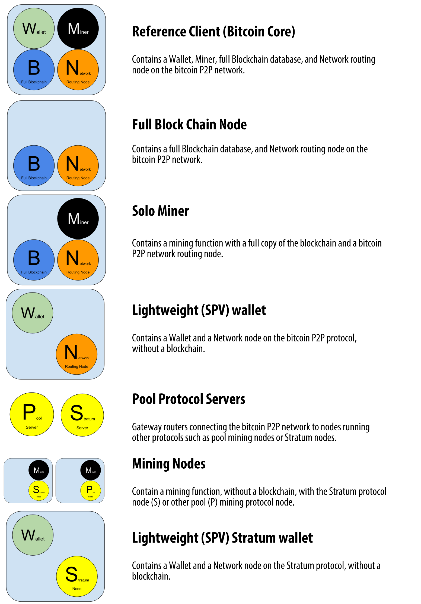
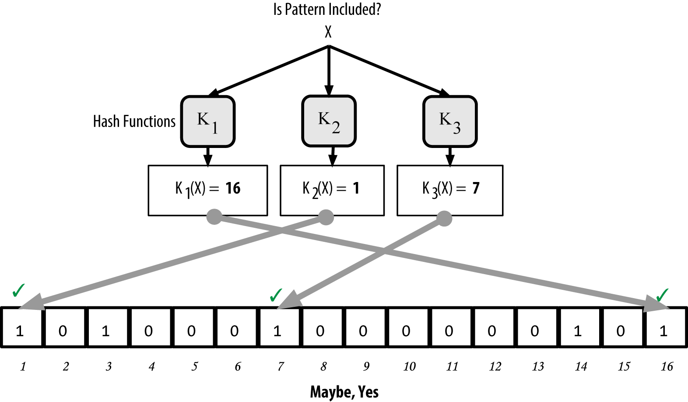

[[bitcoin_network_ch06]]
== La Rete Bitcoin

=== Architettura di Rete Peer-to-Peer

((("network bitcoin", id="ix_ch06-asciidoc0", range="startofrange")))((("network bitcoin","architettura del")))((("networks peer-to-peer")))Bitcoin è strutturato come un'architettura peer-to-peer sopra internet. Il termine peer-to-peer, o P2P, sta a significare che i computer che partecipano alla rete sono (nodi n.d.t.) al pari degli altri, e sono tutti uguali, che non ci sono nodi "speciali", e che tutti i nodi condividono il compito di fornire servizi alla rete. I nodi della rete (network) sono connessi tra di loro in una rete mesh (a maglia n.d.t.) con una topologia "piatta". Non c'è un server, nessun servizio centralizzato, e nessuna gerarchia di alcun tipo nella rete. I nodi in una rete peer-to-peer provvedono a fornire e utilizzano i servizi allo stesso tempo con reciprocità agendo come incentivo per la partecipazione. Le reti peer-to-peer sono resilienti per definizione, decentralizzate, e aperte. Il preminente esempio di un'architettura di una rete P2P si è verificato con lo stesso internet quando era ai suoi primordi, dove i nodi della rete IP erano uguali. L'architettura attuale di internet è più gerarchica, ma l'Internet Protocol mantiene ancora la sua topologia-piatta che ne è l'essenza. Dopo bitcoin, l'applicazione più grande e con più successo delle tecnologie P2P è la condivisione dei file con Napster come suo pioniere e BitTorrent come l'evoluzione più recente dell'architettura.

L'architettura P2P di Bitcoin è molto più di una scelta tecnologica. Bitcoin è stato progettato per essere un sistema peer-to-peer di contante digitale, e l'architettura del network, è sia un riflesso che le fondamenta di questa caratteristica principale. La decentralizzazione del controllo è una delle scelte architetturali principali e può essere ottenuta solamente mantenendo una rete P2P di consenso piatta (tutti i nodi hanno gli stessi privilegi) e decentralizzata. 

((("network bitcoin","spiegato")))Il termine "network bitcoin" si riferisce alla serie di nodi che eseguono il protocollo P2P bitcoin. Oltre al protocollo P2P di bitcoin, ci sono altri protocolli come quello di((("protocollo di mining Stratum (STM, Stratum mining protocol)"))) Stratum, che sono utilizzati per il mining e per wallet bitcoin mobile o leggeri. Questi protocolli addizionali sono forniti da server gateways di routing che hanno accesso alla rete bitcoin usando il protocollo P2P bitcoin,  e estendono la rete a nodi che eseguono altri protocolli. Per esempio, i server Stratum si connettono ai nodi che effettuano mining attraverso il protocollo Stratum del network bitcoin principale e collegano il protocollo Stratum al protocollo bitcoin P2P. Usiamo il termine "network di bitcoin esteso" (extended bitcoin network) per riferirsi a tutto il network generale che include il protocollo P2P bitcoin, i protocolli di pool-mining, il protocollo Stratum, e altri protocolli correlati che connettono i componenti al sistema bitcoin.  

=== Tipi di Nodi e Ruoli

((("rete bitcoin","nodi del")))((("nodi","ruoli dei")))((("nodi","tipi di ")))Anche se i nodi della rete P2P bitcoin sono uguali, possono avere differenti ruoli a seconda della funzionalità che stanno supportando. Un nodo bitcoin è una serie di funzioni: routing, database della blockchain, mining, e servizi wallet. Un nodo completo (full node) con tutte queste quattro caratteristiche è mostrato in <<full_node_reference>>.

[[full_node_reference]]
.Un nodo della rete bitcoin con tutte e quattro le funzioni: wallet, miner, database blockchain completo, e network routing
image::images/msbt_0601.png["FullNodeReferenceClient_Small"]

Tutti i nodi hanno la funzionalità di routing per partecipare al network ma possono anche avere anche altre funzionalità. Tutti i nodi convalidano e propagano le transazioni ed i blocchi, inoltre individuano e mantengono collegamenti peer-to-peer con altri nodi. Nell'esempio del full-node in <<full_node_reference>>, la funzione di routing è indicata da un cerchio arancione denominato "Network Routing Node". 

Alcuni nodi, detti full-node (nodi completi), mantengono anche una completa e aggiornata copia della blockchain. I full-node possono verificare autonomamente e autoritativamente ogni transazione senza bisogno di riferimenti esterni. Alcuni nodi mantengono solo un sottoinsieme della blockchain e verificano le transazioni utilizzando un metodo chiamato ((( "simplified payment verification (SPV, nodi di verifica semplificata del pagamento)", "definiti"))) _simplified payment verification_, o SPV (verifica semplificata del pagamento). Questi nodi sono noti come SPV o nodi lightweight (light, leggeri). Nell'esempio del full-node mostrato nell'immagine, la funzione di database blockchain del full-node è indicata da un cerchio blu chiamato "Full Blockchain." In <<bitcoin_network>>, i nodi SPV sono disegnati senza il cerchio blu, per mettere in evidenza che non hanno una copia completa della blockchain. 

I nodi addetti al "mining" competono per creare nuovi blocchi utilizzando hardware specializzato per risolvere l'algoritmo di proof-of-work. Alcuni nodi di mining sono anche nodi completi  e mantengono una copia completa della blockchain, mentre altri sono nodi leggeri che partecipano ad un gruppo di mining e si basano su un server di mining per mantenere un nodo completo. La funzione di mining è indicata nel nodo completo come un cerchio nero denominato "Miner."

I portafogli utente possono far parte di un nodo completo, come spesso è il caso per i client bitcoin desktop. Ma sempre più di frequente, molti portafogli utente, specialmente quelli dedicati a dispositivi con risorse limitate, sono nodi di tipo SPV. Il portafoglio è indicato nel <<full_node_reference>> come un cerchio verde denominato "Wallet"

In aggiunta ai tipi di nodo principali del protocollo bitcoin P2P, ci sono server e nodi che eseguono altri protocolli, come protocolli di mining pool specializzati e protocolli di accesso dei light client per accedere più efficacemente ad essi. 

<<node_type_ledgend>> mostra il tipi di nodi più comuni sulla rete bitcoin estesa.

=== Il Network Bitcoin Esteso

((("bitcoin network","extended")))((("extended bitcoin network")))Il principale network bitcoin, l'esecuzione del protocollo bitcoin P2P, consiste in 7000 - 10000 nodi in ascolto che eseguono le varie versioni del client di riferimento bitcoin (Bitcoin Core)  e qualche centinaio di nodi che eseguono varie altre implementazioni del protocollo Bitcoin P2P, come ad esempio ((("BitcoinJ library")))((("btcd")))((("libbitcoin library"))) BitcoinJ, Libbitcoin, e btcd. Una piccola percentuale dei nodi della rete P2P Bitcoin sono anche nodi del mining, quindi, li ritroviamo nel processo di estrazione, nel convalidare le transazioni e nel creare nuovi blocchi. Varie grandi compagnie si interfacciano con il network bitcoin eseguendo i clients full-node basati sul client di Bitcoin Core, con copie piene della blockchain e di un nodo del network, ma senza mining o funzioni da wallet. Questi nodi agiscono come un network edge routers, consentendo a vari altri servizi (exchanges, wallets, block explorers, merchant payment processing) di essere implementati su sulla rete stessa. 

L'estensione del network bitcoin include il network di esecuzione del protocollo bitcoin P2P, descritto facilmente, così come i nodi eseguono i protocolli specializzati. Un certo numero di ((("mining pools","on the bitcoin network"))) pool servers e di protocolli gateways sono collegati alla rete principale bitcoin P2P e connettono i nodi che eseguono altri protocolli. Questi altri nodi dei protocolli sono perlopiù nodi di mining pool  (vedi <<ch8>>) e wallet leggeri, che non scaricano una copia completa della blockchain. 

<<bitcoin_network>> mostra la rete estesa di bitcoin con i vari tipi di nodi, gateway server, edge router, e client wallet e i vari protocolli che essi usano per connettersi l'un l'altro. 

[[node_type_ledgend]]
.Diversi tipi di nodi della rete estesa di bitcoin

[[bitcoin_network]]
.La rete estesa di bitcoin che mostra vari tipi di nodi, gateway, e protocolli
image::images/msbt_0603.png["BitcoinNetwork"]

=== Network Discovery

((("rete bitcoin","discovery", id="ix_ch06-asciidoc1", range="startofrange")))((("discovery del network", id="ix_ch06-asciidoc2", range="startofrange")))((("nodi","discovery del network e", id="ix_ch06-asciidoc3", range="startofrange")))((("reti peer-to-peer","discovery da parte di nuovi nodi", id="ix_ch06-asciidoc4", range="startofrange")))Quando un nuovo nodo viene avviato, deve scoprire altri nodi bitcoin presenti sulla rete per partecipare a essa. Per iniziare questo processo, un nuovo nodo deve scoprire almeno un nodo esistente sulla rete e connettervisi. La locazione geografica degli altri nodi è irrilevante; la topologia del network bitcoin non è definita geograficamente. Perciò, ogni nodo bitcoin esistente può essere selezionato in modo casuale. 

((("peer-to-peer networks","connections")))Per connettersi ad un peer conosciuto, i nodi stabiliscono una connessione TCP, solitamente dalla porta 8333 (la porta generalmente conosciuta come l'unica usata da bitcoin) o una porta alternativa se previsto. Nel momento in cui una connessione sarà stabilita. il nodo inizierà un "handshake" (vedi <<network_handshake>>) trasmettendo un ((("version message"))) +version+ message, che conterrà le informazioni di identificazione di base, compreso:

+PROTOCOL_VERSION+:: Una costante che definisce la versione del protocollo P2P bitcoin che "parla" il client (e.g., 70002)
+nLocalServices+:: Una lista di servizi locali supportati dal nodo, attualmente solo +NODE_NETWORK+
+nTime+:: Il tempo attuale
+addrYou+:: L'indirizzo IP del nodo remoto come è visto dal nodo corrente
+addrMe+:: L'indirizzo IP del nodo locale, visto dal nodo locale
+subver+:: Una sotto-versione che mostra il tipo di software in esecuzione su questo nodo (es., "/Satoshi:0.9.2.1/")+
+BestHeight+:: L'altezza del blocco della catena di blocchi di questo nodo

(Vedi http://bit.ly/1qlsC7w[GitHub] per un esempio del messaggio di +versione+ del network.)

Il nodo peer risponde con +verack+ per accettare e stabilire una connessione, e facoltativamente invia il suo messaggio +version+ se vuole ricambiare la connessione e connettersi come peer. 

Come fa un nuovo nodo a trovare dei peers (ndt altri nodi)? Il primo metodo è è quello di query DNS utilizzando un numero di ((("nodi", "seme"))) ((("seme DNS"))) "seed DNS", che sono i server DNS che forniscono un elenco di indirizzi IP di nodi Bitcoin. Alcuni di quei seed DNS forniscono un' elenco statico di indirizzi Ip per i nodi stabili di ascolto di bitcoin. Alcuni seeds DNS sono implementazioni personalizzate di BIND (Berkeley Internet Name Daemon) che restituiscono un sottoinsieme casuale da un elenco di indirizzi dei nodi bitcoin raccolti da un crawler o da un nodo bitcoin di lunga durata. Il client Bitcoin Core contiene i nomi dei cinque diversi seeds DNS. La diversità delle proprietà e la diversità di attuazione dei diversi semi DNS offre un livello alto o affidabilità per il processo di bootstrap iniziale. Nel client Bitcoin core, la possibilità di utilizzare i seed DNS è controllato da il parametro di opzione + -dnsseed + (impostato a 1 per default ed utilizzare il seed DNS).

Alternativamente, un nodo bootstrapping che non conosce niente del network deve dare l'indirizzo IP dell'ultimo nodo bitcoin, dopo di che è possibile stabilire connessioni attraverso ulteriori presentazioni (ndt di nuovi nodi). L'argomento della riga di comando + -seednode + può essere utilizzato per connettersi a un nodo solo per le presentazioni, usandolo come un seed. Dopo aver usato il nodo seed per iniziare e per "determinare" un'introduzione, il client si disconnetterà e userà i peers che ha nuovamente scoperto. 

[[network_handshake]]
.L'handshake iniziale tra peers
image::images/msbt_0604.png["NetworkHandshake"]

Una volta che una o più connessioni sono stabilite, il nuovo nodo invierà un ((("addr message"))) +addr+  messaggio contenente il proprio indirizzo IP per i suoi vicini. I vicini dovranno, a loro volta, inoltrare il messaggio + addr + ai loro vicini, assicurando che il nodo appena collegato diventa ben noto e meglio collegato. Inoltre, il nodo appena collegato può inviare + getaddr + per i vicini, chiedendo loro di restituire un elenco di indirizzi IP di altri peer. In questo modo, un nodo può trovare peers per connettersi e pubblicizzare la sua esistenza sulla rete per agevolare altri nodi a trovarlo. <<address_propagation>> mostra il protocollo di rilevamento dell'indirizzo. 

[[address_propagation]]
.La propagazione e la "scoperta" degli indirizzi
image::images/msbt_0605.png["AddressPropagation"]

Un nodo deve collegarsi a un paio di peers diversi al fine di stabilire percorsi diversi nella rete bitcoin. I percorsi non sono affidabili - i nodi vanno e vengono - e quindi il nodo deve continuare a scoprire nuovi nodi dato che perde le vecchie connessioni e deve anche aiutare gli altri nodi quando bootstrappano. Per il bootstrap basterà solo una connessione è necessario perché il primo nodo è in grado di offrire introduzioni ai suoi nodi peer e quei peers sono in grado di offrire ulteriori introduzioni. E' inutile ed uno spreco di risorse di rete connettersi a più di una manciata di nodi. Dopo il bootstrap, un nodo si ricorderà le sue più recenti connessioni peer di successo, in modo che qualora venisse riavviato potrà ristabilire rapidamente le connessioni con la sua ex rete peer. Se nessuno degli ex peers dovesse rispondere alla sua richiesta di connessione, il nodo può utilizzare i nodi del seed per avviarsi nuovamente. 

Su un nodo che sta eseguendo il client Bitcoin Core, puoi elencare le connessioni dei peer con il comando((("getpeerinfo command"))) +getpeerinfo+:

[source,bash]
----
$ bitcoin-cli getpeerinfo
----
[source,json]
----
[
    {
        "addr" : "85.213.199.39:8333",
        "services" : "00000001",
        "lastsend" : 1405634126,
        "lastrecv" : 1405634127,
        "bytessent" : 23487651,
        "bytesrecv" : 138679099,
        "conntime" : 1405021768,
        "pingtime" : 0.00000000,
        "version" : 70002,
        "subver" : "/Satoshi:0.9.2.1/",
        "inbound" : false,
        "startingheight" : 310131,
        "banscore" : 0,
        "syncnode" : true
    },
    {
        "addr" : "58.23.244.20:8333",
        "services" : "00000001",
        "lastsend" : 1405634127,
        "lastrecv" : 1405634124,
        "bytessent" : 4460918,
        "bytesrecv" : 8903575,
        "conntime" : 1405559628,
        "pingtime" : 0.00000000,
        "version" : 70001,
        "subver" : "/Satoshi:0.8.6/",
        "inbound" : false,
        "startingheight" : 311074,
        "banscore" : 0,
        "syncnode" : false
    }
]
----

((("peer-to-peer networks","automatic management, overriding"))) Per ignorare la gestione automatica dei peers e per specificare un elenco di indirizzi IP, gli utenti possono fornire l'opzione + -connect = <IPAddress> + e specificare uno o più indirizzi IP. Se si utilizza questa opzione, il nodo si collegherà solo agli indirizzi IP selezionati, invece di scoprire e mantenere automaticamente le connessioni peer. 

Se non c'è traffico su una connessione, i nodi periodicamente invieranno messaggi per mantenere la connessione. Se un nodo non ha comunicato su una connessione per più di 90 minuti, verrà disconnesso e un nuovo peer verrà ricercato. Così, il network dinamicamente regola i nodi transitori e problemi di rete, e può organicamente crescere e ridursi a seconda delle necessità, senza alcun controllo centrale.(((range="endofrange", startref="ix_ch06-asciidoc4")))(((range="endofrange", startref="ix_ch06-asciidoc3")))(((range="endofrange", startref="ix_ch06-asciidoc2")))(((range="endofrange", startref="ix_ch06-asciidoc1")))

=== Nodi Completi (Full Node)

((( "blockchains", "nodi completi"))) ((( "nodi completi"))) ((( "nodi", "completi"))) i nodi completi sono quelli che mantengono una blockchain completa di tutte le transazioni . Più precisamente, dovrebbero essere chiamati "nodi blockchain completi." Nei primi anni di Bitcoin, tutti i nodi erano completi e attualmente il client Bitcoin Core è un nodo blockchain completo. Negli ultimi due anni, tuttavia, sono state introdotte nuove forme di client bitcoin che non mantengono una blockchain completa ma eseguono una versione più leggera. Li esamineremo con maggiore dettaglio nella prossima sezione. 

((("blockchains","on full nodes")))I full nodes della blockchain mantengono una completa e up-to-date copia della blockchain bitcoin con tutte le transazioni, che si formano indipendentemente e sono verificate, partendo con il primo blocco (blocco genesi) e costruendo l'ultimo blocco noto nella rete. Una blockchain full node può autonomamente e autorevolmente verificare ogni transazione senza ricorrere o affidarsi a qualsiasi altro nodo o fonte di informazioni. La blockchain full node si basa sulla rete per ricevere aggiornamenti sui nuovi blocchi di operazioni, che poi verifica e incorpora nella propria copia locale della blockchain. 

Eseguire un full node della blockchain ti dà un'esperienza pura di bitcoin: verifica indipendente di tutte le transazioni senza la necessità di basarsi o fidarsi di qualche altro sistema. E' facile capire se si sta eseguendo un full node perché sono richiesti più di 20 gigabytes di storage persistente (spazio del disco) per memorizzare tutta la blockchain. Se avete molta memoria nel disco e due o tre giorni per la sincronizzazione con la rete, potete eseguire un nodo completo. Questo è il prezzo di una completa indipendenza e la libertà da un'autorità centrale. 

Ci sono un po' di implementazioni alternative al client full node della blockchain di bitcoin, costruite utilizzando diversi linguaggi di programmazione e architetture software. Tuttavia, l'implementazione più comune è il client di riferimento ((("client Bitcoin core", "e full node"))) Bitcoin Core, noto anche come il client di Satoshi. Più del 90% dei nodi della rete bitcoin eseguono varie versioni di Bitcoin Core. Si è identificato come "Satoshi" nella stringa sub-versione inviata nella versione + + messaggio e mostrato dal comando + getpeerinfo + come abbiamo visto in precedenza; per esempio, + / Satoshi: 0.8.6 / +.

=== Exchanging "repertorio" più comunemente conosciuto come exchanging inventory

((("blockchains","creating on nodes")))((("blockchains","on new nodes")))((("blocks","on new nodes")))((("full nodes","creating full blockchains on")))La prima cosa che un full node farà, una volta essersi connesso ai peers sarà cercare di costruire una blockchain completa. Se si tratta di un nuovo nodo,  non avrà la blockchain, conoscerà un solo blocco, il blocco di Genesis, che è incorporato in modo statico nel software client. Partendo dal blocco 0 (blocco genesi), il nuovo nodo dovrà scaricare centinaia di migliaia di blocchi per la sincronizzarsi con la rete e ristabilire la blockchain competa. 

((("syncing the blockchain")))Il processo di sincronizzazione della blockchain inizia con il messaggio di versione, perché quello contiene + BestHeight +, l'altezza della blockchain corrente di un nodo (numero di blocchi). Un nodo vedrà il messaggio di versione dei suoi peers, conoscerà quanti blocchi ognuno ha, e sarà in grado di confrontare il numero di blocchi che ha nella propria blockchain. I nodi peer si scambieranno un messaggio + getblocks + che contiene l'hash (impronta digitale) del blocco superiore sulla loro blockchain locale. Il nodo sarà in grado di identificare l'hash ricevuto come appartenente ad un blocco che non è in alto, ma appartenente ad un blocco vecchio, deducendo così che la propria blockchain locale è più lunga di quella del suo peer. 

Il peer che ha la blockchain più lunga ha più blocchi dell'altro nodo e può identificare quali sono i blocchi di cui l'altro nodo hanno bisogno (ndt per completare la blockchain). Identificherà i primi 500 blocchi da condividere e trasmetterà i suoi hash usando un ((("inv messages"))) +inv+ (inventory) message. Il nodo a cui mancheranno questi blocchi li richiamerà mediante l'emissione di una serie di messaggi + GetData+ che richiedono i tutti i dati del blocco, identificando i blocchi richiesti utilizzando gli hash dal messaggio +inv+ .

Assumiamo, per esempio, che un nodo abbia solamente il genesis block. Ricevera', allora, un messaggio dai suoi pari contenente gli hash dei successivi 500 blocchi nella catena. Iniziera' a richiedere blocchi da tutti i suoi pari connessi, distribuendo il carico e garantendo che non travolga qualsiasi pari di richieste. Il nodo tiene traccia di come molti blocchi sono "in transito" per ciascuna connessione tra pari, ovvero blocchi che ha richiesto ma non ricevuto, controllando che non ecceda il limite. In questo modo, se necessita molti blocchi, richiedera' solamente dei nuovi a seguito del soddisfacimento delle precedenti richieste, consentendo ai pari di controllare il flusso degli aggiornamenti, evitando di sovraccaricare la rete. Quando ciascun blocco arriva, viene aggiunto alla blockchain, come vedremo in <<blockchain>>. Man mano che la blockchain si forma, sempre piu blocchi vengono richiesti e ricevuti, ed il processo continua fino a quando il nodo raggiunge il resto della rete. 

Questo processo di confrontare la blockchain locale con i pari e recuperare qualsiasi blocco mancante avviene ogni volta che un nodo si disconnette per qualsiasi periodo di tempo. Sia che un nodo sia stato offline per qualche minuto e abbia perso qualche blocco, o per un mese e abbia perso qualche migliaia di blocchi, inizia inviando +getblocks+, ottenendo un +inv+ response, ed inizia scaricando i blocchi mancanti. <<inventory_synchronization>> mostra l'inventario ed il protocollo di propagazione dei blocchi. 

[[spv_nodes]]
=== Nodi di Simplified Payment Verification (SPV)

((("nodes","SPV", id="ix_ch06-asciidoc5", range="startofrange")))((("nodes","lightweight", id="ix_ch06-asciidoc5a", range="startofrange")))((("simplified payment verification (SPV) nodes", id="ix_ch06-asciidoc6", range="startofrange")))Non tutti i nodi hanno la capacita' di memorizzare l'intera blockchain. Molti bitcoin clients sono progettati per girare su dispositivi con potenza e spazio limitati, come smartphone, tablet, o sistemi integrati. Per questi dispositivi, un metodo _simplified paymente verificatio_ (SPV) e' impiegato per consentirgli di operare senza memorizzare l'intera blockchain. Questi tipi di clients sono chiamati SPV clients o clients leggeri. Con l'aumento dell'adozione di bitcoin, il nodo SPV sta divenendo la piu comune forma di nodo, specialmente per i bitcoin wallet.

((("blockhain","su nodi SPV")))I nodi SPV scaricano solo gli header del blocco e non scaricano le transazioni incluse in ogni blocco. La catena di blocchi risultante, senza transazioni, è 1.000 volte più piccola della blockchain completa. I nodi SPV non possono avere una visione completa di tutte le UTXO che sono disponibili per essere spese perché non conoscono tutte le transazioni presenti sul network. I nodi SPV verificano le transazioni usando una metodologia  leggermente diversa che si appoggia a nodi per ottenere una visione parziale dei componenti rilevanti della blockchain quando ne hanno bisogno.

[[inventory_synchronization]]
.I nodi sincronizzano la blockchain scaricando i blocchi da un altro nodo (peer)
image::images/msbt_0606.png["InventorySynchronization"]

Come analogia, un full node e' come un turista in una città straniera, equipaggiato di una mappa dettagliata con ogni strada ed indirizzo. A confronto,  un nodo SPV e' come un turista in una città straniera che chiede a casuali sconosciuti dettagliate indicazioni, conoscendo solamente la via principale. Sebbene entrambi i turisti possano verificare l'esistenza di una strada visitandola, il turista senza mappa non conosce cosa si celi dietro ogni vicolo e non e' a conoscenza di quali altre vie esistono. Posizionato di fronte all'indirizzo, Church Street, il turista sprovvisto di mappa non può sapere se ci sono decine di altri indirizzi, "Church Street", nella città e se questo sia quello corretto. La migliore speranza, per il turista sprovvisto di mappa, e' di chiedere alle persone e sperare che alcune di esse non stiano provando a prendersi gioco di lui.

La verifica semplificata del pagamento verifica le transazioni facendo riferimento alla loro _profondità_ nella blockchain invece della loro _altezza_. Mentre un nodo blockchain completo costruisce una catena completamente verificata di migliaia di blocchi e transazioni che raggiungono la blockchain (andando indietro nel tempo) fino al blocco genesis, un nodo SPV verificherà la catena di tutti i blocchi (ma non tutte le transazioni) e collega tale catena alla transazione di interesse. 

Ad esempio, quando si esamina una transazione nel blocco 300.000, un nodo completo collega tutti i 300.000 blocchi al blocco di genesi e crea un database completo di UTXO, stabilendo la validità della transazione confermando che l'UTXO rimane non speso. Un nodo SPV non può validare se UTXO non è speso. Invece, il nodo SPV stabilirà un collegamento tra la transazione e il blocco che lo contiene, usando un ((("merkle trees","SPV and"))) _merkle path_ (vedi <<merkle_trees>>). Quindi, il nodo SPV attende fino a quando vede i sei blocchi da 300,001 a 300,006 impilati sopra il blocco contenente la transazione e lo verifica stabilendone la profondità sotto i blocchi da 300,006 a 300,001. Il fatto che altri nodi sulla rete hanno accettato il blocco 300.000 e poi sia stato fatto il lavoro necessario per produrre altri sei blocchi sopra di esso è la prova, per procura, che la transazione non era una doppia spesa.

Un nodo SPV non può essere persuaso che una transazione esiste in un blocco quando la transazione non esiste di fatto. Il nodo SPV stabilisce l'esistenza di una transazione in un blocco richiedendo una prova del merkle path e convalidando la prova di lavoro nella catena di blocchi. Tuttavia, l'esistenza di una transazione può essere "nascosta" da un nodo SPV. Un nodo SPV può sicuramente provare che esiste una transazione ma non può verificare che una transazione, come una doppia spesa dello stesso UTXO, non esiste perché non ha un record di tutte le transazioni. Questa vulnerabilità può essere utilizzata in un attacco denial-of-service o per un attacco a doppia spesa contro i nodi SPV. Per difendersi da questo, un nodo SPV deve connettersi casualmente a diversi nodi, per aumentare la probabilità che sia in contatto con almeno un nodo onesto. Questa necessità di connettersi in modo casuale significa che i nodi SPV sono anche vulnerabili agli attacchi di partizionamento di rete o agli attacchi Sybil, dove i nodi sono connessi a nodi falsi o reti fittizie e non hanno accesso a nodi onesti o alla vera rete di bitcoin.

Per scopi più pratici, i nodi SPV ben connessi sono abbastanza sicuri, trovando il giusto equilibrio di risorse necessarie, praticità e sicurezza. Per una sicurezza infallibile, tuttavia, niente batte l'eseguire un full blockchain node. 

[TIP]
====
((("simplified payment verification (SPV) nodes","verification")))Un nodo completo blockchain, verifica una transazione controllando l'intera catena di migliaia di blocchi al di sotto di essa al fine di garantire che l'UTXO non sia già stato speso, mentre un nodo SPV controlla che un blocco sia sepolto da una manciata di blocchi successivi ad esso. 
====

((("block headers","getting on SPV nodes")))Per ottenere le intestazioni dei blocchi, i nodi SPV usano un ((("getheaders message"))) +getheaders+ message invece di +getblocks+. Il peer rispondente invierà fino a 2.000 intestazioni di blocco usando un singolo messaggio di +header+ . Il processo è uguale a quello utilizzato da un nodo completo per recuperare blocchi completi. I nodi SPV impostano anche un filtro sulla connessione ai peer, per filtrare il flusso di futuri blocchi e transazioni inviati dai peer. Qualsiasi transazione di interesse viene recuperata utilizzando una richiesta +getdata+. Il peer genera un messaggio ((("tx messages"))) +tx+ contenente le transazioni, in risposta. <<spv_synchronization>> mostra la sincronizzazione delle intestazioni dei blocchi.

[[spv_synchronization]]
.Nodo di SPV nella fase di sincronizzazione degli header del blocco
image::images/msbt_0607.png["SPVSynchronization"]

Poiché i nodi SPV devono recuperare transazioni specifiche per verificarli in modo selettivo, creano anche un rischio per la privacy. A differenza dei full blockchain nodes, che raccolgono tutte le transazioni all'interno di ciascun blocco, le richieste di dati specifici del nodo SPV possono rivelare inavvertitamente gli indirizzi nel loro portafoglio. Ad esempio, una terza parte che controlla una rete può tenere traccia di tutte le transazioni richieste da un portafoglio su un nodo SPV e utilizzare quelle per associare gli indirizzi bitcoin all'utente di quel portafoglio, distruggendo la privacy dell'utente. 

Poco dopo l'introduzione dei nodi SPV/lightweight, gli sviluppatori di bitcoin hanno aggiunto una funzione chiamata _bloom filters_ per affrontare i rischi per la privacy dei nodi SPV. I filtri Bloom consentono ai nodi SPV di ricevere un sottoinsieme di transazioni senza rivelare con precisione gli indirizzi a cui sono interessati, attraverso un meccanismo di filtraggio che utilizza probabilità anziché patterns fissi.(((range="endofrange", startref="ix_ch06-asciidoc6")))(((range="endofrange", startref="ix_ch06-asciidoc5a")))(((range="endofrange", startref="ix_ch06-asciidoc5"))) 

=== Filtri di Bloom (Bloom Filter)

((("bitcoin network","bloom filters and", id="ix_ch06-asciidoc7", range="startofrange")))((("bloom filters", id="ix_ch06-asciidoc8", range="startofrange")))((("Simplified Payment Verification (SPV) nodes","bloom filters and", id="ix_ch06-asciidoc9", range="startofrange")))Un filtro Bloom è un filtro di ricerca probabilistico, un modo per descrivere uno schema desiderato senza specificarlo esattamente. I filtri Bloom offrono un modo efficace per esprimere un modello di ricerca proteggendo al contempo la privacy. Vengono utilizzati dai nodi SPV per chiedere ai loro peer transazioni corrispondenti a un modello specifico, senza rivelare esattamente quali indirizzi stanno cercando. 

Nella nostra precedente analogia, un turista senza una mappa sta chiedendo indicazioni per un indirizzo specifico, "23 Church St." Se chiede agli estranei le indicazioni per questa strada, rivela inavvertitamente la sua destinazione. Un filtro Bloom è come chiedere: "Ci sono strade in questo quartiere il cui nome finisce in R-C-H?" Una domanda del genere rivela meno della destinazione desiderata che chiedere "23 Church St." Usando questa tecnica, un turista potrebbe specificare l'indirizzo desiderato in modo più dettagliato come "che termina con U-R-C-H" o meno come "che finische con H.". Variando la precisione della ricerca, il turista rivela più o meno informazioni, a scapito di ottenere risultati più o meno specifici. Se chiede uno schema meno specifico, ottiene molti più indirizzi possibili e una migliore privacy, ma molti risultati sono irrilevanti. Se chiede uno schema molto specifico, ottiene meno risultati ma perde la privacy. 

I filtri Bloom servono a questa funzione consentendo a un nodo SPV di specificare un modello di ricerca per le transazioni che possono essere regolate in base alla precisione o alla privacy. Un filtro bloom più specifico produrrà risultati accurati, ma a scapito di rivelare quali indirizzi vengono utilizzati nel portafoglio dell'utente. Un filtro meno specifico produrrà più dati su più transazioni, molti irrilevanti per il nodo, ma consentirà al nodo di mantenere una migliore privacy. 

Un nodo SPV inizializzerà un filtro bloom come "vuoto" e in tale stato il filtro non corrisponderà a nessun pattern (n.d.r. modello). Il nodo SPV creerà quindi un elenco di tutti gli indirizzi nel suo portafoglio e creerà un pattern di ricerca corrispondente all'output della transazione corrispondente a ciascun indirizzo. Di solito, il modello di ricerca è un ((("pay-to-public-key-hash (P2PKH)", "bloom filters and"))) pay-to-public-key-hash script che è lo script di blocco previsto che sarà presente in ogni transazione pagando l'hash della chiave pubblica (indirizzo). Se il nodo SPV sta monitorando il saldo di un ((("pay-to-script-hash (P2SH)", "bloom filters and"))) indirizzo P2SH, il modello di ricerca sarà invece uno script pay-to-script-hash. Il nodo SPV aggiunge quindi ciascuno dei  pattern di ricerca al filtro bloom, in modo che il filtro possa riconoscere se il modello di ricerca è presente in una transazione. Infine, il filtro bloom viene inviato al peer e il peer lo utilizza per associare le transazioni per la trasmissione al nodo SPV. 

I filtri Bloom vengono implementati come una matrice di dimensioni variabili di N cifre binarie (un campo di bit) e un numero variabile di funzioni di hash M. Le funzioni di hash sono progettate per produrre sempre un'uscita compresa tra 1 e N, corrispondente alla matrice di cifre binarie. Le funzioni di hash vengono generate in modo deterministico, in modo che qualsiasi nodo che implementa un filtro bloom utilizzi sempre le stesse funzioni di hash e ottenga gli stessi risultati per un input specifico. Scegliendo filtri bloom di lunghezza diversa (N) e un numero diverso (M) di funzioni di hash, il filtro può essere regolato, variando il livello di precisione e quindi la privacy. 

In <<bloom1>>, usiamo un'array molto piccolo di 16 bit e una serie di tre funzioni di hashing per dimostrare come funzionano i bloom filter. 

[[bloom1]]
.Un esempio di un filtro bloom semplice, con un campo a 16-bit e tre funzioni di hashing
image::images/msbt_0608.png["Bloom1"]

Il filtro bloom viene inizializzato in modo tale che l'array di bit sia valorizzato tutto a zero. Per aggiungere un pattern al filtro bloom, il pattern viene sostituito a turno da ciascuna funzione di hash. Applicando la prima funzione di hash all'input si ottiene un numero compreso tra 1 e N. Il bit corrispondente nell'array (indicizzato da 1 a N) viene trovato e impostato su +1+, registrando in tal modo l'output della funzione di hash. Quindi, la funzione di hash successiva viene utilizzata per impostare un altro bit e così via. Una volta applicate tutte le funzioni di hash M, il pattern di ricerca verrà "registrato" nel filtro bloom come bit M che sono stati modificati da +0+ a +1+. 

<<bloom2>> è un esempio di aggiunta di un pattern "A" al semplice filtro bloom mostrato in <<bloom1>>.

Aggiungere un secondo pattern è semplice basta ripetere questo processo. Il motivo viene alternato a turno da ciascuna funzione di hash e il risultato viene registrato impostando i bit su +1+. Si noti che come un filtro bloom è pieno di più patterns, un risultato di funzione hash potrebbe coincidere con un bit che è già impostato su +1+, nel qual caso il bit non viene modificato. In sostanza, poiché più pattern registrano su bit sovrapposti, il filtro bloom inizia a saturarsi con più bit impostati su +1+ e la precisione del filtro diminuisce. Questo è il motivo per cui il filtro è una struttura di dati probabilistica: diventa meno preciso man mano che vengono aggiunti più modelli. L'accuratezza dipende dal numero di pattern aggiunti rispetto alla dimensione dell'array di bit (N) e dal numero di funzioni hash (M). Più un array di bit è grande, più funzioni di hash possono registrare più pattern con maggiore precisione. Un array di bit più piccolo o un minor numero di funzioni di hash registreranno meno pattern e produrranno meno precisione. 

[[bloom2]]
.Aggiungendo un pattern "A" al nostro filtro bloom semplice
image::images/msbt_0609.png["Bloom2"]

<<bloom3>> è un esempio di aggiunta di un secondo pattern "B" al filtro bloom semplice.

[[bloom3]]
.Aggiungendo un secondo pattern "B" al nostro filtro bloom semplice
image::images/msbt_0610.png["Bloom3"]

Per testare se un pattern e' parte di un bloom filter, il pattern e' hashato da ogni funzione di hash ed il risultante bit pattern e' testato rispetto al bit array. Se tutti i bit indicizzati dalle funzioni di hash sono impostati su +1+, allora il pattern e' _probablimente_ registrato nel bloom filter. Poiché i bit possono essere impostati (ndt ad 1) a causa della sovrapposizione di più schemi, la risposta non è certa, ma è piuttosto probabilistica. In termini semplici, una corrispondenza positiva del filtro bloom è "Forse, Sì". 

<<bloom4>> è un esempio di controllo dell'esistenza di un pattern "X" nel filtro bloom semplice. I bit corrispondenti sono impostati a +1+, quindi il pattern probabilmente è una corrispondenza.

[[bloom4]]
.Testando l'esistenza del pattern "X" nel bloom filter. Il risultato è una corrispondenza probabilistica positiva, che sta a significare "Possibile."

Al contrario, se un pattern viene testato rispetto al filtro bloom e uno qualsiasi dei bit è impostato su +0+, ciò dimostra che il pattern non è stato registrato nel filtro bloom. Un risultato negativo non è una probabilità, è una certezza. In termini semplici, una corrispondenza negativa su un filtro bloom è "Assolutamente no!" 

<<bloom5>> è un esempio di test dell'esistenza del pattern "Y" nel filtro bloom semplice. Uno dei bit corrispondenti è impostato su +0+, quindi il pattern non è sicuramente una corrispondenza.

[[bloom5]]
.Testando l’esistenza del pattern "Y" nel filtro bloom. Il risultato sarà una corrispondenza definitiva negativa, che sta a significare "Sicuramente No!"
image::images/msbt_0612.png[]

L'implementazione dei filtri bloom di Bitcoin è descritta in Bitcoin Improvement Proposal 37 (BIP0037). Vedi <<appdxbitcoinimpproposals>> o visita http://bit.ly/1x6qCiO[GitHub].

=== I Bloom Filters e gli Inventory Updates (Aggiornamenti di Inventario)

((("inventory updates, bloom filters and")))I filtri bloom vengono utilizzati per filtrare le transazioni (e i blocchi che le contengono) che un nodo SPV riceve dai suoi pari. I nodi SPV creeranno un filtro che corrisponde solo agli indirizzi contenuti nel portafoglio del nodo SPV. Il nodo SPV invierà quindi un messaggio ((("filterload message"))) +filterload+ al nodo, contenente il filtro bloom da utilizzare sulla connessione. Dopo aver stabilito un filtro, il peer testerà quindi le uscite di ogni transazione con il filtro bloom. Solo le transazioni che corrispondono al filtro vengono inviate al nodo. 

In risposta ad un messaggio +getdata+ dal nodo,  i peer invieranno un messaggio +merkleblock+ che contiene solo gli headers del blocco che hannod ato esito positivo per il filtro indicato ed un merkle path (vedi <<merkle_trees>>) per ogni transazione accoppiata. il peer invierà poi anche messaggi +tx+ contenenti le transazioni corrispondenti al filtro.

Il nodo che imposta il filtro bloom può aggiungere in modo interattivo pattern al filtro inviando un messaggio ((("filteradd message"))) +filteradd+. Per cancellare il filtro bloom, il nodo può inviare un messaggio ((("filterclear message"))) +filterclear+. Poiché non è possibile rimuovere un pattern da un filtro di bloom, un nodo deve cancellare e inviare nuovamente un nuovo filtro  bloom se un pattern non è più desiderato.(((range="endofrange", startref="ix_ch06-asciidoc9")))(((range="endofrange", startref="ix_ch06-asciidoc8")))(((range="endofrange", startref="ix_ch06-asciidoc7"))) 

[[transaction_pools]]
=== Gruppo di Transazioni (Transaction Pools)

((("bitcoin network","transaction pools")))((("transaction pools")))((("memory pool")))((("mempool")))((("transactions","unconfirmed, pools of")))((("unconfirmed transactions")))Quasi tutti i nodi della rete bitcoin mantengono un elenco temporaneo di transazioni non confermate chiamato _memory pool_, _mempool_ o _transaction pool_. I nodi utilizzano questo pool per tenere traccia delle transazioni note alla rete ma non ancora incluse nella blockchain. Ad esempio, un nodo che contiene il wallet di un utente utilizzerà il pool di transazioni per tenere traccia dei pagamenti in entrata sul wallet dell'utente che sono stati ricevuti sulla rete ma non ancora confermati. 

Man mano che le transazioni sono ricevute e verificate, sono aggiunte alla pool delle transazioni e trasmesse ai nodi vicini che le propagano sul network.

((( "Pool di transazioni orfane"))) Alcune implementazioni di nodi mantengono un pool separato per le transazioni orfane. Se gli input di una transazione fanno riferimento ad una transazione non ancora nota, ad esempio senza la transazione che l'ha generata, la transazione orfana verrà memorizzata temporaneamente nel pool delle transazioni orfane finché non arriva la transazione padre. 

Quando una transazione viene aggiunta al pool di transazioni, il pool orfano viene controllato per tutti gli orfani che fanno riferimento agli output di questa transazione (i relativi figli). Tutti gli orfani corrispondenti vengono quindi convalidati. Se validi, vengono rimossi dal pool orfano e aggiunti al pool di transazioni, completando la catena avviata con la transazione principale. Alla luce della transazione appena aggiunta, che non è più orfana, il processo viene ripetuto ricorsivamente alla ricerca di ulteriori discendenti, fino a quando non vengono trovati più discendenti. Attraverso questo processo, l'arrivo di una transazione padre innesca una ricostruzione a cascata di un'intera catena di transazioni interdipendenti, riunendo gli orfani con i loro genitori lungo tutta la catena. 

((("orphan transaction pool","storage")))((("transaction pools","storage")))Sia il pool di transazioni sia il pool orfano (dove implementato) sono memorizzati nella memoria locale e non vengono salvati nella memoria permanente; piuttosto, sono popolati dinamicamente dai messaggi in arrivo dalla rete. All'avvio di un nodo, entrambi i pool sono vuoti e vengono gradualmente popolati con nuove transazioni ricevute dalla rete.

Alcune implementazioni del client bitcoin mantengono anche un database UTXO o un pool di UTXO, che è l'insieme di tutti gli output non spesi sulla blockchain. Sebbene il nome "UTXO pool" suona simile al pool di transazioni, rappresenta un diverso insieme di dati. A differenza della transazione e dei pool orfani, l'UTXO pool non è inizializzato vuoto ma contiene invece milioni di voci di output di transazione non spesi, compresi alcuni risalenti al 2009. Il pool UTXO può essere ospitato nella memoria locale o come tabella di database indicizzata su storage persistente. 

Mentre i pool di transazioni e i pool orfani rappresentano la prospettiva locale di un singolo nodo e potrebbero variare significativamente da nodo a nodo a seconda di quando il nodo è stato avviato o riavviato, il pool UTXO rappresenta il consenso emergente della rete e pertanto varierà poco tra i nodi. Inoltre, la transazione e i pool orfani contengono solo transazioni non confermate, mentre il pool UTXO contiene solo output confermati.

=== Messaggi di Avviso

((("alert messages")))((("bitcoin network","alert messages")))I messaggi di avviso sono una funzione utilizzata raramente, ma sono comunque implementati nella maggior parte dei nodi. I messaggi di avviso sono il "sistema di trasmissione di emergenza" di bitcoin, un mezzo tramite il quale gli sviluppatori core bitcoin possono inviare un messaggio di testo di emergenza a tutti i nodi bitcoin. Questa funzione è implementata per consentire al team di sviluppo principale di notificare a tutti gli utenti un problema serio nella rete bitcoin, come una vulnerabilità critica che richiede un'azione da parte dell'utente. Il sistema di allerta è stato usato solo una manciata di volte, in particolare all'inizio del 2013, quando una vulnerabilità a livello dei database critico causava un fork multiblocco nella blockchain bitcoin. 

I messaggi di allerta sono propagati dal messaggio +alert+. Il messaggio alert contiene numerosi campi, inclusi:

ID::
Un identificatore dell'alert cosí che gli alert doppi possono essere rilevati

Expiration::
Un'unità di tempo dopo la quale l'alert scade

RelayUntil::
Un'unità di tempo dopo la quale l'alert non dovrebbe essere mostrato

MinVer, MaxVer::
Il range di versioni del protocollo bitcoin a cui si applica

subVer::
La versione del software client a cui questo alert si applica

Priority::
Un livello di priorità d'allerta, attualmente inutilizzato

Gli avvisi sono firmati crittograficamente da una chiave pubblica. La chiave privata corrispondente è detenuta da alcuni membri selezionati del team di sviluppo principale. La firma digitale garantisce che gli avvisi falsi non vengano propagati sulla rete.

Ogni nodo che riceve questo messaggio di avviso lo verificherà, controllando la scadenza, e propagandolo a tutti i suoi pari, garantendo così una rapida propagazione su tutta la rete. Oltre alla propagazione della segnalazione, i nodi possono implementare un'interfaccia per presentare la segnalazione all'utente. 

((("Bitcoin Core client","alerts, configuring")))Nel client Bitcoin Core, l'avviso è configurato con l'opzione della riga di comando +-alertnotify+, che specifica un comando da eseguire quando viene ricevuto un avviso. Il messaggio di avviso viene passato come parametro al comando +alertnotify+. Più comunemente, il comando +alertnotify+ è impostato per generare un messaggio di posta elettronica all'amministratore del nodo, contenente il messaggio di avviso. L'avviso viene anche visualizzato come finestra di dialogo a comparsa nell'interfaccia utente grafica (bitcoin-Qt) se è in esecuzione. 

Altre implementazioni del protocollo bitcoin potrebbero gestire l'avviso in diversi modi. ((("mining","hardware, alerts and"))) Molti sistemi di mining bitcoin incorporati nell'hardware non implementano la funzione di messaggio di avviso perché non hanno un'interfaccia utente. Si consiglia vivamente ai minatori che eseguono tali sistemi di mining di sottoscrivere gli avvisi tramite un gestore di pool di data mining o eseguendo un nodo leggero solo per scopi di avviso.(((range="endofrange", startref="ix_ch06-asciidoc0"))) 

